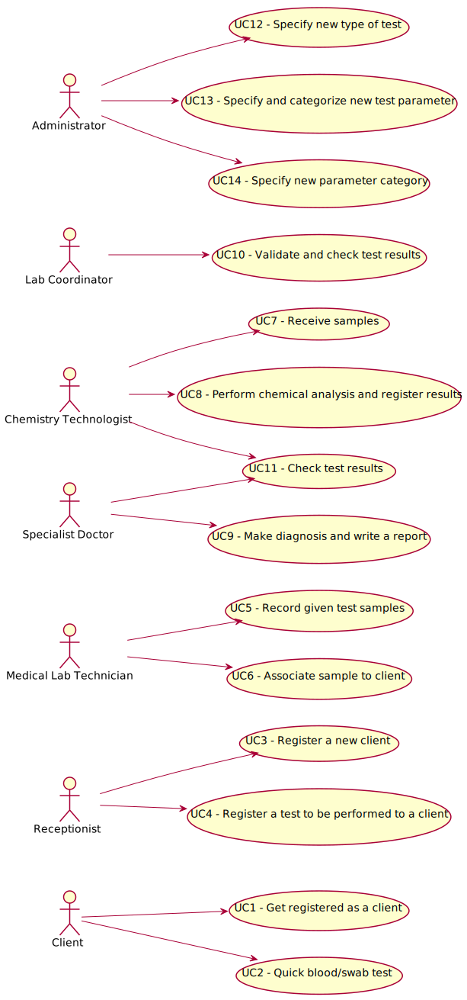

# Use Case Diagram (UCD)

**In the scope of this project, there is a direct relationship of _1 to 1_ between Use Cases (UC) and User Stories (US).**

**For each UC/US, it must be provided evidences of applying main activities of the software development process (requirements, analysis, design, tests and code). Gather those evidences on a separate file for each UC/US and set up a link as suggested below.**

# Use Cases / User Stories
| UC/US  | Description                                                          |
|:----|:------------------------------------------------------------------------|
| US1 | [As a new client of the laboratory, I want to be registered as a client of the laboratory](US1.md)|
| US2 | [As a new client of the laboratory, I want to have a test done quickly and effortlessly (Blood or swab test)](US2.md)|
| US3 | [As a receptionist of the lab, I want to be able to register a new client](US3.md)|
| US4 | [As a receptionist of the laboratory, I intend to register a test to be performed to a registered client](US4.md)|
| US5 | [As a medical lab technician, I want to record the samples collected in the scope of a given test.](US5.md)|
| US6 | [As a medical lab technician, I want to have a way of associating a certain sample to a client](US6.md)|
| US7 | [As a chemistry technologist, I want to have a way of receiving the samples](US7.md)|
| US8 | [As a chemistry technologist, I want to register the results of a certain analysis on the software application](US8.md)|
| US9 | [As an administrator, I want to specify a new type of test and its collecting methods](US9.md)|
| US10 | [As an administrator, I want to specify a new test parameter and categorize it](US10.md)|
| US11 | [As an administrator, I want to specify a new parameter category](US11.md)|
| US12 | [As a specialist doctor, I want to be able to check the test results](US12.md)|
| US13 | [As a specialist doctor, I want to be able to make a diagnosis and write a report that can be submitted in a platform](US13.md)|
| US14 | [As a lab coordinator, I want to be able to validate and check test results before becoming available to the client](US14.md)|

