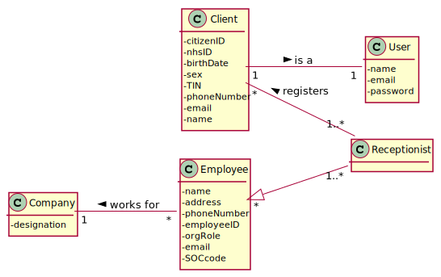
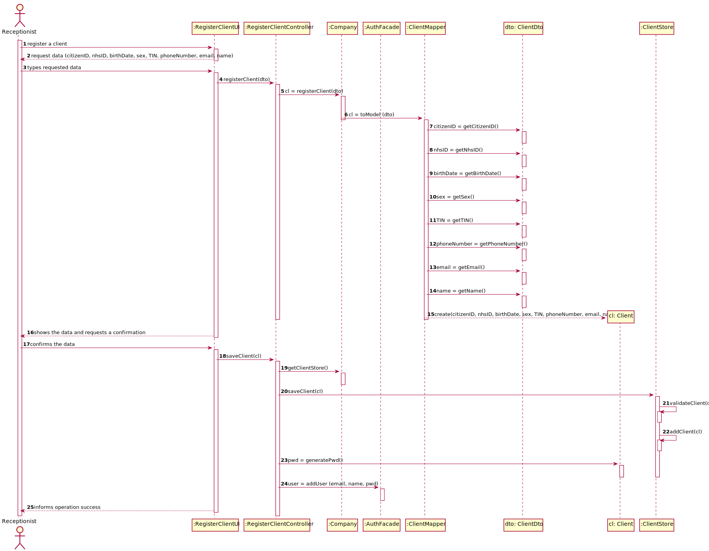
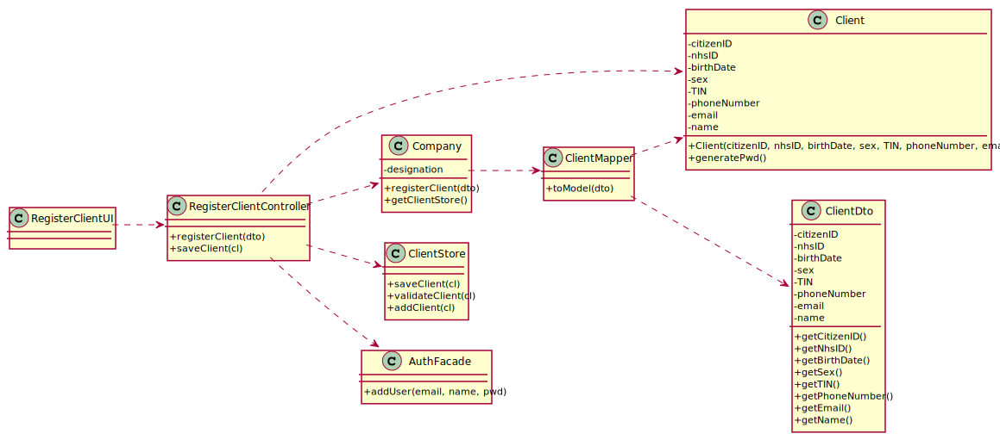

# US3 - As a receptionist, I want to register a client 

## 1. Requirements Engineering

### 1.1. User Story Description

As a receptionist of the laboratory, I want to register a client.

### 1.2. Customer Specifications and Clarifications 

From the Specifications Document:

  * " (...) a receptionist asks the client’s citizen card number, the lab order (which contains the type of test and parameters to be measured), and registers in the application the test to be performed to that client."
  * " In case of a new client, the receptionist registers the client in the application. To register a client, the receptionist needs the client’s citizen card number, National Healthcare Service (NHS) number, birth date, sex, Tax Identification number (TIF), phone number, e-mail and name."
  
From the client clarifications:

  * Question: Does the receptionist need to be logged in the app to preform the regist. [Client forum](https://moodle.isep.ipp.pt/mod/forum/discuss.php?d=7462)
    * Answer: Yes.
  * Question: What parameter (asked by the receptionist) should the system use to create the password of the new client. [Client forum](https://moodle.isep.ipp.pt/mod/forum/discuss.php?d=7462)
    * Answer: The password should be randomly generated. It should have ten alphanumeric characters.
  * Question: Relative to registering a new user, how should the system respond in the event of creating a new user with the same attributes of an already existing user? [Client forum](https://moodle.isep.ipp.pt/mod/forum/discuss.php?d=7482)
    * Answer: This should be treated as an error. A subset of the attributes of any client are unique.
  * Question: And what attributes among "Citizen Card number, NHS number, Birth date, Sex, Tax Identification Number, Phone number, E-mail, Name, Employee ID, Organization Role, Address, Standard Occupational Code and Doctor Index Number" will trigger this response? [Client forum](https://moodle.isep.ipp.pt/mod/forum/discuss.php?d=7482)
    * Answer: The e-mail address and phone number should be unique for each user. The sex of each user is optional.
  * Question: When the receptionist is making the client registration he needs to pay ? [Client forum](https://moodle.isep.ipp.pt/mod/forum/discuss.php?d=7563)
    * Answer: There are costs and payments but they are managed by a third party and are outside of the system. Therefore, in this project we will not consider the cost and payments associated with each test.
  * Question: The receptionist needs mandatorily of all client data described on the project description? [Client forum](https://moodle.isep.ipp.pt/mod/forum/discuss.php?d=7563)
    * Answer: Citizen Card: 16 digit number. NHS: 10 digit number. TIN: 10 digit number. Birth day - in which format: DD/MM/YY. Sex - should only be Male/Female or include more options. Male/Female. Phone number: 11 digit number. The sex is opcional. All other fields are required.
  * Question: When registering a new client, does the system send a email with login and password to client? [Client forum](https://moodle.isep.ipp.pt/mod/forum/discuss.php?d=7689)
    * Answer: Each users receives an e-mail informing that the registration was successful and that he can start to use the system. The e-mail includes the user password.
  * Question: What should be the maximum length of the String with the name of the Client? [Client forum](https://moodle.isep.ipp.pt/mod/forum/discuss.php?d=7945)
    * Answer: A string with no more than 35 characters.
  * Question: Does the client need to tell his age to the recepcionis. Im asking because before you didnt especified that that would be a parameter? [Client forum](https://moodle.isep.ipp.pt/mod/forum/discuss.php?d=7954)
    * Answer: No, only needs to tell the birth day (from a previous post). The application must validate and should not accept clients who have more than 150 years of age.
      It is good to have old people using our services, but 150 years it's too much and it may be a typo.
  * Question: Should each client have an unique ID, generated during their creation? [Client forum](https://moodle.isep.ipp.pt/mod/forum/discuss.php?d=7955)
    * Answer: No.
  * Question: Should some data of the client (phone number and e-mail address, for example) be edited in the future? [Client forum](https://moodle.isep.ipp.pt/mod/forum/discuss.php?d=7959)
    * Answer: For now there is no need to have such feature.
  * Question: Recently you said that the maximum acceptable age is 150 years old, so the client can be born in 1870 and the data format is DD/MM/YY, this format can be tricky because, for example, if the data is DD/MM/70 the data can indicate that he born on 1870 or 1970. How can we solve this? Or I am understanding wrong? [Client forum](https://moodle.isep.ipp.pt/mod/forum/discuss.php?d=7962)
    * Answer: Please consider DD / MM / YYYY format for all dates.
    
### 1.3. Acceptance Criteria

  * AC1: The client must become a system user.
  * AC2: Citizen Card number must be a 16 digit number.
  * AC3: NHS number must be a 10 digit number.
  * AC4: TIN must be a 10 digit number.
  * AC5: Birth day must be in format DD/MM/YYYY.
  * AC6: If sex is inserted it should only be Male/Female/more options.
  * AC7: Phone number must be a 11 digit number.
  * AC8: Name must not have more than 35 characteres.

### 1.4. Found out Dependencies

No dependencies were found.

### 1.5 Input and Output Data

Input Data

  * Typed data: client’s citizen card number, National Healthcare Service (NHS) number, birth date, sex, Tax Identification number (TIN), phone number, e-mail and name.
  * Selected data:
  
Output Data

  * (In)Success of the operation

### 1.6. System Sequence Diagram (SSD)

### 1.7 Other Relevant Remarks

* This US should be quite used, since it is the first step of the whole business process. If a new user comes into the laboratory, he needs to be registered in order to have a clinical test performed. 

## 2. OO Analysis

### 2.1. Relevant Domain Model Excerpt

### 2.2. Other Remarks

## 3. Design - User Story Realization 

### 3.1. Rationale

| Interaction ID | Question: Which class is responsible for... | Answer  | Justification (with patterns)  |
|:-------------  |:--------------------- |:------------|:---------------------------- |
| Step 1: register a client  		 |... interacting with the actor?							 |RegisterClientUI             |Pure Fabrication: there is no reason to assign this responsibility to any existing class in the Domain Model.                              |
|					 |... coordinating the US?		      					 |RegisterClientController		  	   |Controller										   |
|					 |... register a client?		      					 |ClientStore	  	   |Creator: ClientStore is responsible for register a client										   |
| Step 2: request data (citizenID, nhsID, birthDate, sex, TIN, phoneNumber, email, name		 |n/a							 |             |                              |
| Step 3: types requested data 		 |... saving the input data?							 |Client            |IE: The object created in step 1 has its own data                              |
| Step 4: shows the data and requests a confirmation  		 |... validating the data locally (e.g.: mandatory vs.non-mandatory data)?							 |Client           |IE: owns its data                            |
|								 |… validating the data globally (e.g.: duplicated)?										 |ClientStore	       |IE: knows all the client objects         		      |
| Step 5: confirms the data  		 |... saving the registered client?							 |ClientStore             |IE: records all the client objects                              |
| Step 6: informs operation success  		 |... informing operation success?							 |RegisterClientUI             |IE: responsible for user interaction                              |              

### Systematization ##

According to the taken rationale, the conceptual classes promoted to software classes are: 

 * Client
 * ClientStore
 
Other software classes (i.e. Pure Fabrication) identified: 

 * RegisterClientUI  
 * RegisterClientController

## 3.2. Sequence Diagram (SD)

## 3.3. Class Diagram (CD)

# 4. Tests 

**Test 1:** Check the acceptance criteria for citizen card number in the class client.

    @org.junit.Test
    public void checkCitizenIDRulesValid() {

        Client cl = new Client();

        String resultCitizenID = "1234567890123456";
        cl.checkCitizenIDRules(resultCitizenID);
    }

    @org.junit.Test(expected = IllegalArgumentException.class)
    public void checkCitizenIDRulesInvalidBlank() {

        Client cl = new Client();

        String resultCitizenID = "";
        cl.checkCitizenIDRules(resultCitizenID);
    }

    @org.junit.Test(expected = IllegalArgumentException.class)
    public void checkCitizenIDRulesInvalidLength() {

        Client cl = new Client();

        String resultCitizenID = "1234";
        cl.checkCitizenIDRules(resultCitizenID);
    }

    @org.junit.Test(expected = IllegalArgumentException.class)
    public void checkCitizenIDRulesInvalidLetters() {

        Client cl = new Client();

        String resultCitizenID = "1234LT";
        cl.checkCitizenIDRules(resultCitizenID);
    }

**Test 2:** Check the method saveClient present in the RegisterClientController class.

    @Test
    public void saveClientTrue() {

        Client cl = new Client("1234567890123456","1234567890", "12/12/1940","male","1234567890","12345678901","roberto@gmail.com","Roberto");

        RegisterClientController rcc = new RegisterClientController();

        boolean result = true;
        boolean expected = rcc.saveClient(cl);

        Assert.assertEquals(result,expected);
    }

    @Test
    public void saveClientFalse() {

        Client cl = new Client("1234567890123456","1234567890", "12/12/1940","male","1234567890","12345678901","roberto@gmail.com","Roberto");

        RegisterClientController rcc = new RegisterClientController();

        boolean result = false;
        rcc.getClientstore().addClient(cl);
        boolean expected = rcc.saveClient(cl);

        Assert.assertEquals(result,expected);
    }

**Test 3:** Check the methods saveClient and validateClient present in the ClientStore class.

    @Test
    public void saveClientInStore() {

        Client cl = new Client("1234567890123456","1234567890","12/12/1940","male","1234567890","12345678901","roberto@gmail.com","Roberto");

        ClientStore cl2 = new ClientStore();

        boolean result = true;
        boolean expected = cl2.saveClient(cl);

        Assert.assertEquals(result,expected);
    }

    @Test
    public void DoesNotsaveClientInStore() {

        Client cl = new Client("1234567890123456","1234567890","12/12/1940","male","1234567890","12345678901","roberto@gmail.com","Roberto");

        ClientStore cl2 = new ClientStore();

        boolean result = false;
        cl2.addClient(cl);
        boolean expected = cl2.saveClient(cl);

        Assert.assertEquals(result,expected);
    }

    @Test
    public void validateClientExists() {

        Client cl = new Client("1234567890123456","1234567890","12/12/1940","male","1234567890","12345678901","roberto@gmail.com","Roberto");

        ClientStore cl2 = new ClientStore();

        boolean result = false;
        cl2.addClient(cl);
        boolean expected = cl2.validateClient(cl);

        Assert.assertEquals(result,expected);

    }

    @Test
    public void validateClientDoesNotExist() {

        Client cl = new Client("1234567890123456","1234567890","12/12/1940","male","1234567890","12345678901","roberto@gmail.com","Roberto");

        ClientStore cl2 = new ClientStore();

        boolean result = true;
        boolean expected = cl2.validateClient(cl);

        Assert.assertEquals(result,expected);

    }

# 5. Construction (Implementation)

**Client class**

    public class Client {

        private String citizenID;
        private String nhsID;
        private String birthDate;
        private String sex;
        private String TIN;
        private String phoneNumber;
        private String email;
        private String name;

        public Client (String citizenID, String nhsID, String birthDate,String sex, String TIN, String phoneNumber, String email, String name){
    
            checkCitizenIDRules (citizenID);
            checkNhsIDRules (nhsID);
            checkTinRules (TIN);
            checkBirthDateRules (birthDate);
            checkSexRules (sex);
            checkPhoneNumberRules (phoneNumber);
            checkNameRules (name);
            this.citizenID = citizenID;
            this.nhsID = nhsID;
            this.birthDate = birthDate;
            this.sex = sex;
            this.TIN = TIN;
            this.phoneNumber = phoneNumber;
            this.email = email;
            this.name = name;
        }

        public Client (){
    
        }

        public void checkCitizenIDRules (String citizenID){
    
            if (StringUtils.isBlank(citizenID))
                throw new IllegalArgumentException("Citizen card number cannot be blank.");
            if ( citizenID.length() != 16 )
                throw new IllegalArgumentException("Citizen card number must have 16 chars.");
            for (int i = 0; i<citizenID.length(); i++){
                char y = citizenID.charAt(i);
                if (y != 48 && y != 49 && y != 50 && y != 51 && y != 52 && y != 53 && y != 54 && y != 55 && y != 56 && y != 57 ){
                    throw new IllegalArgumentException("Citizen card number must be only numbers.");
                }
            }
        }

        public void checkNhsIDRules (String nhsID){
    
            if (StringUtils.isBlank(nhsID))
                throw new IllegalArgumentException("NHS number cannot be blank.");
            if ( nhsID.length() != 10 )
                throw new IllegalArgumentException("NHS number must have 10 chars.");
            for (int i = 0; i<nhsID.length(); i++){
                char y = nhsID.charAt(i);
                if (y != 48 && y != 49 && y != 50 && y != 51 && y != 52 && y != 53 && y != 54 && y != 55 && y != 56 && y != 57 ){
                    throw new IllegalArgumentException("NHS number must be only numbers.");
                }
            }
    
        }

        public void checkTinRules (String TIN){
    
            if (StringUtils.isBlank(TIN))
                throw new IllegalArgumentException("TIN cannot be blank.");
            if ( TIN.length() != 10 )
                throw new IllegalArgumentException("TIN must have 10 chars.");
            for (int i = 0; i<TIN.length(); i++){
                char y = TIN.charAt(i);
                if (y != 48 && y != 49 && y != 50 && y != 51 && y != 52 && y != 53 && y != 54 && y != 55 && y != 56 && y != 57 ){
                    throw new IllegalArgumentException("TIN must be only numbers.");
                }
            }
    
        }

        public boolean checkBirthDateRules (String birthDate){
    
            if (birthDate.trim().equals(""))
                throw new IllegalArgumentException("BirthDate cannot be null");
            else {
    
                SimpleDateFormat data = new SimpleDateFormat("dd/MM/yyyy");
                data.setLenient(false);
    
                try {
                    Date javaDate = data.parse(birthDate);
                    Calendar cal = Calendar.getInstance(TimeZone.getTimeZone("Europe/Paris"));
                    cal.setTime(javaDate);
                    int year = cal.get(Calendar.YEAR);
                    int currentYear = Calendar.getInstance().get(Calendar.YEAR);
    
                    if (year > currentYear || year <= (currentYear - 150))
                        throw new IllegalArgumentException("Birth date is incorrect.");
    
                } catch (ParseException e) {
    
                    throw new IllegalArgumentException("Birth date is incorrect.");
                }
            }
            return true;
        }

        public void checkSexRules (String sex){
    
            if (StringUtils.isBlank (sex))
                throw new IllegalArgumentException("Sex cannot be blank.");
            if (!sex.equalsIgnoreCase("male") && !sex.equalsIgnoreCase("female"))
                throw new IllegalArgumentException("Sex must be male or female");
        }

        public void checkPhoneNumberRules (String phoneNumber){
    
            if (StringUtils.isBlank(phoneNumber))
                throw new IllegalArgumentException("Phone number cannot be blank.");
            if ( phoneNumber.length() != 11 ){
                throw new IllegalArgumentException("Phone number must have 11 chars.");
            }
            for (int i = 0; i<phoneNumber.length(); i++){
                char y = phoneNumber.charAt(i);
                if (y != 48 && y != 49 && y != 50 && y != 51 && y != 52 && y != 53 && y != 54 && y != 55 && y != 56 && y != 57 ){
                    throw new IllegalArgumentException("Phone number must be only numbers.");
                }
            }
        }

        public void checkNameRules (String name) {
    
            if (StringUtils.isBlank(name))
                throw new IllegalArgumentException("Name cannot be blank.");
            if ( name.length() > 35 )
                throw new IllegalArgumentException("Name must not have more than 35 chars.");
            for (int i = 0; i<name.length(); i++){
                char y = name.charAt(i);
                if (y == 48 || y == 49 || y == 50 || y == 51 || y == 52 || y == 53 || y == 54 || y == 55 || y == 56 || y == 57 ){
                    throw new IllegalArgumentException("Name must be only letters.");
                }
            }
        }

        public String getCitizenID() {
            return citizenID;
        }

        public String getNhsID() {
            return nhsID;
        }

        public String getBirthDate() {
            return birthDate;
        }

        public String getSex() {
            return sex;
        }

        public String getTIN() {
            return TIN;
        }

        public String getPhoneNumber() {
            return phoneNumber;
        }

        public String getEmail() {
            return email;
        }

        public String getName() {
            return name;
        }

        public String generatePwd(){
    
            Random random = new Random();
    
            String str = "ABCDEFGHIJKLMNOPQRSTUVWXYZabcdefghijklmnopqrstuvwxyz0123456789";
            String strAux = "";
    
            for (int i=0; i<10; i++){
    
                int x = 1 + random.nextInt(61);
                char aux = str.charAt(x);
                strAux += aux;
            }
            return strAux;
        }
    }

**Company class**

    public class Company {

        private String designation;

        public Company(String designation) {
            if (StringUtils.isBlank(designation))
                throw new IllegalArgumentException("Designation cannot be blank.");

            this.clientstore = new ClientStore();
        }

        public Client registerClient(ClientDto dto) {
            return ClientMapper.toModel(dto);
        }

        public ClientStore getClientStore (){
            return this.clientstore;
        }
    }

**RegisterClientController class**

    public class RegisterClientController {

        private App app;
        private Company company;
        public ClientStore clientstore;
        private AuthFacade authFacade;

        public RegisterClientController ()
        {
            this.app = App.getInstance();
            this.company = app.getCompany();
            this.authFacade = company.getAuthFacade();
            this.clientstore = company.getClientStore();
        }

        public Client registerClient (ClientDto dto){
    
            return company.registerClient(dto);
        }

        public boolean saveClient (Client cl){
    
            if (this.clientstore.saveClient(cl)){
                String pwd = cl.generatePwd();
                authFacade.addUser(cl.getName(),cl.getEmail(), pwd);
                return true;
            }
            return false;
        }

        public ClientStore getClientstore (){
    
            return this.clientstore;
        }
    }

**ClientStore class**

    public class ClientStore {

        List<Client> ClientList;

        public ClientStore (){
    
            this.ClientList = new ArrayList<>();
        }

        public List<Client> getClientList() {
            return ClientList;
        }

        public boolean saveClient (Client cl){
    
            if (validateClient(cl) == true){
                addClient(cl);
                return true;
            }
            return false;
        }

        public void addClient (Client cl){
    
             ClientList.add(cl);
    
        }

        public boolean validateClient (Client cl){
    
            if (ClientList.contains(cl))
                return false;
            else
                return true;
        }
    }

**AuthFacade class**

    public class AuthFacade {
        
        private UserSession userSession;
        private UserRoleStore roles ;
        private UserStore users;
    
        public AuthFacade()
        {
            this.userSession = new UserSession();
            this.roles = new UserRoleStore();
            this.users = new UserStore();
        }
    
        public boolean addUser(String name, String email, String pwd)
        {
            User user = this.users.create(name, email, pwd);
            return this.users.add(user);
        }
    }

**ClientMapper**

    public class ClientMapper {

        public static Client toModel (ClientDto clientDto ){
    
            String citizenID = clientDto.getCitizenID();
            String nhsID = clientDto.getNhsID();
            String birthDate = clientDto.getBirthDate();
            String sex = clientDto.getSex();
            String TIN = clientDto.getTIN();
            String phoneNumber = clientDto.getPhoneNumber();
            String email = clientDto.getEmail();
            String name = clientDto.getName();
    
            Client c = new Client(citizenID, nhsID, birthDate, sex, TIN, phoneNumber, email, name);
    
            return c;
        }
    }

**ClientDto**

    public class ClientDto {

        private String citizenID;
        private String nhsID;
        private String birthDate;
        private String sex;
        private String TIN;
        private String phoneNumber;
        private String email;
        private String name;

        public ClientDto (String citizenID, String nhsID, String birthDate, String sex, String TIN, String phoneNumber, String email, String name){
    
            this.citizenID = citizenID;
            this.nhsID = nhsID;
            this.birthDate = birthDate;
            this.sex = sex;
            this.TIN = TIN;
            this.phoneNumber = phoneNumber;
            this.email = email;
            this.name = name;
    
        }

        public String getCitizenID(){
            return citizenID;
        }

        public String getNhsID(){
            return nhsID;
        }

        public String getBirthDate(){
            return birthDate;
        }

        public String getSex(){
            return sex;
        }

        public String getTIN(){
            return TIN;
        }

        public String getPhoneNumber(){
            return phoneNumber;
        }

        public String getEmail(){
            return email;
        }

        public String getName(){
            return name;
        }
    }

# 6. Integration and Demo 

*In this section, it is suggested to describe the efforts made to integrate this functionality with the other features of the system.*

# 7. Observations

*In this section, it is suggested to present a critical perspective on the developed work, pointing, for example, to other alternatives and or future related work.*

