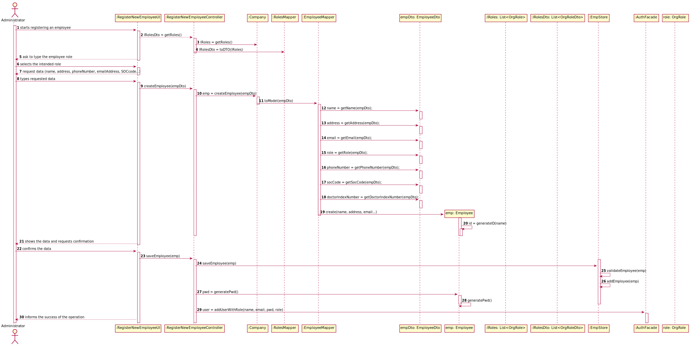
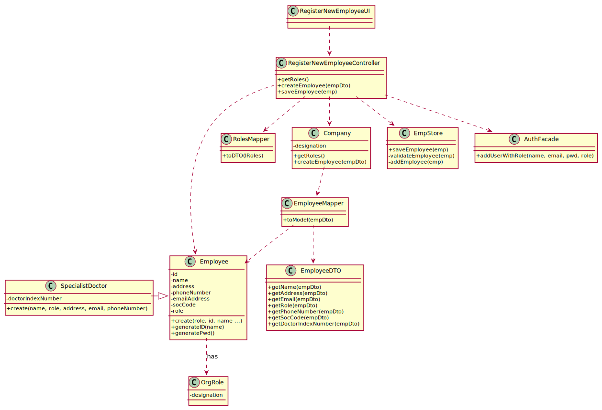

# US 7 - Register a new employee.

## 1. Requirements Engineering
### 1.1. User Story Description

As an administrator, I want to register a new employee.

### 1.2. Customer Specifications and Clarifications 
### 1.3. Acceptance Criteria

AC1: Each user must have a single role defined in the system. 

AC2: When registering an employee, the organization role must be a string with no more than 15 characters.

AC3: When registering an employee, the employee ID should be generated from the initials of the employee name and should include a number. The number should have 5 digits and it increases automatically when a new employee is registered in the system.

AC4: When registering an employee, the employee name must be a string with no more than 35 characters.

### 1.4. Found out Dependencies

The administrator needs to be logged in to register a new employee.

### 1.5 Input and Output Data
**Input Data**

• Typed data: name, address , phone number, e-mail, Standard Occupational Classification (SOC) code and Doctor Index Number. 	
• Selected data: organization role

**Output Data**

• (In)Success of the operation
### 1.6. System Sequence Diagram (SSD)

*Insert here a SSD depicting the envisioned Actor-System interactions and throughout which data is inputted and outputted to fulfill the requirement. All interactions must be numbered.*

### 1.7 Other Relevant Remarks
N/A

## 2. OO Analysis

### 2.1. Relevant Domain Model Excerpt 
*In this section, it is suggested to present an excerpt of the domain model that is seen as relevant to fulfill this requirement.* 

### 2.2. Other Remarks

N/A

## 3. Design - User Story Realization 

### 3.1. Rationale

**The rationale grounds on the SSD interactions and the identified input/output data.**

| Interaction ID | Question: Which class is responsible for... | Answer  | Justification (with patterns)  |
|:-------------  |:--------------------- |:------------|:---------------------------- |
| Step 1: register an employee 		 | ...interacting with the actor?		 |RegisterNewEmployeeUI              | Pure Fabrication: there is no reason to assign this responsibility to any existing class in the Domain Model.                             |
|   		 |		...coordinating the US?					 | RegisterNewEmployeeController            | Controller                             |
|   		 |		...register an employee?					 |    EmpStore          |   Creator: ClientStore is responsible for register a client                           |
| Step 2: request data  		 |			n/a				 |    n/a         |    n/a                          | 
| Step 3: types requested data		 |		...saving the inputted data?					 |     EmployeeDTO        |                              |
| Step 4: shows the data and requests a confirmation  		 |	... validating the data locally (e.g.: mandatory vs.non-mandatory data)?			 |  Employee           |  IE: owns its data and knows his own criteria                            | 
|  		 |… validating the data globally (e.g.: duplicated)?			 |  EmployeeStore           |  IE:  knows all the employee objects                    |
| Step 5: confirms the data	 		 |	... saving the registered employee?						 |    EmpStore          |   IE: records all the employee objects 
| Step 6: informs operation success  		 |		... informing operation success?|    RegisterNewEmployeeUI          |   IE: responsible for user interaction 
### Systematization ##

According to the taken rationale, the conceptual classes promoted to software classes are: 

 * Employee
 

Other software classes (i.e. Pure Fabrication) identified: 

 * RegisterNewEmployeeUI  
 * RegisterNewEmployeeController

## 3.2. Sequence Diagram (SD)

*In this section, it is suggested to present an UML dynamic view stating the sequence of domain related software objects' interactions that allows to fulfill the requirement.* 

## 3.3. Class Diagram (CD)

*In this section, it is suggested to present an UML static view representing the main domain related software classes that are involved in fulfilling the requirement as well as and their relations, attributes and methods.*

# 4. Tests 
*In this section, it is suggested to systematize how the tests were designed to allow a correct measurement of requirements fulfilling.* 

**_DO NOT COPY ALL DEVELOPED TESTS HERE_**

**Test 1:** Check that it is not possible to create an instance of the Example class with null values. 

	@Test(expected = IllegalArgumentException.class)
		public void ensureNullIsNotAllowed() {
		Exemplo instance = new Exemplo(null, null);
	}

*It is also recommended to organize this content by subsections.* 

# 5. Construction (Implementation)
**Class EmpStore**

    public class UserStore {
        public List<Employee> EmployeeStore;
        
        public EmpStore() { }
        public EmpStore getEmployeeStore() { }
        public List<Employee> getEmpList() { }
        public boolean validateEmployee(Employee emp) { }
        public boolean addEmployee(Employee emp) { }
    }
**Class OrgRole**

    public class OrgRole {
        public String designation;

        public OrgRole (String designation) { }
    }
**Class Company**

    public class Company {
        private String designation;
        private AuthFacade authFacade;
        private EmpStore employeeStore;
        private List<OrgRole> roleList;
        public int numEmp;
        
        public Company(String designation) { }
        public List<OrgRole> getRoles() { }
        public Employee createEmployee(EmployeeDto empDto) { }
        public EmpStore getEmployeeStore() { }
        
    }
**Class RegisterNewEmployeeController**

    public class RegisterNewEmployeeController {
        
        public List<OrgRoleDto> getRoles() { }
        public boolean createEmployee(EmployeeDto empDto) { }
        public boolean saveEmployee(Employee emp) { }
    }
**Class RolesMapper**
   
    public class RegisterNewEmployeeController {
        
         public static List<OrgRoleDto> toDto(List<OrgRole> list) { }
    }
**Class EmployeeDto**

    public class EmployeeDto {
        private String name;
        private String role;
        private String address;
        private String email;
        private String phoneNumber;
        public int socCode;
        public int doctorIndexNumb;
        
        public EmployeeDto (String name, String role, String address, String email, String phoneNumber, int socCode) { }
        public EmployeeDto (String name, String role, String address, String email, String phoneNumber, int socCode, int doctorIndexNumb) { }
        
        public String getName { }
        public String getRole { }
        public String getAddress { }
        public String getEmail { }
        public String getPhoneNumber { }
        public int getSocCode { }
        public int getDoctorIndexNumber { }
    }
**Class Employee**

    public class EmployeeDto {
        public Company company;
        public String name;
        public OrgRole role;
        public String address;
        public String email;
        private String empID;
        private String phoneNumber;
        private int socCode;
        private int doctorIndexNumb;
        
        public Employee () { }
        public Employee (String name, String role, String address, String email,String phoneNumber, int socCode, int doctorIndexNumb)  { }
        public Employee (String name, String role, String address, String email, String phoneNumber, int socCode)  { }
        
        private void checkNameRules (String name) { }
        private void checkRoleRules(String role) { }
        private void checkPhoneNumberRules (String phoneNumber){ }
        private void checkSOCCODERules (int socCode){ }
        private void checkDoctorIndexNumberRules (int doctorIndexNumb){ }
        private String generateID(String name) { }
        public String generatePwd() { }
        }
**Class EmployeeMapper**

    public class EmployeeMapper {
        public static Employee toModel (EmployeeDto  employeeDto){ }
    }
**Class OrgRoleDto**

    public class OrgRoleDto {
        private String designation;
        
        public OrgRoleDto(OrgRole role) { }

        public String getDesignation() { }
    }
**Class RolesMapper**
    
    public class RolesMapper {
        public static List<OrgRoleDto> toDto(List<OrgRole> list) { }
    }

**Class SpecialistDoctor**
 
    public class SpecialistDoctor extends Employee {
        public SpecialistDoctor(String name, String role, String address, String email, String phoneNumber, int socCode, int doctorIndexNumb) { }
    }

*It is also recommended to organize this content by subsections.* 

# 6. Integration and Demo 

*In this section, it is suggested to describe the efforts made to integrate this functionality with the other features of the system.*

# 7. Observations

*In this section, it is suggested to present a critical perspective on the developed work, pointing, for example, to other alternatives and or future related work.*