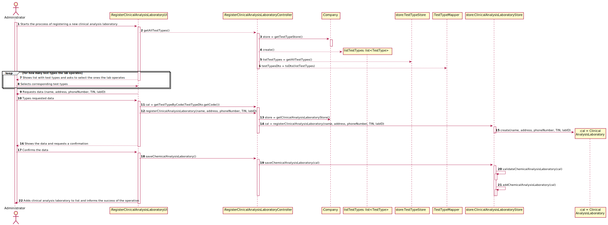
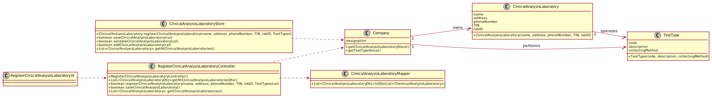

# US 08 - Register Clinical Analysis Laboratory

## 1. Requirements Engineering

### 1.1. User Story Description

* As an administrator, I want to register a new clinical analysis laboratory, stating which kind of tests it operates.

### 1.2. Customer Specifications and Clarifications 

**From the specifications document:**

* "All Many Labs clinical analysis laboratories perform clinical blood tests, and a subset of these laboratories also performs Covid-19 tests."
  
**From the client clarifications**

* Question: "Are the test types in US8 typed in or selected from those that the program has?"
    * Answer: "The test types are selected from a list."

* Question: "We know through the specifications document that "All Many Labs clinical analysis laboratories perform clinical blood tests. When creating a new Clinical Analysis Laboratory, should the system automatically record that it operates that type of test or should the person who is creating it select it manually while selecting other types of tests?"
    * Answer: The administrator should select, manually, all the types of tests to be performed by the Clinical Analysis Laboratory.

### 1.3. Acceptance Criteria

AC1: TIN must have 10 numeric characters.

### 1.4. Found out Dependencies

To state the tests it operates, it is needed that Test Types are created beforehand.

### 1.5 Input and Output Data

**Input data**

* Typed data: Laboratory ID.
* Selected data: TestType.

**Output data**

*  (In)Success of the operation of adding a clinical analysis laboratory to the clinical analysis laboratory list.

### 1.6. System Sequence Diagram (SSD)

### 1.7 Other Relevant Remarks

* The clinical analysis laboratories can perform the diversity of tests desired. That guarantees versatility to the labs' work.

## 2. OO Analysis

### 2.1. Relevant Domain Model Excerpt 

### 2.2. Other Remarks

This US depends directly on the US9 to work, as Test Types are needed to register a Clinical Analysis Laboratory. Therefore, it also depends on the US11 as Test Types need a Parameter Category

## 3. Design - User Story Realization 

### 3.1. Rationale

| Interaction ID | Question: Which class is responsible for... | Answer  | Justification (with patterns)  |
|:-------------  |:--------------------- |:------------|:---------------------------- |
| Step 1: Starts the proccess of registering a new clinical analysis laboratory | ... creating a new clinical analysis laboratory?	 | ClinicalAnalysisLaboratoryStore | Creator: The ClinicalAnalysisLaboratoryStore is responsible for registering a clinical analysis laboratory |
|                                                                               |  ... coordenating the US?                          |   registerClinicalAnalysisLaboratoryController | Controller |
| Step 2: Shows list with test types and asks to select the ones the lab operates | ...showing the available options? | registerClinicalAnalysisLaboratoryUI and TestTypeStore	| IE and Creator: UI is responsible for showing it and the TestTypeStore is able to retrieve the test types |              
| Step 3: Selects corresponding test types | ...making the list available? | registerClinicalAnalysisLaboratoryUI |  IE: allows user to insert the intended option  |      
| Step 4: Requests data (i.e., labID) | ...requesting the data?	 | registerClinicalAnalysisLaboratoryUI	 | IE: Responsible for user interaction |
| Step 5: Types requested data | ...saving the input data? | ClinicalAnalysisLaboratoryStore | IE: The ClinicalAnalysisLaboratoryStore is responsible for saving the clinical analysis laboratory |
| Step 6: Shows requested data and asks for confirmation | ... confirm the data | ClinicalAnalysisLaboratoryStore |  IE: is able to confirm a new clinical analysis laboratory |
| Step 7: Confirms the data | ... saving the typed data? | ClinicalAnalysisLaboratoryStore | Creator: saves ClinicalAnalysisLaboratory objects |
| Step 10: Informs the success of the operation	| ...informing the success of the operation? | registerClinicalAnalysisLaboratoryUI | IE: responsible for user interaction |              

### Systematization ##

According to the taken rationale, the conceptual classes promoted to software classes are: 
 
 * ClinicalAnalysisLaboratory
 * ClinicalAnalysisLaboratoryStore

Other software classes (i.e. Pure Fabrication) identified: 

 * registerClinicalAnalysisLaboratoryUI  
 * registerClinicalAnalysisLaboratoryController

## 3.2. Sequence Diagram (SD)

## 3.3. Class Diagram (CD)

# 4. Tests 

**Test 1:** Tests that is impossible to create a ClinicalAnalysisLaboratory object with no ID.

    @Test(expected = IllegalArgumentException.class)
    public void setLabID() {
      List<TestType> TestTypesList1 = new ArrayList<>();
      TestTypesList1.add(new TestType("12345", "Description", "Collect1", new ParameterCategory("null", "pcnul")));
      ClinicalAnalysisLaboratory test5 = new ClinicalAnalysisLaboratory("", "Avenida da Boavista", "931234567", "12345", "123456789", TestTypesList1);
    }
**Test 2:** Tests the functionality of registering a Clinical Analysis Laboratory by the ClinicalAnalysisLaboratoryStore.

    @Test
    public void registerClinicalAnalysisLaboratory() {
      List<TestType> TestTypesList1 = new ArrayList<>();
      TestTypesList1.add(new TestType("12345", "Description", "Collect1", new ParameterCategory("null", "pcnul")));
      ClinicalAnalysisLaboratoryStore calStoreTest = new ClinicalAnalysisLaboratoryStore();
      ClinicalAnalysisLaboratory cal1 = calStoreTest.registerClinicalAnalysisLaboratory("Lab", "Avenida da Boavista", "931234567", "12345", "123456789", TestTypesList1);
      assertEquals(cal1.toString(), calStoreTest.registerClinicalAnalysisLaboratory("Lab", "Avenida da Boavista", "931234567", "12345", "123456789", TestTypesList1).toString());
    } 

# 5. Construction (Implementation)
 
* ClinicalAnalysisLaboratory Class:

      public class ClinicalAnalysisLaboratory {

        private String name;
        private String address;
        private String phoneNumber;
        private String TIN;
        private String labID;
        private List<TestType> TestTypesList;
    
        public ClinicalAnalysisLaboratory(String name, String address, String phoneNumber, String TIN, String labID, List<TestType> TestTypesList) {}
        
        public String getName() {}
   
        public String getAddress() {}

        public String getPhoneNumber() {}

        public String getTIN() {}

        public String getLabID() {}

        public List<TestType> getTestTypesList() {}

        @Override
        public String toString() {}
      
    }         
      
* ClinicalAnalysisLaboratoryStore Class:  

      public class ClinicalAnalysisLaboratoryStore {

        private List<ClinicalAnalysisLaboratory> ClinicalAnalysisLaboratoryList;
        
        public ClinicalAnalysisLaboratoryStore() {}
        
        public ClinicalAnalysisLaboratory registerClinicalAnalysisLaboratory(String name, String address, String phoneNumber, String TIN, String labID, List<TestType> TestTypes) {}

        public boolean saveClinicalAnalysisLaboratory(ClinicalAnalysisLaboratory cal) {}
        
        public boolean validateClinicalAnalysisLaboratory(ClinicalAnalysisLaboratory cal) {}
        
        public boolean addClinicalAnalysisLaboratory(ClinicalAnalysisLaboratory cal) {}
        
        public ClinicalAnalysisLaboratory getClinicalAnalysisLaboratoryByID(String labID) {}
        
        public List<ClinicalAnalysisLaboratory> getAllClinicalAnalysisLaboratories() {}

    }
      
* RegisterClinicalAnalysisLaboratoryController Class:

      public class RegisterClinicalAnalysisLaboratoryController {
      
        private App app;
        private Company company;
        private ClinicalAnalysisLaboratory cal;
        private ClinicalAnalysisLaboratoryStore calStore;
        
        public RegisterClinicalAnalysisLaboratoryController() {}
        
        public boolean registerClinicalAnalysisLaboratory(String name, String address, String phoneNumber, String TIN, String labID, List<TestType> TestTypesList) {}
        
        public boolean saveClinicalAnalysisLaboratory() {}
        
        public List<ClinicalAnalysisLaboratory> getAllClinicalAnalysisLaboratories() {}
        
        public List<ClinicalAnalysisLaboratoryDto> getAllClinicalAnalysisLaboratoriesDto() {}

    }

* RegisterClinicalAnalysisLaboratoryUI Class:

      public class RegisterClinicalAnalysisLaboratoryUI implements Runnable {
      
        private RegisterClinicalAnalysisLaboratoryController rcalController;
        private CreateTestTypeController ttController;
      
        public RegisterClinicalAnalysisLaboratoryUI() {}
        
        @Override
        public void run() {}

    }
      
* ClinicalAnalysisLaboratoryDto Class:      
      
    public class ClinicalAnalysisLaboratoryDto {
    
      private String name;
      private String address;
      private String phoneNumber;
      private String TIN;
      private String labID;
      
      public ClinicalAnalysisLaboratoryDto(String name, String address, String phoneNumber, String TIN, String labID) {}
      
      public String getLabID() {}
      
      @Override
      public String toString() {}
      
    }
      
* ClinicalAnalysisLaboratoryMapper Class: 

    public class ClinicalAnalysisLaboratoryMapper {
    
      public static List<ClinicalAnalysisLaboratoryDto> toDto(List<ClinicalAnalysisLaboratory> ClinicalAnalysisLaboratory) {}
      
    } 

# 6. Integration and Demo 

* This User Story requiered some effort as it was linked with 2 other User Storys. As a clinical analysis laboratory operates test types, and test types have parameter categories, it was needed to build bridges between User Stories where the administrator specifies test types and specifies parameter categories.

# 7. Observations

* In this work we didn't need to make classes like "Test", but surely they will be needed in the future. Anyway, the developed work was made in order to facilite the proccess of making them, in case it's needed to.

