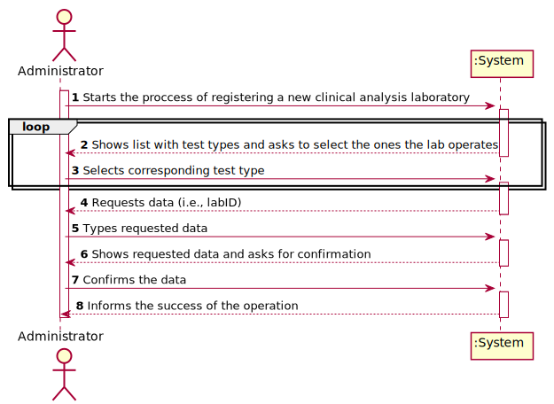
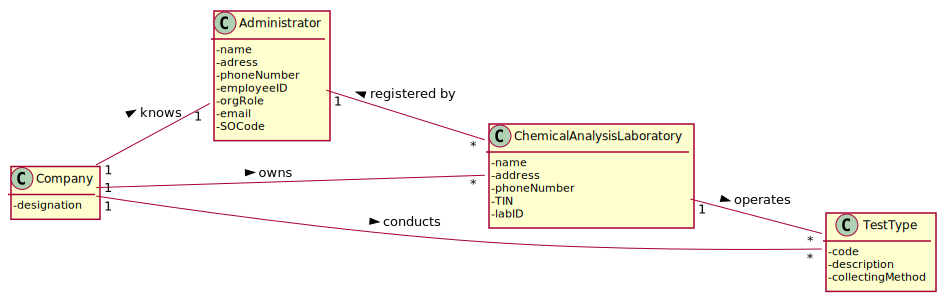

# US 08 - Register Clinical Analysis Laboratory

## 1. Requirements Engineering

### 1.1. User Story Description

* As an administrator, I want to register a new clinical analysis laboratory, stating which kind of tests it operates.

### 1.2. Customer Specifications and Clarifications 

**From the specifications document:**

* "All Many Labs clinical analysis laboratories perform clinical blood tests, and a subset of these laboratories also performs Covid-19 tests."
  
**From the client clarifications**

* ** to finish **
* Question: 
    * Answer:

### 1.3. Acceptance Criteria

*Insert here the client acceptance criteria.*

### 1.4. Found out Dependencies

To state the tests it operates, it is needed that Test Types are created beforehand.

### 1.5 Input and Output Data

**Input data**

* Typed data: Laboratory ID.
* Selected data: TestType.

**Output data**

*  (In)Success of the operation of adding a clinical analysis laboratory to the clinical analysis laboratory list.

### 1.6. System Sequence Diagram (SSD)

### 1.7 Other Relevant Remarks

*Use this section to capture other relevant information that is related with this US such as (i) special requirements ; (ii) data and/or technology variations; (iii) how often this US is held.* 

## 2. OO Analysis

### 2.1. Relevant Domain Model Excerpt 

### 2.2. Other Remarks

*Use this section to capture some aditional notes/remarks that must be taken into consideration into the design activity. In some case, it might be usefull to add other analysis artifacts (e.g. activity or state diagrams).* 

## 3. Design - User Story Realization 

### 3.1. Rationale

**The rationale grounds on the SSD interactions and the identified input/output data.**

| Interaction ID | Question: Which class is responsible for... | Answer  | Justification (with patterns)  |
|:-------------  |:--------------------- |:------------|:---------------------------- |
| Step 1  		 |							 |             |                              |
| Step 2  		 |							 |             |                              |
| Step 3  		 |							 |             |                              |
| Step 4  		 |							 |             |                              |
| Step 5  		 |							 |             |                              |
| Step 6  		 |							 |             |                              |              

### Systematization ##

According to the taken rationale, the conceptual classes promoted to software classes are: 

 * Administrator
 * Company  
 * ClinicalAnalysisLaboratory
 * ClinicalAnalysisLaboratoryStore
 * Test
 * TestType
 * TestTypeStore

Other software classes (i.e. Pure Fabrication) identified: 
 * registerClinicalAnalysisLaboratoryUI  
 * registerClinicalAnalysisLaboratoryController

## 3.2. Sequence Diagram (SD)

*In this section, it is suggested to present an UML dynamic view stating the sequence of domain related software objects' interactions that allows to fulfill the requirement.* 

## 3.3. Class Diagram (CD)

# 4. Tests 
*In this section, it is suggested to systematize how the tests were designed to allow a correct measurement of requirements fulfilling.* 

**_DO NOT COPY ALL DEVELOPED TESTS HERE_**

**Test 1:** Check that it is not possible to create an instance of the Example class with null values. 

	@Test(expected = IllegalArgumentException.class)
		public void ensureNullIsNotAllowed() {
		Exemplo instance = new Exemplo(null, null);
	}

*It is also recommended to organize this content by subsections.* 

# 5. Construction (Implementation)

*In this section, it is suggested to provide, if necessary, some evidence that the construction/implementation is in accordance with the previously carried out design. Furthermore, it is recommeded to mention/describe the existence of other relevant (e.g. configuration) files and highlight relevant commits.*

*It is also recommended to organize this content by subsections.* 

# 6. Integration and Demo 

*In this section, it is suggested to describe the efforts made to integrate this functionality with the other features of the system.*

# 7. Observations

*In this section, it is suggested to present a critical perspective on the developed work, pointing, for example, to other alternatives and or future related work.*

