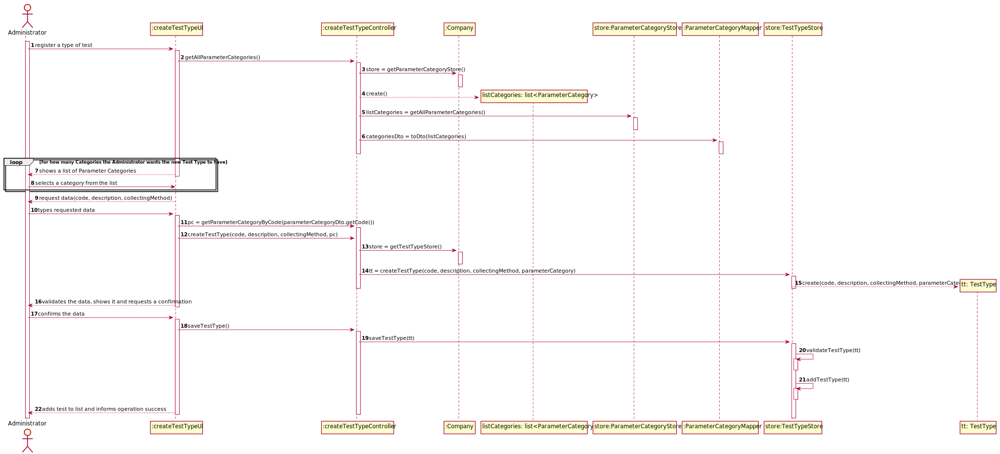

# US 09- As an administrator, I want to specify a new type of test and its collecting methods.

## 1. Requirements Engineering

*In this section, it is suggested to capture the requirement description and specifications as provided by the client as well as any further clarification on it. It is also suggested to capture the requirements acceptance criteria and existing dependencies to other requirements. At last, identfy the involved input and output data and depicted an Actor-System interaction in order to fulfill the requirement.

### 1.1. User Story Description

* As an Administrator, I want to specify a new type of test and its collecting methods.

### 1.2. Customer Specifications and Clarifications

**From the specifications document:**

* "(...) tests are frequently characterized by measuring several parameters which for presentation/reporting purposes are organized by categories."
  
* “(...) such tests rely on measuring one or more parameters that can be grouped/organized by categories.”

**From the client clarifications**

* Question: What do you mean by the collecting methods and which ones are available?
    * Answer: For example, in order to perform a Covid Test, you need a swab. The collecting methods are specified by the Administrator. [Client Forum](https://moodle.isep.ipp.pt/mod/forum/discuss.php?d=7752#p10120)

* Question: Are there any different collecting methods other than the ones currently known?
    * Answer: Each collecting method is associated with a test type. Every test must have its collecting method defined. [Client Forum](https://moodle.isep.ipp.pt/mod/forum/discuss.php?d=7514#p10172)

* Question: Which attributes does a type of test have besides its name and Collecting Method?
    * Answer: A code, a description,a Collecting Method and a Parameter Category. [Client Forum](https://moodle.isep.ipp.pt/mod/forum/discuss.php?d=7512#p10171)
    
### 1.3. Acceptance Criteria

* AC1: **Code** must have 5 alphanumeric characters and not be automatically generated.
* AC2: **Description** must be a string with no more than 15 characters.
* AC3: **Collecting Method** must be a String with no more than 20 characters.
* AC4: **Parameter Category** must be described through a name and a unique code, which must have 5 alphanumeric characters and not be automatically generated.

### 1.4. Found out Dependencies

* US11: As an administrator, I want to specify a new parameter category.

### 1.5 Input and Output Data
**Input data**

* Typed data: Code, Description, Collecting method.
* Selected data: ParameterCategory.

**Output data**

*  (In)Success of the operation of adding the new type of test to the test types list.

### 1.6. System Sequence Diagram (SSD)

### 1.7 Other Relevant Remarks

* This US should be frequently used, since it allows the Company to expand its offer in terms of different test types, attracting more customers.
*Use this section to capture other relevant information that is related with this US such as (i) special requirements ; (ii) data and/or technology variations; (iii) how often this US is held.* 

## 2. OO Analysis

### 2.1. Relevant Domain Model Excerpt 
*In this section, it is suggested to present an excerpt of the domain model that is seen as relevant to fulfill this requirement.*

### 2.2. Other Remarks

*Use this section to capture some additional notes/remarks that must be taken into consideration into the design activity. In some case, it might be usefull to add other analysis artifacts (e.g. activity or state diagrams).* 

## 3. Design - User Story Realization 

### 3.1. Rationale

**The rationale grounds on the SSD interactions and the identified input/output data.**

| Interaction ID | Question: Which class is responsible for... | Answer  | Justification (with patterns)  |
|:-------------  |:--------------------- |:------------|:---------------------------- |
| Step 1: register a type of test | ...creating a new type of test? | TestTypeStore | Creator: The TestTypeStore is responsible for creating a test type|
|                                 | ...coordinating the US?  | createTestTypeController | Controller| 
| Step 2: shows a list of Parameter Categories | ...showing the available options? | createTestTypeUI and ParameterCategoryStore| IE and Creator: UI is responsible for showing it and the Parameter Category Store is able to retrieve the available categories |
| Step 3: selects a category from the list | ...making the list available? | createTestTypeUI | IE: allows user to insert the intended option |
| Step 4: request data(code, description, collectingMethod) | ...requesting the data? | createTestTypeUI | IE: responsible for user interaction 
| Step 5: types requested data | ...saving the input data? | TestTypeStore | IE: The TestTypeStore is responsible for saving the new test type, since it was responsible for creating it and will validate it 
| Step 6: validates the data, shows it and requests a confirmation | ... validating the data locally (e.g.: mandatory vs.non-mandatory data)? | TestTypeStore | IE: is able to validate a new Test Type, according to the provided Acceptance Criteria 
|                                                                  | ... validating the data globally (e.g.: duplicated)? | Company  | IE: knows all TestType objects
| Step 7: confirms the data | ... saving the typed data? | TestTypeStore | Creator: saves all the TestType objects
| Step 8: adds test to list and informs operation success | ...informing addition success? | createTestTypeUI | IE: responsible for user interaction

### Systematization ##

According to the taken rationale, the conceptual classes promoted to software classes are: 

 * Administrator
 * Company  
 * TestType
 * TestTypeStore

Other software classes (i.e. Pure Fabrication) identified: 
 
 * createTestTypeUI
 * createTestTypeController

## 3.2. Sequence Diagram (SD)

*In this section, it is suggested to present an UML dynamic view stating the sequence of domain related software objects' interactions that allows to fulfill the requirement.* 

## 3.3. Class Diagram (CD)

*In this section, it is suggested to present an UML static view representing the main domain related software classes that are involved in fulfilling the requirement as well as and their relations, attributes and methods.*

# 4. Tests 
*In this section, it is suggested to systematize how the tests were designed to allow a correct measurement of requirements fulfilling.* 

**_DO NOT COPY ALL DEVELOPED TESTS HERE_**

**Test 1:** Check that it is not possible to create an instance of the Example class with null values. 

	@Test(expected = IllegalArgumentException.class)
		public void ensureNullIsNotAllowed() {
		Exemplo instance = new Exemplo(null, null);
	}

*It is also recommended to organize this content by subsections.* 

# 5. Construction (Implementation)
  
* Administrator Class:

    public class Administrator extends Employee{

        public Administrador(int name, String address, int phoneNumber, int employeeID,
            String orgRole, String email, int SOCcode){

            super(name, address, phoneNumber, employeeID, orgRole, email, SOCcode);
        }
    
        private void checkCitizenIDRules (int citizenID){...}
    
        private void checkNhsIDRules (String nhsID){...}
    
        private void checkTinRules (int TIN){...}
    
        private void checkBirthDateRules (String BirthDate){...}
    
        private void checkSexRules (String sex){...}
    
        private void checkPhoneNumberRules (String phoneNumber){...}
    
    }

*In this section, it is suggested to provide, if necessary, some evidence that the construction/implementation is in accordance with the previously carried out design. Furthermore, it is recommeded to mention/describe the existence of other relevant (e.g. configuration) files and highlight relevant commits.*

*It is also recommended to organize this content by subsections.* 

# 6. Integration and Demo 

*In this section, it is suggested to describe the efforts made to integrate this functionality with the other features of the system.*

# 7. Observations

*In this section, it is suggested to present a critical perspective on the developed work, pointing, for example, to other alternatives and or future related work.*

