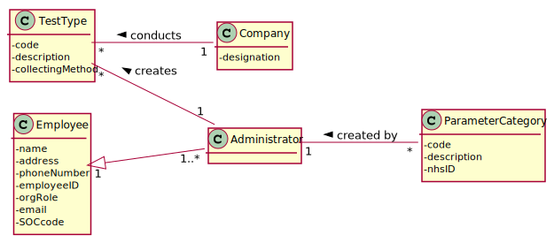
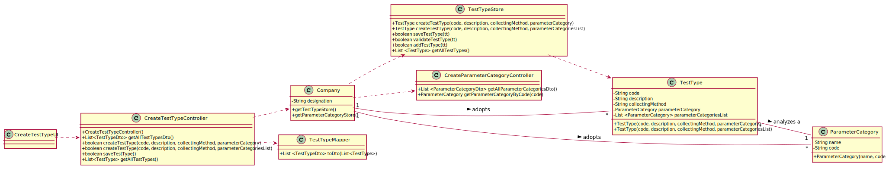

# US 09- As an administrator, I want to specify a new type of test and its collecting methods.

## 1. Requirements Engineering

### 1.1. User Story Description

* As an Administrator, I want to specify a new type of test and its collecting methods.

### 1.2. Customer Specifications and Clarifications

**From the specifications document:**

* "(...) tests are frequently characterized by measuring several parameters which for presentation/reporting purposes are organized by categories."
  
* “(...) such tests rely on measuring one or more parameters that can be grouped/organized by categories.”

**From the client clarifications**

* Question: What do you mean by the collecting methods and which ones are available?
    * Answer: For example, in order to perform a Covid Test, you need a swab. The collecting methods are specified by the Administrator. [Client Forum](https://moodle.isep.ipp.pt/mod/forum/discuss.php?d=7752#p10120)

* Question: Are there any different collecting methods other than the ones currently known?
    * Answer: Each collecting method is associated with a test type. Every test must have its collecting method defined. [Client Forum](https://moodle.isep.ipp.pt/mod/forum/discuss.php?d=7514#p10172)

* Question: Which attributes does a type of test have besides its name and Collecting Method?
    * Answer: A code, a description,a Collecting Method and a Parameter Category. [Client Forum](https://moodle.isep.ipp.pt/mod/forum/discuss.php?d=7512#p10171)
    
### 1.3. Acceptance Criteria

* AC1: **Code** must have 5 alphanumeric characters and not be automatically generated.
* AC2: **Description** must be a string with no more than 15 characters.
* AC3: **Collecting Method** must be a String with no more than 20 characters.
* AC4: **Parameter Category** must be described through a name and a unique code, which must have 5 alphanumeric characters and not be automatically generated.

### 1.4. Found out Dependencies

* US11: As an administrator, I want to specify a new parameter category.

### 1.5 Input and Output Data
**Input data**

* Typed data: Code, Description, Collecting method.
* Selected data: ParameterCategory.

**Output data**

*  (In)Success of the operation of adding the new type of test to the test types list.

### 1.6. System Sequence Diagram (SSD)

### 1.7 Other Relevant Remarks

* This US should be frequently used, since it allows the Company to expand its offer in terms of different test types, attracting more customers. 

## 2. OO Analysis

### 2.1. Relevant Domain Model Excerpt

### 2.2. Other Remarks

The US09 is heavily dependent on the US11 contents, since a Test Type cannot be created without a Parameter Category. 

## 3. Design - User Story Realization 

### 3.1. Rationale

**The rationale grounds on the SSD interactions and the identified input/output data.**

| Interaction ID | Question: Which class is responsible for... | Answer  | Justification (with patterns)  |
|:-------------  |:--------------------- |:------------|:---------------------------- |
| Step 1: register a type of test | ...creating a new type of test? | TestTypeStore | Creator: The TestTypeStore is responsible for creating a test type|
|                                 | ...coordinating the US?  | createTestTypeController | Controller| 
| Step 2: shows a list of Parameter Categories | ...showing the available options? | createTestTypeUI and ParameterCategoryController| IE and Creator: UI is responsible for showing it and the Parameter Category Store is able to retrieve the available categories |
| Step 3: selects a category from the list | ...making the list available? | createTestTypeUI | IE: allows user to insert the intended option |
| Step 4: request data(code, description, collectingMethod) | ...requesting the data? | createTestTypeUI | IE: responsible for user interaction 
| Step 5: types requested data | ...saving the input data? | TestTypeStore | IE: The TestTypeStore is responsible for saving the new test type, since it was responsible for creating it and will validate it 
| Step 6: validates the data, shows it and requests a confirmation | ... validating the data locally (e.g.: mandatory vs.non-mandatory data)? | TestType | IE: is able to validate a new Test Type, according to the provided Acceptance Criteria 
|                                                                  | ... validating the data globally (e.g.: duplicated)? | TestTypeStore | IE: knows all TestType objects
| Step 7: confirms the data | ... saving the typed data? | TestTypeStore | Creator: saves all the TestType objects
| Step 8: adds test to list and informs operation success | ...informing addition success? | createTestTypeUI | IE: responsible for user interaction

### Systematization ##

According to the taken rationale, the conceptual classes promoted to software classes are: 

 * Company  
 * TestType
 * TestTypeStore

Other software classes (i.e. Pure Fabrication) identified: 
 
 * createTestTypeUI
 * createTestTypeController

## 3.2. Sequence Diagram (SD)

## 3.3. Class Diagram (CD)

# 4. Tests

**Test 1:** Tests if the creation process of the Test Type is working without problems. 

	@Test
    public void createTestType() {
        CreateTestTypeController ttControllerTest = new CreateTestTypeController();
        boolean ttTest = ttControllerTest.createTestType("test0", "testJunit", "TestjUnit", new ParameterCategory("test", "test0"));
        assertEquals(true, ttTest);
    }

**Test 2:** Tests that is impossible to create a TestType object with no code.

    @Test(expected = IllegalArgumentException.class)
    public void setCode() {
      TestType test = new TestType("", "Covid_test", "Swab", new ParameterCategory("test","test0"));
    }

**Test 3:** Tests the functionality of validating a Test Type by the TestTypeStore.

    @Test
    public void validateTestType() {
      TestTypeStore ttStoreTest = new TestTypeStore();
      TestType tt1 = ttStoreTest.createTestType("test1", "testJunit", "TestjUnit", new ParameterCategory("test", "test0"));
      assertTrue(ttStoreTest.validateTestType(tt1));
    }

# 5. Construction (Implementation)
  
* TestType Class:

      public class TestType {

        private String code;

        private String description;

        private String collectingMethod;

        private ParameterCategory parameterCategory;

        private List<ParameterCategory> parameterCategoriesList;

        private static final int CODE_LENGTH = 5;

        private static final int DESCRIPTION_MAX_LENGTH = 15;
        
        private static final int COLLECTING_METHOD_MAX_LENGTH = 20;

        public TestType(String code, String description, String collectingMethod, ParameterCategory parameterCategory){}

        public TestType(String code, String description, String collectingMethod, List<ParameterCategory> parameterCategoriesList){}

        public String getCode(){}

        public String getDescription(){}

        public String getCollectingMethod(){}

        public ParameterCategory getParameterCategory(){}

        public List<ParameterCategory> getParameterCategoriesList(){}

        public void setCode(String code){}
    
        public void setDescription(String description){}
    
        public void setCollectingMethod(String collectingMethod){}
    
        public void setParameterCategory(ParameterCategory parameterCategory){}
    
        public void setParameterCategoriesList(List<ParameterCategory> parameterCategoriesList){}
    
        @Override
        public String toString(){}
    
        @Override
        public boolean equals(Object obj){}
      }

* TestTypeStore Class:

      public class TestTypeStore {

        private List<TestType> testTypeList;
    
        public TestTypeStore() {}
    
        public TestType createTestType(String code, String description, String collectingMethod, ParameterCategory parameterCategory){}
    
        public TestType createTestType(String code, String description, String collectingMethod, List<ParameterCategory> parameterCategoriesList){}
    
        public boolean saveTestType(TestType tt){}
  
        public boolean validateTestType(TestType tt){}
  
        public boolean addTestType(TestType tt) {}
  
        public List<TestType> getAllTestTypes(){}
      }

* TestTypeController Class:

      public class CreateTestTypeController {
    
        private App app;
        
        private Company company;
        
        private TestTypeStore ttStore;
        
        private TestType tt;
        
        public CreateTestTypeController(){ }
      
        public List<TestTypeDto> getAllTestTypesDto(){}
      
        public boolean createTestType(String code, String description, String collectingMethod, ParameterCategory parameterCategory){}
      
        public boolean createTestType(String code, String description, String collectingMethod, List<ParameterCategory> parameterCategoriesList){}
    
        public boolean saveTestType(){}
        
        public List<TestType> getAllTestTypes(){}
      
      }

* TestTypeUI Class:
  
      public class CreateTestTypeUI implements Runnable {
  
        private CreateTestTypeController ttController;
  
        private CreateParameterCategoryController pcController;
  
        public void run(){}
      }

* TestTypeDto Class:

      public class TestTypeDto {
    
        private String code;
    
        private String description;
    
        private String collectingMethod;
    
        private ParameterCategory parameterCategory;
    
        private List<ParameterCategory> parameterCategoriesList;
  
        public TestTypeDto(String code, String description, String collectingMethod, ParameterCategory parameterCategory){}
  
        public TestTypeDto(String code, String description, String collectingMethod, List<ParameterCategory> parameterCategoriesList){}
    
        public String getCode(){}
    
        public String getDescription(){}
    
        public String getCollectingMethod(){}
    
        public ParameterCategory getParameterCategory(){}
    
        public List<ParameterCategory> getParameterCategoriesList(){}
    
        @Override
        public String toString(){}  
      }

* TestTypeMapper Class:

      public class TestTypeMapper {
  
        public static List<TestTypeDto> toDto (List<TestType> testType){}
        
      }

# 6. Integration and Demo 

* This User Story was deeply important to integrate in our code, since a Clinical Analysis Laboratory cannot operate without having available Test Types.

# 7. Observations

* The developed work was made in order to allow an easy implementation of future changes. For example, the implementation of an Equals method (that overrides the Object equals).