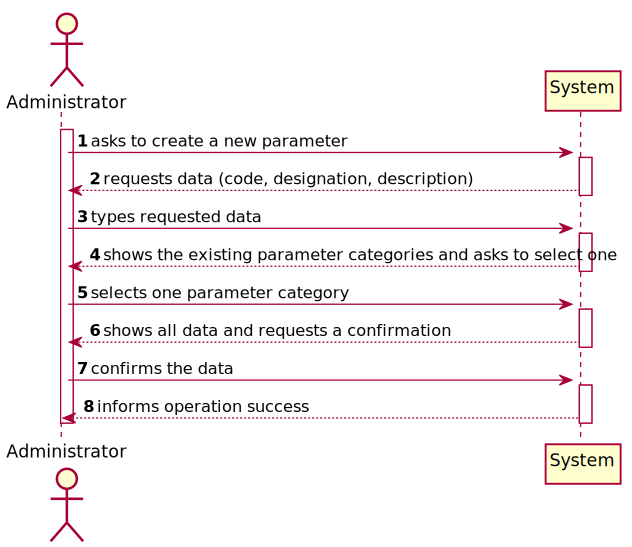
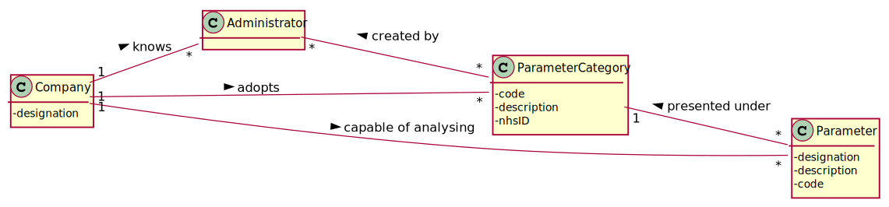

# US 10 - As an administrator, I want to specify a new parameter and categorize it.

## 1. Requirements Engineering

*In this section, it is suggested to capture the requirement description and specifications as provided by the client as well as any further clarification on it. It is also suggested to capture the requirements acceptance criteria and existing dependencies to other requirements. At last, identfy the involved input and output data and depicted an Actor-System interaction in order to fulfill the requirement.*

### 1.1. User Story Description

As an administrator, I want to specify a new parameter and categorize it.

### 1.2. Customer Specifications and Clarifications

*Insert here any related specification and/or clarification provided by the client together with **your interpretation**. When possible, provide a link to such specifications/clarifications.*

From the Specifications Document:

* "Blood tests are frequently characterized by measuring several parameters which for presentation/reporting purposes are organized by categories. For example, parameters such as the number of Red Blood Cells (RBC), White Blood Cells (WBC) and Platelets (PLT) are usually presented under the blood count (Hemogram) category."
* "Regardless, such tests rely on measuring one or more parameters that can be grouped/organized by categories."

From the client clarifications:

* Question:"What is the data that characterize a parameter?"
	* Answer:"Each parameter is associated with one category. Each parameter has a Code, a Short Name and a Description."

### 1.3. Acceptance Criteria

*Insert here the client acceptance criteria.*

* AC1:"The Code are five alphanumeric characters."
* AC2:"The Short Name is a String with no more than 8 characters."
* AC3:"The Description is a String with no more than 20 characters."

### 1.4. Found out Dependencies

*Identify here any found out dependency to other US and/or requirements.*
* There is a dependency to "US11 As an administrator, I want to specify a new parameter category" since at least a parameter category must exist to classify the parameter being created.

### 1.5 Input and Output Data

*Identity here the data to be inputted by the system actor as well as the output data that the system have/needs to present in order to properly support the actor actions. Regarding the inputted data, it is suggested to distinguish between typed data and selected data (e.g. from a list)*

Input Data

* Typed data:
  	
	* a code 
	* a short name/designation
	* a description
	

* Selected data:
  
	* Classifying parameter category

Output Data

* List of existing parameter categories
* (In)Success of the operation

### 1.6. System Sequence Diagram (SSD)

*Insert here a SSD depicting the envisioned Actor-System interactions and throughout which data is inputted and outputted to fulfill the requirement. All interactions must be numbered.*

### 1.7 Other Relevant Remarks

*Use this section to capture other relevant information that is related with this US such as (i) special requirements ; (ii) data and/or technology variations; (iii) how often this US is held.*

## 2. OO Analysis

### 2.1. Relevant Domain Model Excerpt
*In this section, it is suggested to present an excerpt of the domain model that is seen as relevant to fulfill this requirement.*

### 2.2. Other Remarks

*Use this section to capture some aditional notes/remarks that must be taken into consideration into the design activity. In some case, it might be usefull to add other analysis artifacts (e.g. activity or state diagrams).*

## 3. Design - User Story Realization

### 3.1. Rationale

**The rationale grounds on the SSD interactions and the identified input/output data.**

| Interaction ID | Question: Which class is responsible for... | Answer  | Justification (with patterns)  |
|:-------------  |:--------------------- |:------------|:---------------------------- |
| Step 1: asks to create a new parameter		 | ... interacting with the actor?				 |     CreateParameterUI        |   Pure Fabrication: there is no reason to assign this responsibility to any existing class in the Domain Model.                         |
|		 | ... starting a new parameter?				 |     Administrator        |                            |
|		 | ... coordinating the US?				 | CreateParameterController         |    Controller                          |
| Step 2: requests data 		 | n/a				 |             |                              |
| Step 3: types requested data 		 | ... saving the inputted data?					 | Parameter            |  IE: The object created in step 1 has its own data                            |
| Step 4: shows the existing parameter categories and asks to select one		 |	...	knowing the task categories to show?			 |  Company           |  IE: Parameter Categories are adopted by the Company.                            |
| Step 5: selects one parameter category	 | 	... saving the selected category?	 |  Parameter           |  IE: object created in step 1 is classified in one Parameter Category.                            |
| Step 6: shows all data and requests a confirmation 		 |		n/a					 |             |                              |
| Step 7: confirms the data 		 | 	... validating the data locally (e.g.:mandatory vs. non-mandatory	data)?					 |  Administrator          |   IE: knows all the required data                          | 
|		 | ... validating the data globally	(e.g.: duplicated)?				 |    Company         | IE: knows all the parameter objects                             |
|		 | ... saving the created parameter?			 |    Company         | IE: records all the parameter objects                             |
| Step 8: informs operation success 		 | ... informing operation success?						 | CreateParameterUI            | IE: is responsible for user interactions.    | 
### Systematization ##

According to the taken rationale, the conceptual classes promoted to software classes are:

* Administrator
* Company
* Parameter

Other software classes (i.e. Pure Fabrication) identified:

* CreateParameterUI
* CreateParameterController

## 3.2. Sequence Diagram (SD)

*In this section, it is suggested to present an UML dynamic view stating the sequence of domain related software objects' interactions that allows to fulfill the requirement.*

## 3.3. Class Diagram (CD)

*In this section, it is suggested to present an UML static view representing the main domain related software classes that are involved in fulfilling the requirement as well as and their relations, attributes and methods.*

# 4. Tests
*In this section, it is suggested to systematize how the tests were designed to allow a correct measurement of requirements fulfilling.*

**_DO NOT COPY ALL DEVELOPED TESTS HERE_**

**Test 1:** Check that it is not possible to create an instance of the Example class with null values.

	@Test(expected = IllegalArgumentException.class)
		public void ensureNullIsNotAllowed() {
		Exemplo instance = new Exemplo(null, null);
	}

*It is also recommended to organize this content by subsections.*

# 5. Construction (Implementation)

*In this section, it is suggested to provide, if necessary, some evidence that the construction/implementation is in accordance with the previously carried out design. Furthermore, it is recommeded to mention/describe the existence of other relevant (e.g. configuration) files and highlight relevant commits.*

*It is also recommended to organize this content by subsections.*

# 6. Integration and Demo

*In this section, it is suggested to describe the efforts made to integrate this functionality with the other features of the system.*

# 7. Observations

*In this section, it is suggested to present a critical perspective on the developed work, pointing, for example, to other alternatives and or future related work.*

