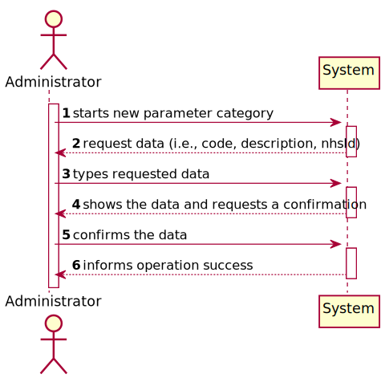
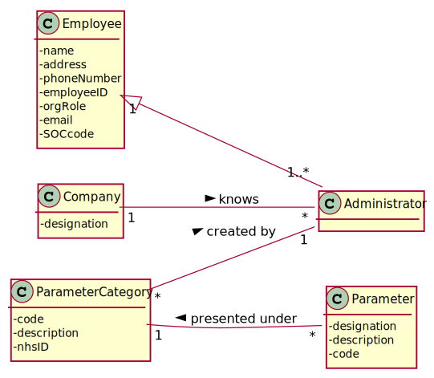

# US 11 - As an administrator, I want to specify a new parameter category.

## 1. Requirements Engineering
### 1.1. User Story Description

As an administrator, I want to specify a new parameter category.

### 1.2. Customer Specifications and Clarifications 
#### From the Specifications Document:
* “Blood tests are frequently characterized by measuring several parameters which for presentation/reporting purposes are organized by categories. For example, parameters such as the number of Red Blood Cells (RBC), White Blood Cells (RBC) and Platelets (PLT) are usually presented under the blood count (Hemogram) category.”

* “Regardless, such tests rely on measuring one or more parameters that can be grouped/organized by categories.”

#### From the client clarifications:
* Question: What are the data that characterize a parameter category?

* Answer: Simply consider a code, a description and an NHS identifier 

* Question: What are the business rules applicable to such data?

* Answer: ...

### 1.3. Acceptance Criteria

* AC1: Name cannot be empty, must be unique, having at maximum 10 chars.
* AC2: Code cannot be empty and has 10 chars

### 1.4. Found out Dependencies

As an administrator; I need to be logged in order to register a new employee.

### 1.5 Input and Output Data

#### **Input Data**
	* Typed data: code, description and NHS identifier
	* Selected data: (none)

#### **Output Data**
	* (In)Success of the operation

### 1.6. System Sequence Diagram (SSD)

### 1.7 Other Relevant Remarks

## 2. OO Analysis

### 2.1. Relevant Domain Model Excerpt

### 2.2. Other Remarks

## 3. Design - User Story Realization 

### 3.1. Rationale

| Interaction ID | Question: Which class is responsible for... | Answer  | Justification (with patterns)  |
|:-------------  |:--------------------- |:------------|:---------------------------- |
| Step 1: starts new parameter category | ... instantiating a new Parameter Category?						 | Company            | Creator: R1/2                              |
| Step 2: request data (i.e., code, description, nhsId) | n/a							 |             |                              |
| Step 3: types requested data | ...saving the input data							 | Parameter Category             | IE: The object created in step 1 has its own data.                              |
| Step 4: shows the data and requests a confirmation | ...validating the data locally (e.g.: mandatory vs. non-mandatory data)?							 | Parameter Category             | IE: knows its own data.
|                                                    | ...validating the data globally (e.g.: duplicated) ?							 | Company             | IE: knows all the ParameterCategory objects. |
| Step 5: confirms the data | ...saving the created parameter category?							 | Company             | IE: adopts/records all the ParameterCategory objects.                              |
| Step 6: informs operation success | ...informing operation success?							 | UI             | IE: responsible for user interaction.                             |              

### Systematization ##

According to the taken rationale, the conceptual classes promoted to software classes are: 

 * Company
 * ParameterCategory
 

Other software classes (i.e. Pure Fabrication) identified: 
 * CreateCategoryUI 
 * CreateCategoryController

## 3.2. Sequence Diagram (SD)

## 3.3. Class Diagram (CD)

# 4. Tests

# 5. Construction (Implementation)

# 6. Integration and Demo 

*In this section, it is suggested to describe the efforts made to integrate this functionality with the other features of the system.*

# 7. Observations

*In this section, it is suggested to present a critical perspective on the developed work, pointing, for example, to other alternatives and or future related work.*