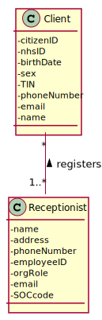
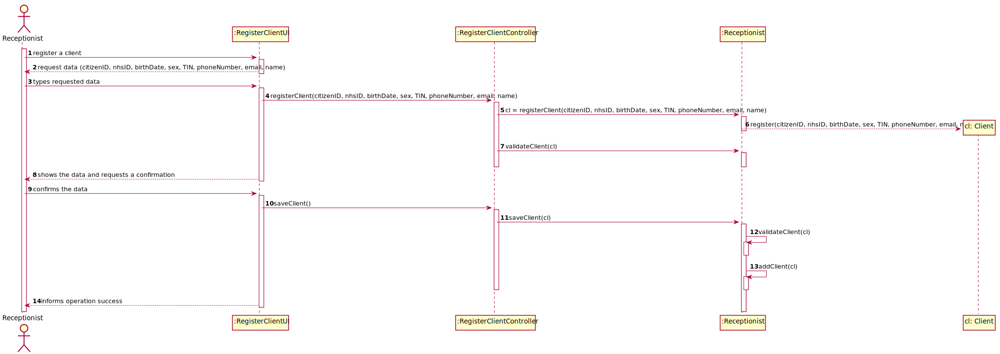
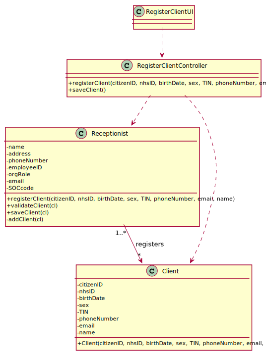

# US3 - As a receptionist, I want to register a client 

## 1. Requirements Engineering

*In this section, it is suggested to capture the requirement description and specifications as provided by the client as well as any further clarification on it. It is also suggested to capture the requirements acceptance criteria and existing dependencies to other requirements. At last, identfy the involved input and output data and depicted an Actor-System interaction in order to fulfill the requirement.*

### 1.1. User Story Description

*Insert here the User Story as described by the client.*

As a receptionist of the laboratory, I want to register a client.

### 1.2. Customer Specifications and Clarifications 

*Insert here any related specification and/or clarification provided by the client together with **your interpretation**. When possible, provide a link to such specifications/clarifications.*

From the Specifications Document:

  * " (...) a receptionist asks the client’s citizen card number, the lab order (which contains the type of test and parameters to be measured), and registers in the application the test to be performed to that client."
  * " In case of a new client, the receptionist registers the client in the application. To register a client, the receptionist needs the client’s citizen card number, National Healthcare Service (NHS) number, birth date, sex, Tax Identification number (TIF), phone number, e-mail and name."
  
From the client clarifications:

  * Question: Does the receptionist need to be logged in the app to preform the regist.
    * Answer: Yes.
  * Question: What parameter (asked by the receptionist) should the system use to create the password of the new client.
    * Answer: The password should be randomly generated. It should have ten alphanumeric characters.
  * Question: Relative to registering a new user, how should the system respond in the event of creating a new user with the same attributes of an already existing user?
    * Answer: This should be treated as an error. A subset of the attributes of any client are unique.
  * Question: And what attributes among "Citizen Card number, NHS number, Birth date, Sex, Tax Identification Number, Phone number, E-mail, Name, Employee ID, Organization Role, Address, Standard Occupational Code and Doctor Index Number" will trigger this response? 
    * Answer: The e-mail address and phone number should be unique for each user. The sex of each user is optional.
  * Question: When the receptionist is making the client registration he needs to pay ?
    * Answer: There are costs and payments but they are managed by a third party and are outside of the system. Therefore, in this project we will not consider the cost and payments associated with each test.
  * Question: The receptionist needs mandatorily of all client data described on the project description?
    * Answer: Citizen Card: 16 digit number. NHS: 10 digit number. TIN: 10 digit number. Birth day - in which format: DD/MM/YY. Sex - should only be Male/Female or include more options. Male/Female. Phone number: 11 digit number. The sex is opcional. All other fields are required.
  * Question: When registering a new client, does the system send a email with login and password to client?
    * Answer: Each users receives an e-mail informing that the registration was successful and that he can start to use the system. The e-mail includes the user password.

### 1.3. Acceptance Criteria

*Insert here the client acceptance criteria.*

  * AC1: The client must become a system user.

### 1.4. Found out Dependencies

*Identify here any found out dependency to other US and/or requirements.*

No dependencies were found.

### 1.5 Input and Output Data

*Identity here the data to be inputted by the system actor as well as the output data that the system have/needs to present in order to properly support the actor actions. Regarding the inputted data, it is suggested to distinguish between typed data and selected data (e.g. from a list)*

Input Data

  * Typed data: client’s citizen card number, National Healthcare Service (NHS) number, birth date, sex, Tax Identification number (TIN), phone number, e-mail and name.
  * Selected data:
  
Output Data

  * (In)Success of the operation

### 1.6. System Sequence Diagram (SSD)

*Insert here a SSD depicting the envisioned Actor-System interactions and throughout which data is inputted and outputted to fulfill the requirement. All interactions must be numbered.*

### 1.7 Other Relevant Remarks

*Use this section to capture other relevant information that is related with this US such as (i) special requirements ; (ii) data and/or technology variations; (iii) how often this US is held.* 

## 2. OO Analysis

### 2.1. Relevant Domain Model Excerpt 
*In this section, it is suggested to present an excerpt of the domain model that is seen as relevant to fulfill this requirement.* 

### 2.2. Other Remarks

*Use this section to capture some aditional notes/remarks that must be taken into consideration into the design activity. In some case, it might be usefull to add other analysis artifacts (e.g. activity or state diagrams).* 

## 3. Design - User Story Realization 

### 3.1. Rationale

**The rationale grounds on the SSD interactions and the identified input/output data.**

| Interaction ID | Question: Which class is responsible for... | Answer  | Justification (with patterns)  |
|:-------------  |:--------------------- |:------------|:---------------------------- |
| Step 1: register a client  		 |... register a client ?							 |Receptionist             |Creator: the receptionist registers the client in the application                              |
| Step 2: request data (citizenID, nhsID, birthDate, sex, TIN, phoneNumber, email, name		 |n/a							 |             |                              |
| Step 3: types requested data 		 |... saving the input data ?							 |Client             |The object created in step 1 has its own data                              |
| Step 4: shows the data and requests a confirmation  		 |... validating the data locally (e.g.: mandatory vs.non-mandatory data)?							 |Client             |knows its own data                             |
|								 |… validating the data globally (e.g.: duplicated)?										 |Receptionist	       |knows all the client objects         		      |
| Step 5: confirms the data  		 |... saving the created parameter category?							 |Receptionist             |records all the client objects                              |
| Step 6: informs operation success  		 |... informing operation success?							 |UI             |responsible for user interaction                              |              

### Systematization ##

According to the taken rationale, the conceptual classes promoted to software classes are: 

 * Client
 * Receptionist

Other software classes (i.e. Pure Fabrication) identified: 

 * RegisterClientUI  
 * RegisterClientController

## 3.2. Sequence Diagram (SD)

*In this section, it is suggested to present an UML dynamic view stating the sequence of domain related software objects' interactions that allows to fulfill the requirement.* 

## 3.3. Class Diagram (CD)

*In this section, it is suggested to present an UML static view representing the main domain related software classes that are involved in fulfilling the requirement as well as and their relations, attributes and methods.*

# 4. Tests 
*In this section, it is suggested to systematize how the tests were designed to allow a correct measurement of requirements fulfilling.* 

**_DO NOT COPY ALL DEVELOPED TESTS HERE_**

**Test 1:** Check that it is not possible to create an instance of the Example class with null values. 

	@Test(expected = IllegalArgumentException.class)
		public void ensureNullIsNotAllowed() {
		Exemplo instance = new Exemplo(null, null);
	}

*It is also recommended to organize this content by subsections.* 

# 5. Construction (Implementation)

*In this section, it is suggested to provide, if necessary, some evidence that the construction/implementation is in accordance with the previously carried out design. Furthermore, it is recommeded to mention/describe the existence of other relevant (e.g. configuration) files and highlight relevant commits.*

*It is also recommended to organize this content by subsections.* 

# 6. Integration and Demo 

*In this section, it is suggested to describe the efforts made to integrate this functionality with the other features of the system.*

# 7. Observations

*In this section, it is suggested to present a critical perspective on the developed work, pointing, for example, to other alternatives and or future related work.*

