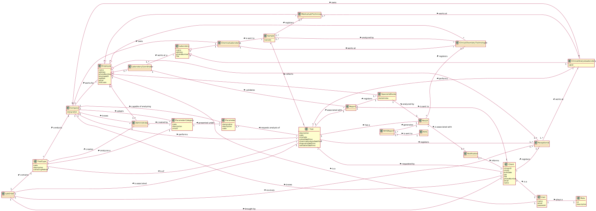

# OO Analysis #

The construction process of the domain model is based on the client specifications, especially the nouns (for _concepts_) and verbs (for _relations_) used. 

## Rationale to identify domain conceptual classes ##
To identify domain conceptual classes, start by making a list of candidate conceptual classes inspired by the list of categories suggested in the book "Applying UML and Patterns: An Introduction to Object-Oriented Analysis and Design and Iterative Development". 

### _Conceptual Class Category List_ ###

**Business Transactions**

* Test

---

**Transaction Line Items**

* Sample

---

**Product/Service related to a Transaction or Transaction Line Item**

*  Covid-19 Test 
*  Blood Test 

---

**Transaction Records**

*  Report
*  Lab order
*  Result

---

**Roles of People or Organizations**

* Client
* Administrator
* Clinical Chemistry Technologist
* Laboratory Coordinator
* Medical Lab Technician
* Receptionist
* Specialist Doctor

---

**Places**

*  Application
*  Clinical Analysis Laboratory
*  Chemical Laboratory 

---

**Noteworthy Events**

* Chemical Analysis

---

**Physical Objects**

* Swab 

---

**Descriptions of Things**

*  Type of Test (TestType)
*  Category

---

**Containers**

*  Parameters

---

**Elements of Containers**

*  PLT 
*  RBC 
*  WBC

---

**Organizations**

* Company (Many labs)

---

**Other External/Collaborating Systems**

*  External module
*  Internal code
*  Internal process 

---

###**Rationale to identify associations between conceptual classes**###

An association is a relationship between instances of objects that indicates a relevant connection and that is worth of remembering, or it is derivable from the List of Common Associations: 

+ **_A_** is physically or logically part of **_B_**
+ **_A_** is physically or logically contained in/on **_B_**
+ **_A_** is a description for **_B_**
+ **_A_** known/logged/recorded/reported/captured in **_B_**
+ **_A_** uses or manages or owns **_B_**
+ **_A_** is related with a transaction (item) of **_B_**
+ etc.

| Concept (A) 		|  Association   	|  Concept (B) |
|----------	   		|:-------------:		|------:       |
| Administrator | creates | Test Type |
| Chemical Laboratory | is a | Laboratory |
| Company | owns | Chemical Laboratory |
|         | owns | Clinical Analysis Laboratory |
|         | performs | Test |
|         | conducts | Test Type |
|	  | capable of analysing 	     | Parameter 		 |
|         | adopts | Parameter Category |
|         | knows | Administrator |
| Clinical Analysis Laboratory | performs | Test |
|			       | is a	  | Laboratory     |
| Clinical Chemistry Technologist | registers | Result |
| 				  | works at | Chemical Laboratory |
|				  | is a          | Employee  		    |
| Diagnosis Report        | associated with	     | Test 		 |
|         	          | is sent to	     	     | Client 		 |
| Employee        | works for	     | Company 		 |
| LaboratoryCoordinator | is a | Employee |
| 			| works at a| Laboratory |
| 		        | validates| Diagnosis Report |
| Lab order | brought by | Client |
|           | contains | Test Type |
| Medical lab technician | registers | Sample |
|   			 | works at  | Clinical Analysis Laboratory |
|			 | is a          | Employee                             |
| NHSReport       | is sent to	     | NHS 		 |
| Notification       | informs	     | Client		 |
| Parameter | presented under | Category |
| ParameterCategory | created by | Administrator |
| Receptionist | works at  | Clinical Analysis Laboratory |
| 			   | registers | Test |
|  			   | registers | Client |
|  			   | receives | Lab Order |
|			   | is a 	      |	Employee	  |
| Result | analyzed by | Specialist Doctor |
|	 | generates	       | NHSReport		   |
|	 | is associated with	       | Notification		   |
| Sample | analyzed by | Clinical Chemistry Technologist |
| 		 | is sent to | Chemical Laboratory |
| Specialist doctor | registers | Diagnosis Report |
| Test | requested by | Client |
|  	   | is of | Test Type |
|      | requests analysis of | Parameter |
|      | collects | Sample |
|      | has a	  | Result	   |
|      | is associated	  | Lab Order		   |

## Domain Model

