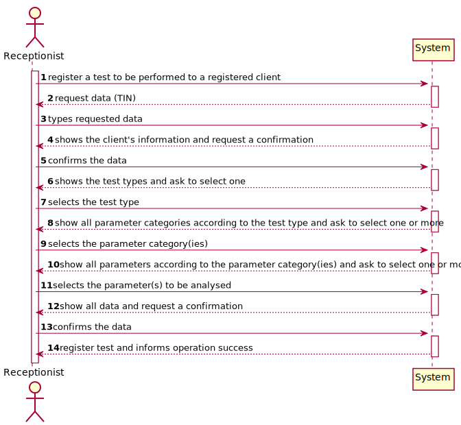
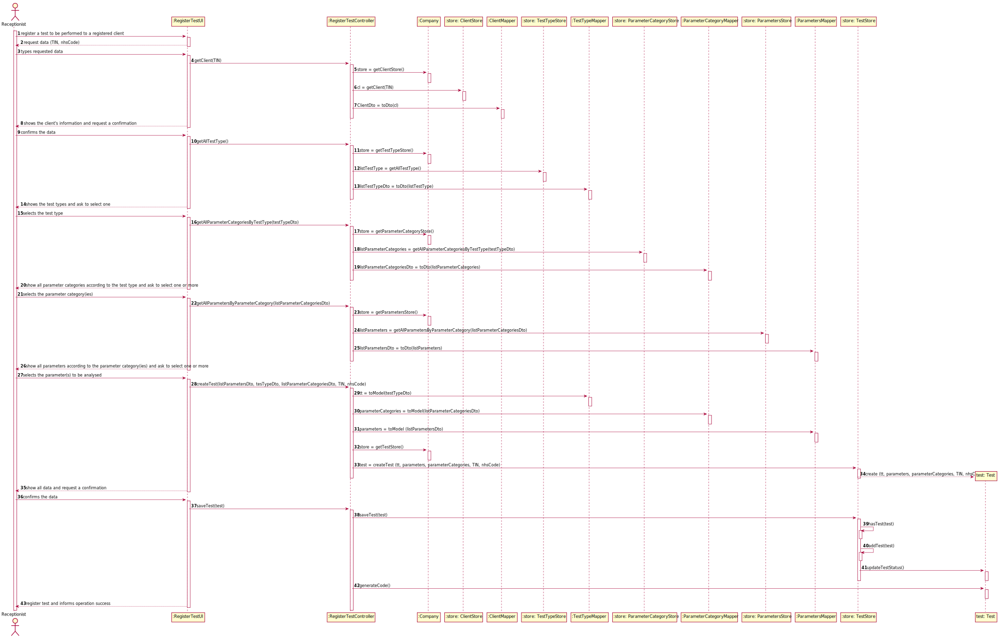

# US4 - As a receptionist, I entend to register a test

## 1. Requirements Engineering

*In this section, it is suggested to capture the requirement description and specifications as provided by the client as well as any further clarification on it. It is also suggested to capture the requirements acceptance criteria and existing dependencies to other requirements. At last, identfy the involved input and output data and depicted an Actor-System interaction in order to fulfill the requirement.*

### 1.1. User Story Description

*Insert here the User Story as described by the client.*

As a receptionist of the laboratory, I intend to register a test to be performed to a registered client.

### 1.2. Customer Specifications and Clarifications 

*Insert here any related specification and/or clarification provided by the client together with **your interpretation**. When possible, provide a link to such specifications/clarifications.*

From the Specifications Document:

* "Once there, a receptionist asks the client’s citizen card number, the lab order (which contains the type of test and parameters to be measured), and registers in the application the test to be performed to that client."

From the client clarifications:

* Question: Other than the attributes already mentioned (test code, NHS code, designation) are there any other attributes that characterize a test? [Client forum](https://moodle.isep.ipp.pt/mod/forum/discuss.php?d=8145)
    * Answer: The test attributes are: Test code : Sequential number with 12 digits. The code is automatically generated.
      NHS code: 12 alphanumeric characters.
      
* Question: On those attributes, what requirements are there? For example, the characters on a designation, the code length, etc [Client forum](https://moodle.isep.ipp.pt/mod/forum/discuss.php?d=8145)
    * Answer: The test attributes are: Test code : Sequential number with 12 digits. The code is automatically generated.
      NHS code: 12 alphanumeric characters.
      
* Question: When the receptionist chooses the test type, should the categories appear, and then when selecting the category, the receptionist can choose the parameters for the test? Or when the Receptionist chooses the test type, should appear all the parameters that it includes immediately? [Client forum](https://moodle.isep.ipp.pt/mod/forum/discuss.php?d=8181)
    * Answer: Firstly, the receptionist should choose a test type. Then choose a category from a set of categories. Last, the receptionist should choose a parameter.
  
* Question: When the recepcionist is supposed to insert the lab order in the system, does he need to insert something that defines it ( like a code ) or does the recepcionist need to insert the type of test and parameters to be measured that are contained in the lab order? [Client forum](https://moodle.isep.ipp.pt/mod/forum/discuss.php?d=8197)
    * Answer:

* Question: What exactly the client wishes is to create an authentication of the lab client based on their citizen card number. Simply put, to recognize a registered client, we must identify them by their CCN. Is that right? [Client forum](https://moodle.isep.ipp.pt/mod/forum/discuss.php?d=8199)
    * Answer:
  
* Question: I would like to ask what other parameters aside the one already metion does de receptionist need to register a new tes. [Client forum](https://moodle.isep.ipp.pt/mod/forum/discuss.php?d=8205)
    * Answer:
  
* Question: The receptionist needs to choose a registered client, is the client identified only by the citizen card number? Or is there other information needed? [Client forum](https://moodle.isep.ipp.pt/mod/forum/discuss.php?d=8208)
    * Answer:
  
* Question: How does the receptionist choose the client? Writing the data or choosing from the client's list? [Client forum](https://moodle.isep.ipp.pt/mod/forum/discuss.php?d=8208)
    * Answer:
  
* Question: The receptionist needs to choose a type of test, how is it identified? [Client forum](https://moodle.isep.ipp.pt/mod/forum/discuss.php?d=8208)
    * Answer:
  
* Question: How does the receptionist choose the type of test? Writing the data or choosing from the type of test's list? [Client forum](https://moodle.isep.ipp.pt/mod/forum/discuss.php?d=8208)
    * Answer:
  
* Question: The receptionist needs to choose the parameters, how is it identified? [Client forum](https://moodle.isep.ipp.pt/mod/forum/discuss.php?d=8208)
    * Answer:
  
* Question: How does the receptionist choose the parameters? Writing the data or choosing from the parameters' list? [Client forum](https://moodle.isep.ipp.pt/mod/forum/discuss.php?d=8208)
    * Answer:
  
* Question: One of the attributes that characterizes a test is an NHS Code. Is this code the same as the clients' NHS Number as a means of associating both? [Client forum](https://moodle.isep.ipp.pt/mod/forum/discuss.php?d=8224)
    * Answer:
  
* Question: Through which attribute in the test, would an employee know, which client is the test associated to? [Client forum](https://moodle.isep.ipp.pt/mod/forum/discuss.php?d=8224)
    * Answer:
  
* Question: Is the client profile associated with the test or only a contact through which the client will be notified that their results are available? In case of the former, do the test results need to have some kind of privacy settings (i.e., only that client can see them on the app), or does the client receive a code that can be used to access the results (by him and everyone with access to that code)? [Client forum](https://moodle.isep.ipp.pt/mod/forum/discuss.php?d=8236)
    * Answer:
  
* Question: Can the same client be associated to different tests? Does he then have an history of tests performed in the company available in the app? [Client forum](https://moodle.isep.ipp.pt/mod/forum/discuss.php?d=8236)
    * Answer:
  
* Question: Are the parameters associated through their respective code, introduced manually by the receptionist, or does the app show a list of parameters? In case of the latter, should the app show the whole list of parameters or should there be a limit of parameters shown, providing the option to go forward or back on the list? [Client forum](https://moodle.isep.ipp.pt/mod/forum/discuss.php?d=8236)
    * Answer:
  
* Question: In case the parameters are selected from a list, which are the parameters that should be shown? The ones associated with the categories which in turn are associated with the chosen type of test? [Client forum](https://moodle.isep.ipp.pt/mod/forum/discuss.php?d=8236)
    * Answer:
  
* Question: In the case of the Covid test, since the result can only be positive/negative, is there a parameter associated? And should the step of choosing a parameter be ignored in this case, i.e., should the app not even ask if the receptionist wants to add a parameter? [Client forum](https://moodle.isep.ipp.pt/mod/forum/discuss.php?d=8236)
    * Answer:
  
* Question: On the project description it says "Each test is characterized by an internal code, an NHS code, a description that identifies the sample collection method...". Are these attributes automatically generated or should they be manually introduced? Is the description automatically filled with the collection method associated with the type of test? [Client forum](https://moodle.isep.ipp.pt/mod/forum/discuss.php?d=8236)
    * Answer:
  
* Question: On the project description we have multiple attributes of date and time ("date and time when the samples were collected", etc). Are these attributes filled by the author of the respective act or is it generated by the system when those acts are performed? And while they're not performed, should these fields show "Not yet performed" or something of the sort? [Client forum](https://moodle.isep.ipp.pt/mod/forum/discuss.php?d=8236)
    * Answer:
  
* Question: Should there be a control of the phase of the test, i.e., a field that says "Sample in collection/In analysis/Results Available"? [Client forum](https://moodle.isep.ipp.pt/mod/forum/discuss.php?d=8236)
    * Answer:
  
* Question: Will there be a need to link each sample and the collection method(s) used? If so, is it associated when creating a test (US4) or when registering the samples collected (US5)? And is(are) the collection method(s) associated with the sample or with each of the parameters? [Client forum](https://moodle.isep.ipp.pt/mod/forum/discuss.php?d=8260)
    * Answer:
  
* Question: Since the Client has a Lab Order which contains the type of test and all the parameters to be measured, all the parameters selected by the Receptionist need to be equal to the Lab Order's parameters? [Client forum](https://moodle.isep.ipp.pt/mod/forum/discuss.php?d=8316)
    * Answer: Yes.
  
* Question: About the other Test attributes, do we need to have in consideration any other criteria? Is the code generated or NHS code ooptional ? [Client forum](https://moodle.isep.ipp.pt/mod/forum/discuss.php?d=8316)
    * Answer: All test attributes are mandatory. The test attributes are the following: Test code : sequential number with 12 digits. The code is automatically generated.
      NHS code: 12 alphanumeric characters.
      
* Question: I wanted to ask if the NHS code of wich test is unique or not. [Client forum](https://moodle.isep.ipp.pt/mod/forum/discuss.php?d=8432)
    * Answer: Yes.
  
* Question: In the case of the Covid test, should the step of choosing a parameter be ignored in this case, i.e., should the app not even ask if the receptionist wants to add a parameter, given that there is only one parameter associated? [Client forum](https://moodle.isep.ipp.pt/mod/forum/discuss.php?d=8442)
    * Answer: No.
  
* Question: On the project description it says "Each test is characterized by an internal code, an NHS code, a description that identifies the sample collection method...". You said that the code is a 12 digit sequential number. Does this mean that, for example, the first test will have the code "000000000001" and so on? [Client forum](https://moodle.isep.ipp.pt/mod/forum/discuss.php?d=8442)
    * Answer: Yes.
  
* Question: And should the description that identifies the sample collection method be automatically filled with the collection method associated with the type of test? [Client forum](https://moodle.isep.ipp.pt/mod/forum/discuss.php?d=8442)
    * Answer: Yes. In a previous post I said that "There exists only one collection method per test type".
  
* Question: On the project description we have multiple attributes of date and time ("date and time when the samples were collected", etc). Are these attributes filled by the author of the respective act or is it generated by the system when those acts are performed? [Client forum](https://moodle.isep.ipp.pt/mod/forum/discuss.php?d=8442)
    * Answer: The system should automatically generate the date and time of the event (test registration, chemical analysis, diagnosis and validation).
  
* Question: Is the receptionist supposed to choose from a list of Clients or should the receptionist enter the client's NHS number to get the derised client? [Client forum](https://moodle.isep.ipp.pt/mod/forum/discuss.php?d=8456)
    * Answer:
  
* Question: How is it possible to know in which laboratory the test is being registered? Should the Receptionist select the Laboratory before selecting the Test Type? [Client forum](https://moodle.isep.ipp.pt/mod/forum/discuss.php?d=8472)
    * Answer: After login the receptionist should select the laboratory where she is working. Then, the receptionist has access to the system's features/functionalities.
  
* Question: Which is the required format for the Dates associated with the test? [Client forum](https://moodle.isep.ipp.pt/mod/forum/discuss.php?d=8472)
    * Answer:
  
* Question: when the receptionist is registering a test for a client, the test can have more than one category and many parameters of the chosen categories or it only can have one category? [Client forum](https://moodle.isep.ipp.pt/mod/forum/discuss.php?d=8522)
    * Answer: Each test can have more than one category.
  
* Question: We are aware that both the receptionist and the MLT are two employees that may work on different labs. As such, do you want that Tests become associated to a specific Lab? [Client forum](https://moodle.isep.ipp.pt/mod/forum/discuss.php?d=8596)
    * Answer: Yes.
  
* Question: This means that, when the receptionist creates a new Test, this test will only be "visible" for that specific LAB (for the receptionist and the MLT only), which means that all other roles (Chemistry Technologist, Specialist Doctor and the Laboratory Coordinator) will be able to see a list of all the tests performed in any lab. [Client forum](https://moodle.isep.ipp.pt/mod/forum/discuss.php?d=8596)
    * Answer: Yes. The test will only be visible for that specific LAB and for all those working in the Chemical Laboratory.
  
* Question: Can the client have two identical tests? or the system should stop from creating the same test? [Client forum](https://moodle.isep.ipp.pt/mod/forum/discuss.php?d=8628)
    * Answer: A test is unique in the system.
  
* Question: You've said on previous questions that the NHS code contains 12 characters and is alphanumeric, so this will be different from the NHS number from the client, am I right? If so, how do we know a certain test is associated to a client? [Client forum](https://moodle.isep.ipp.pt/mod/forum/discuss.php?d=8630)
    * Answer: A test has a NHS code and a client has a NHS number. In US4 the receptionist of the laboratory should ask the client to get his TIN number. Using the TIN number the receptionist of the laboratory can find all information about the client. Do not forget that a client should be registered in the system to make a test.
  
* Question: Should we show the list of all clients available or just introduce the client's CCN ? [Client forum](https://moodle.isep.ipp.pt/mod/forum/discuss.php?d=8673)
    * Answer: The TIN number should be used to find a client and associate the client with the test.
  
* Question: Shouldn't the receptionist locate the Client by the Citizen Card Number instead of TIN Number? [Client forum](https://moodle.isep.ipp.pt/mod/forum/discuss.php?d=8684)
    * Answer: The receptionist should use the TIN number to find the client.

      
  
### 1.3. Acceptance Criteria

*Insert here the client acceptance criteria.*

* AC1: The receptionist must select the parameters to be analysed from all possible parameters in accordance with the test type.

### 1.4. Found out Dependencies

*Identify here any found out dependency to other US and/or requirements.*

* US3: As a receptionist of the laboratory, I want to register a client.
* US9: As an administrator, I want to specify a new type of test and its collecting methods.
* US10: As an administrator, I want to specify a new parameter and categorize it.

### 1.5 Input and Output Data

*Identity here the data to be inputted by the system actor as well as the output data that the system have/needs to present in order to properly support the actor actions. Regarding the inputted data, it is suggested to distinguish between typed data and selected data (e.g. from a list)*

Input Data

* Typed data: 
  * Client’s citizen card number 
  * National Healthcare Service number.
* Selected data: parameters and test type.

Output Data

* (In)Success of the operation

### 1.6. System Sequence Diagram (SSD)

*Insert here a SSD depicting the envisioned Actor-System interactions and throughout which data is inputted and outputted to fulfill the requirement. All interactions must be numbered.*

### 1.7 Other Relevant Remarks

*Use this section to capture other relevant information that is related with this US such as (i) special requirements ; (ii) data and/or technology variations; (iii) how often this US is held.* 

* This US should be quite used, since the test associated to a client, that is a system user, must be registered in the application to be performed.

## 2. OO Analysis

### 2.1. Relevant Domain Model Excerpt 
*In this section, it is suggested to present an excerpt of the domain model that is seen as relevant to fulfill this requirement.* 

### 2.2. Other Remarks

*Use this section to capture some aditional notes/remarks that must be taken into consideration into the design activity. In some case, it might be usefull to add other analysis artifacts (e.g. activity or state diagrams).* 

## 3. Design - User Story Realization 

### 3.1. Rationale

**The rationale grounds on the SSD interactions and the identified input/output data.**

| Interaction ID | Question: Which class is responsible for... | Answer  | Justification (with patterns)  |
|:-------------  |:--------------------- |:------------|:---------------------------- |
| Step 1: register a test to be performed to a registred client  		 | ... interacting with the actor?							 | RegisterTestUI             | Pure Fabrication: there is no reason to assign this responsibility to any existing class in the Domain Model.                              |
|  		 | ... coordinating the US?							 | RegisterTestController             | Controller                             |
|   		 | ... register a test?							 | TestStore            | Creator: TestStore is responsible for register a test                              |
| Step 2: request data (TIN)  		 | n/a 							 |             |                              |
| Step 3: types requested data  		 | ... confirms the input data?							 | ClientStore            | IE: knows all the client objects                              |
|   		 | ... knows ClientStore ?							 | Company            | IE: Company knows the ClientStore to which it is delegating some tasks                              |
| Step 4: shows the client's information and request a confirmation  		 | n/a 							 |             |                              |
| Step 5: confirms the data 		 | ... confirms the client's information?							 | ClientStore             | IE: knows all the client objects                            |
| Step 6: shows the test types and ask to select one  		 | n/a							 |             |                              |
| Step 7: selects the test type  		 | ...saving the selected test type?						 | Test            | IE: object created in step 1 has test type.                              |
| Step 8: show all parameter categories according to the test type and ask to select one or more  		 | n/a						 |             |                               |
| Step 9: selects the parameter category(ies) 		 | ...saving the selected parameter category(ies)?						 | Test            | IE: object created in step 1 has one or more parameter categories.                             |
| Step 10: show all parameters according to the parameter category(ies) and ask to select one or more  		 | n/a							 |             |                              |              
| Step 11: selects the parameter(s) to be analysed   		 | ...saving the selected parameter(s)?						 | Test             | IE: object created in step 1 has one or more parameters.                              |              
| Step 12: show all data and request a confirmation  		 | ... validating the data locally (e.g.: mandatory vs.non-mandatory data)?							 | Test             | IE: an object know its data                              |
|  		 | … validating the data globally (e.g.: duplicated)? 							 | TestStore             | IE: knows all the tests                              |
| Step 13: confirms the data 		 | ... saving the registered test? 							 | TestStore             | IE: records all the test objects                              |
| Step 14: register test and informs operation success  		 | ... informing operation success?							 | RegisterTestUI            | IE: responsible for user interaction                              |

### Systematization ##

According to the taken rationale, the conceptual classes promoted to software classes are: 

 * Company
 * Test

Other software classes (i.e. Pure Fabrication) identified:

 * RegisterTestUI  
 * RegisterTestController
 * ClientStore
 * TestTypeStore
 * ParameterCategoryStore
 * ParametersStore
 * TestStore

## 3.2. Sequence Diagram (SD)

*In this section, it is suggested to present an UML dynamic view stating the sequence of domain related software objects' interactions that allows to fulfill the requirement.* 

## 3.3. Class Diagram (CD)

*In this section, it is suggested to present an UML static view representing the main domain related software classes that are involved in fulfilling the requirement as well as and their relations, attributes and methods.*

# 4. Tests 
*In this section, it is suggested to systematize how the tests were designed to allow a correct measurement of requirements fulfilling.* 

**_DO NOT COPY ALL DEVELOPED TESTS HERE_**

**Test 1:** Check that it is not possible to create an instance of the Example class with null values. 

	@Test(expected = IllegalArgumentException.class)
		public void ensureNullIsNotAllowed() {
		Exemplo instance = new Exemplo(null, null);
	}

*It is also recommended to organize this content by subsections.* 

# 5. Construction (Implementation)

*In this section, it is suggested to provide, if necessary, some evidence that the construction/implementation is in accordance with the previously carried out design. Furthermore, it is recommeded to mention/describe the existence of other relevant (e.g. configuration) files and highlight relevant commits.*

*It is also recommended to organize this content by subsections.* 

# 6. Integration and Demo 

*In this section, it is suggested to describe the efforts made to integrate this functionality with the other features of the system.*

# 7. Observations

*In this section, it is suggested to present a critical perspective on the developed work, pointing, for example, to other alternatives and or future related work.*

