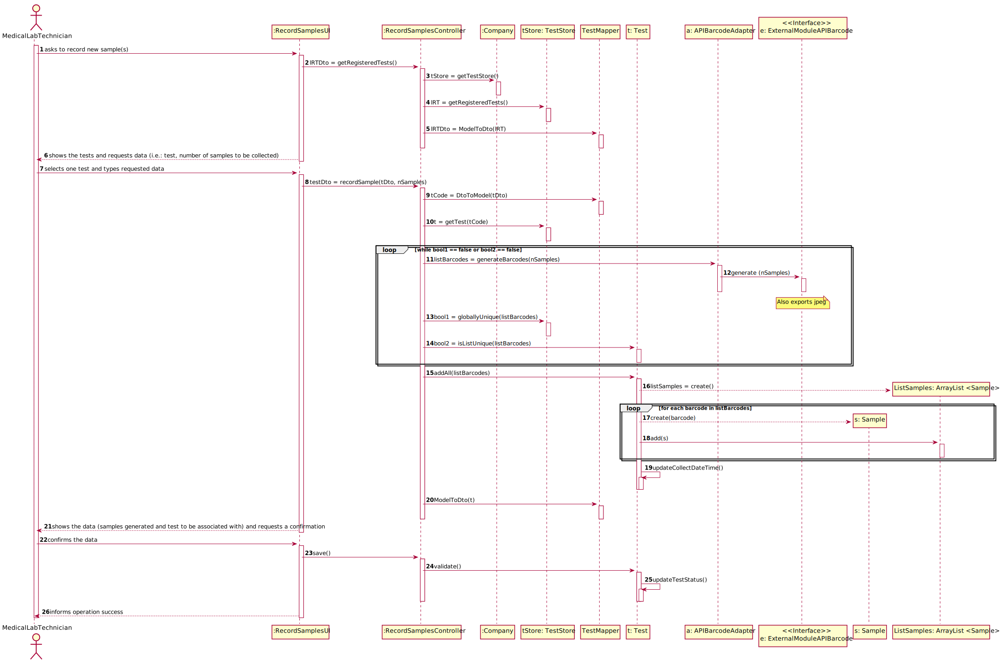

# US 05 - As a medical lab technician, I want to record samples collected in the scope of a given test.

## 1. Requirements Engineering

*In this section, it is suggested to capture the requirement description and specifications as provided by the client as well as any further clarification on it. It is also suggested to capture the requirements acceptance criteria and existing dependencies to other requirements. At last, identfy the involved input and output data and depicted an Actor-System interaction in order to fulfill the requirement.*

### 1.1. User Story Description

As a medical lab technician, I want to record samples collected in the scope of a given test.

### 1.2. Customer Specifications and Clarifications 

From the Specifications Document:

* "(...) until a medical lab technician calls him/her to collect the samples required to perform a given test." (não sei se deve estar aqui)
* "All the tests (clinical blood tests and Covid-19 tests) performed by the network of laboratories are registered locally by the medical lab technicians who collect the samples."
* "When sampling (blood or swab) the medical lab technician records the samples in the system, associating the samples with the client/test, and identifying each sample with a barcode that is automatically generated using an external API."

From the client clarifications:

* Question: "What kind of attributes should a sample have? // Can a test have more than one sample? // We didn't fully understand what will the API do in this US, so here's out interpretation from the US, correct us if we're wrong please: The API will be generated randomly and the API is an attribute from the sample."
  * [Answer:](https://moodle.isep.ipp.pt/mod/forum/discuss.php?d=8244#p10782) "Each sample is associated with a test. A sample has only one attribute, a barcode number (UPC) that is a sequential number and is automatically generated by the system. Each sample has a unique barcode number. In US5, the medical lab technician checks the system and see all tests for which there are no samples collected. The medical lab technician selects a test and the system asks for the number of samples to collect. // Yes. // The API will be used to generate/print barcodes."
  
  
* Question: "What information does the medical lab technician needs to input to the record a new sample?"
  * [Answer:](https://moodle.isep.ipp.pt/mod/forum/discuss.php?d=8360#p10930) "The medical lab technician checks a list of tests and selects one. Then, the application generates barcodes (one or more). After printing the barcodes (one or more) the use case ends."

  
* Question: "It was answered in one of the previous questions that the sample only has one attribute, the barcode, however the description of the project also mentions a date of collection of the samples, is this date supposed to be an attribute of the test and not of the sample itself? // If there were multiple samples for a single test, would there be only one collection date for all of them?"
  * [Answer:](https://moodle.isep.ipp.pt/mod/forum/discuss.php?d=8450#p11069) "Yes. The system should record the date (DD/MM/YYYY) and time (HH:MM) when the sample is collect made. The date and time are automatically generated by the system when the barcode is issued. // Only one collection date and time for a test."

* Question: "Why is there the specification for only the tests with no samples? // Shouldn't there be a way for technicians to add more samples to an existing test? // Should there be a validation of the number of samples? // After the barcodes are generated. The concept-reality link would be, for example to stick each barcode into each sample?"
  * [Answer:](https://moodle.isep.ipp.pt/mod/forum/discuss.php?d=8437#p11052) "The Medical Lab Technician selects a tests and the number of barcodes he/she wants. Then the system generates the requested barcodes. After generating the barcodes, the select test is no more available in the system for generating barcodes. // No. // No. // Yes. Each generated barcode should be saved in a folder as a jpeg file."

* Question: "Is there a specific order/priority for the medical lab technician to select the test to which he wants to collect the samples, or is the selection random? If there is an order, how is a test chosen?"
  * [Answer:](https://moodle.isep.ipp.pt/mod/forum/discuss.php?d=8541#p11196) "The medical lab technician selects the test and the system generates the barcodes."

* Question: "During the current sprint, how should we allow the barcodes to be printed. After generating them via the API, should we save the barcode images to the disk?"
  * [Answer:](https://moodle.isep.ipp.pt/mod/forum/discuss.php?d=8491#p11119) "Each generated barcode should be saved in a folder as a jpeg file."

* Question: "What information does the medical lab technician needs to input to the record a new sample?"
  * [Answer:](https://moodle.isep.ipp.pt/mod/forum/discuss.php?d=8360#p10930) "The medical lab technician checks a list of tests and selects one. Then, the application generates barcodes (one or more). After printing the barcodes (one or more) the use case ends."  

* Question: "What is supposed to show to the Medical Lab Technician when he selects the pretended test ?"
  * [Answer:](https://moodle.isep.ipp.pt/mod/forum/discuss.php?d=8583#p11247) "Firstly, the Medical Lab Technician checks the system to see the tests/clients that need to be done. Before selecting a test, the Medical Lab Technician checks/see the name of the client and all the test data (test attributes, test type, collection method, parameters, etc.). Then, the Medical Lab Technician selects one test/client and the system asks for the number of samples to collect. Next, the system generates the barcodes to put in the samples."

* Question: "Regarding US5, after selecting the number of samples for the test chosen by the medical lab tec., should the barcodes be displayed on the screen, or just printed and saved?"
  * [Answer:](https://moodle.isep.ipp.pt/mod/forum/discuss.php?d=8589#p11253) "Should be saved in a file."

* Question: ""
  * [Answer:]() ""

### 1.3. Acceptance Criteria

* AC1:"The system should support several barcode APIs. The API to use is defined by configuration."

### 1.4. Found out Dependencies

* There is a dependency to "US04  As a receptionist of the laboratory, I intend to register a test to be performed to a registered client." since at least a test must be registered to associate samples to it.

### 1.5 Input and Output Data

Input Data

* Typed data:

  * Number of samples to be collected

* Selected data:

  * Test

Output Data

* List of tests with no samples collected
* (In)Success of the operation

### 1.6. System Sequence Diagram (SSD)

*Insert here a SSD depicting the envisioned Actor-System interactions and throughout which data is inputted and outputted to fulfill the requirement. All interactions must be numbered.*

### 1.7 Other Relevant Remarks

*Use this section to capture other relevant information that is related with this US such as (i) special requirements ; (ii) data and/or technology variations; (iii) how often this US is held.* 

## 2. OO Analysis

### 2.1. Relevant Domain Model Excerpt 
*In this section, it is suggested to present an excerpt of the domain model that is seen as relevant to fulfill this requirement.* 

### 2.2. Other Remarks

*Use this section to capture some aditional notes/remarks that must be taken into consideration into the design activity. In some case, it might be usefull to add other analysis artifacts (e.g. activity or state diagrams).* 

## 3. Design - User Story Realization 

### 3.1. Rationale

**The rationale grounds on the SSD interactions and the identified input/output data.**

| Interaction ID | Question: Which class is responsible for... | Answer  | Justification (with patterns)  |
|:-------------  |:--------------------- |:------------|:---------------------------- |
| Step 1: asks to record new sample(s) | ... interacting with the actor? | RecordSamplesUI         | Pure Fabrication: there is no reason to assign this responsibility to any existing class in the Domain Model |
|                                      | ... creating a new sample?      | Test                    | Creator: According to the Domain Model, a Test aggregates sample                                             |
|                                      | ... coordinating the US?        | RecordSamplesController | Controller                                                                                                   |
| Step 2: shows the tests and requests data (i.e.: test, number of samples to be collected) |	... knowing the tests to show? | RecordSamplesUI and TestStore | IE and Creator: UI is responsible for showing it and the Test Store is able to retrieve the available tests. |
| Step 3: selects one test and types requested data | ... saving the selected test? | Sample  | IE: The object created in step 1 needs to be related to a test       |
|                                                   | ... knowing TestStore?        | Company | IE: Company knows the TestStore to which it is delegating some tasks |
| Step 4: shows the data (samples generated and test to be associated with) and requests a confirmation | ... generating the barcode(s)?            | ExternalModuleAPIBarcode | Protected Variations: because this is a point of variation and instability, it was found necessary to create a stable interface to decrease this point of variation |              
|                                                                                                       | ... requesting the barcode(s) to the API? | APIBarcodeAdapter        | HC+LC |
|                                                                                                       | ... saving the barcode generated?         | Sample                   | IE: a sample knows its data |
| Step 5: confirms the data | ...validating the data locally (e.g.: mandatory vs. non-mandatory data)? | Sample    | IE: is able to validate a new sample |              
|                           | ...validating the data globally (e.g.: duplicated)?                      | TestStore | IE: knows all the test objects which may contain samples    |
|                           | ...saving the created sample(s)?                                         | Test      | IE: records all the sample objects   |
| Step 6: informs operation success | ... informing	operation success? | RecordSamplesUI | IE: is responsible for user interactions |

### Systematization ##

According to the taken rationale, the conceptual classes promoted to software classes are: 

 * Test
 * Sample
 * TestStore
 * Company
 * ExternalModuleAPIBarcode
 * APIBarcodeAdapter

Other software classes (i.e. Pure Fabrication) identified: 
 
 * RecordSamplesUI  
 * RecordSamplesController

## 3.2. Sequence Diagram (SD)

*In this section, it is suggested to present an UML dynamic view stating the sequence of domain related software objects' interactions that allows to fulfill the requirement.* 

## 3.3. Class Diagram (CD)

*In this section, it is suggested to present an UML static view representing the main domain related software classes that are involved in fulfilling the requirement as well as and their relations, attributes and methods.*

# 4. Tests 
*In this section, it is suggested to systematize how the tests were designed to allow a correct measurement of requirements fulfilling.* 

**_DO NOT COPY ALL DEVELOPED TESTS HERE_**

**Test 1:** Check that it is not possible to create an instance of the Example class with null values. 

	@Test(expected = IllegalArgumentException.class)
		public void ensureNullIsNotAllowed() {
		Exemplo instance = new Exemplo(null, null);
	}

*It is also recommended to organize this content by subsections.* 

# 5. Construction (Implementation)

**RecordSamplesController**

    public class RecordSamplesController{
      private App app;
      private Company company;
      private TestStore testStore;
      private Test test;
      private List<Test> testList;
      private List<TestDto> testDtoList;
      private String tCode;
      private boolean bool1=false;
      private boolean bool2=false;
      private List<Barcode> listBarcodes;
      private TestDto testDto;
      private APIBarcodeAdapter adapter;

      public RecordSamplesController() throws Exception {
      }

      public List<TestDto> getRegisteredTests(){
      }

      public TestDto recordSample(TestDto tDto, int nSamples) throws Exception {
      }

      public void deleteBarcode(int nSamples) throws Exception{
      }

      public boolean save(){
      }
    }

**Company**

    public class Company{
      private TestStore testStore;
      //...(omitted)

      public TestStore getTestStore (){
      }
    }

**TestStore**

    public class TestStore{
      private List<Test> TestList;

      public List<Test> getRegisteredTests(){
      }

      public Test getTest(String code){
      }

      public boolean globallyUnique(List<Barcode> listBarcodes){
      }
    }

**TestMapper**

    public class TestMapper{
      public static List<TestDto> ModelToDto (List<Test> listTest){
      }
    
      public static TestDto ModelToDto (Test test){
      }
    
      public static String DtoToModel (TestDto testDto){
      }
    }

**Test**

    public class Test{
      private Status state;
    
      private List<Barcode> testBarcodesList = new ArrayList<>();
    
      private ArrayList<Sample> listSamples = new ArrayList<>();
    
      private Date collectDateTime;
    
      public void updateTestStatus(){
      }
    
      public boolean isListUnique(List<Barcode> listBarcodes){
      }
    
      public void addAll(List<Barcode> listBarcodes){
      }
    
      public List<Sample> create(){
      }
    
      public void updateCollectDateTime(){
      }
    
      public boolean validate(){
      }
    }

**APIBarcodeAdapter**

    public class APIBarcodeAdapter {
      private ExternalModuleAPIBarcode barcode;
    
      public APIBarcodeAdapter() throws Exception{
      }
    
      public List<Barcode> generateBarcodes(int nSamples, boolean a) throws Exception {
      }
    }

**ExternalModuleAPIBarcode**
    
    public interface ExternalModuleAPIBarcode{
      List<Barcode> generate(int nSamples, boolean a) throws Exception;
    }

**ExternalModuleAPIBarcode1**

    public class ExternalModuleAPIBarcode1 implements ExternalModuleAPIBarcode{
      private int nSamples;

      private int nBarcodes=0;

      private boolean a;

      private String fileName;

      private File outputFile;

      private String path;

      private String barcodeCode;

      private List<Barcode> barcodeGenerated;

      public ExternalModuleAPIBarcode1 () throws Exception{
      }

      public List<Barcode> generate(int nSamples, boolean a) throws Exception {
      }

      public static String generateFileName(int totalBarcodes){
      }

      public void writeBarcode(BufferedImage image){
      }

      public void deleteBarcode(){
      }
    }

**Sample**

    public class Sample {
      private Barcode barcode;

      public Sample(Barcode barcode){
      }

      public Sample (){
      }

      public Barcode getBarcode(){
      }
    }

# 6. Integration and Demo 

*In this section, it is suggested to describe the efforts made to integrate this functionality with the other features of the system.*

# 7. Observations

*In this section, it is suggested to present a critical perspective on the developed work, pointing, for example, to other alternatives and or future related work.*

