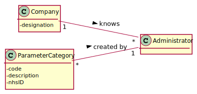
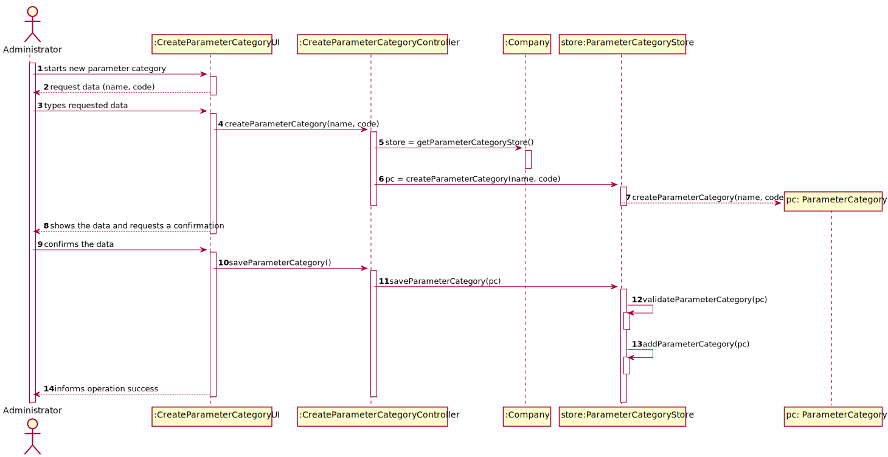
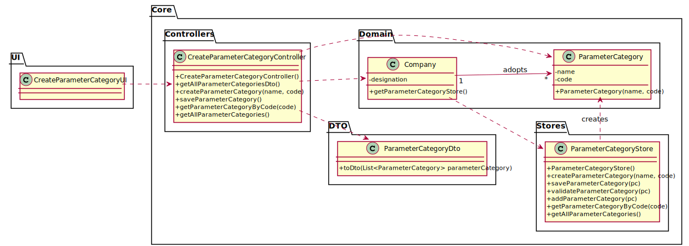

# US 11 - As an administrator, I want to specify a new parameter category.

## 1. Requirements Engineering
### 1.1. User Story Description

As an administrator, I want to specify a new parameter category.

### 1.2. Customer Specifications and Clarifications 
#### From the Specifications Document:

* “Blood tests are frequently characterized by measuring several parameters which for presentation/reporting purposes are organized by categories. For example, parameters such as the number of Red Blood Cells (RBC), White Blood Cells (RBC) and Platelets (PLT) are usually presented under the blood count (Hemogram) category.”

* “Regardless, such tests rely on measuring one or more parameters that can be grouped/organized by categories.”

#### From the client clarifications:
* Question: What are the data that characterize a parameter category?

* Answer: Simply consider a name and a code.[Client Forum](https://moodle.isep.ipp.pt/mod/forum/discuss.php?d=7507#p10106)

* Question: What are the business rules applicable to such data?

* Answer: Code must have five alphanumeric characters. The code is unique and is not automatically generated and the name Name is a string with no more than 10 characters; [Client Forum](https://moodle.isep.ipp.pt/mod/forum/discuss.php?d=7899#p10415)

### 1.3. Acceptance Criteria

* AC1: Name cannot be empty, must be unique, having at maximum 10 chars.
* AC2: Code cannot be empty and has 5 chars.

### 1.4. Found out Dependencies

US - As an administrator; I need to be logged in order to register a new employee.

### 1.5 Input and Output Data

#### **Input Data**
* Typed data: name, code
* Selected data: (none)

#### **Output Data**
* (In)Success of the operation

### 1.6. System Sequence Diagram (SSD)

### 1.7 Other Relevant Remarks

## 2. OO Analysis

### 2.1. Relevant Domain Model Excerpt

### 2.2. Other Remarks

## 3. Design - User Story Realization 

### 3.1. Rationale

| Interaction ID | Question: Which class is responsible for... | Answer  | Justification (with patterns)  |
|:-------------  |:--------------------- |:------------|:---------------------------- |
| Step 1: starts new parameter category | ... instantiating a new Parameter Category? | ParameterCategoryStore | Creator |
| Step 2: request data (i.e., code, description, nhsId) | ... requesting data | CreateParameterCategoryUI| IE: responsible for user interaction |
| Step 3: types requested data | ...saving the input data | Parameter Category | IE: The object created in step 1 has its own data.  |
| Step 4: shows the data and requests a confirmation | ...validating the data locally (e.g.: mandatory vs. non-mandatory data)?	| ParameterCategory | IE: knows its own data. |
|                                                    | ...validating the data globally (e.g.: duplicated) ?	 | ParameterCategoryStore | IE: knows all the ParameterCategory objects. |
| Step 5: confirms the data | ...saving the created parameter category?	| ParameterCategoryStore | IE: adopts/records all the ParameterCategory objects. |
| Step 6: informs operation success | ...informing operation success? | CreateParameterCategoryUI | IE: responsible for user interaction. |              

### Systematization ##

According to the taken rationale, the conceptual classes promoted to software classes are: 

 * Company
 * ParameterCategoryStore
 * ParameterCategory

Other software classes (i.e. Pure Fabrication) identified: 
 * CreateCategoryUI 
 * CreateCategoryController

## 3.2. Sequence Diagram (SD)

## 3.3. Class Diagram (CD)

# 4. Tests

**Test 1:** Tests the functionality of creating by a Parameter Category.
    
    @Test(expected = IllegalArgumentException.class)
    public void setName() {
      ParameterCategory test = new ParameterCategory("", "c0de1");
    }

**Test 2:** Tests that is impossible to create a ParameterCategory object with no code.

    @Test
    public void createParameterCategory() {
        CreateParameterCategoryController pcControllerTest = new CreateParameterCategoryController();
        boolean pcTest = pcControllerTest.createParameterCategory("CovidTest", "c0vid");
        assertEquals(true, pcTest);

    }

**Test 3:** Tests the functionality of validating a ParameterCategory by the ParameterCategoryStore.

    @Test
    public void validateParameterCategory() {
        ParameterCategoryStore pcStoreTest = new ParameterCategoryStore();
        ParameterCategory pc1 = pcStoreTest.createParameterCategory("test", "test0");
        assertTrue(pcStoreTest.validateParameterCategory(pc1));
    }

# 5. Construction (Implementation)

* ParameterCategory Class:

      public class ParameterCategory {

          private String name;

          private String code;

          private static final int NAME_MAX_LENGTH = 10;

          private static final int CODE_LENGTH = 5;

          public ParameterCategory(String name, String code){}

          public void setName(String name){}      

          public void setCode(String code){}
      
          public String getName(){}
      
          public String getCode(){}

          @Override
          public String toString() {}

          @Override
          public boolean equals(Object obj) {}
      }

* ParameterCategoryStore class:

      public class ParameterCategoryStore {

          private List<ParameterCategory> parameterCategoryList;

          public ParameterCategoryStore(){}

          public ParameterCategory createParameterCategory(String name, String code){}

          public boolean saveParameterCategory(ParameterCategory pc){}

          public boolean validateParameterCategory(ParameterCategory pc){}

          public boolean addParameterCategory(ParameterCategory pc) {}

          public ParameterCategory getParameterCategoryByCode(String code){}

          public List<ParameterCategory> getAllParameterCategories(){}
      }

* CreateParameterCategoryController class:

      public class CreateParameterCategoryController {

          private App app;

          private Company company;

          private ParameterCategoryStore pcStore;

          private ParameterCategory pc;

          public CreateParameterCategoryController(){}

          public List<ParameterCategoryDto> getAllParameterCategoriesDto(){}

          public boolean createParameterCategory(String name, String code){}

          public boolean saveParameterCategory(){}

          public ParameterCategory getParameterCategoryByCode(String code){}

          public List<ParameterCategory> getAllParameterCategories(){}
      }       

* CreateParameterCategoryUI:

      public class CreateParameterCategoryUI implements Runnable{

          private CreateParameterCategoryController pcController;

          private List<ParameterCategoryDto> parameterCategoriesListDto;

          public CreateParameterCategoryUI() {}

          public void run(){}
      }

* ParameterCategoryDto class:

      public class ParameterCategoryDto {

          private String name;

          private String code;

          public ParameterCategoryDto(String name, String code){}
    
          public String getName(){}

          public String getCode(){}

          public String toString(){}

      }

# 6. Integration and Demo 

* This User Story was deeply important to integrate, since a Test Type requires a Parameter Category or a set of Parameter Categories in order to be performed. Consequently, like stated in the US09, a Clinical Analysis Laboratory requires a Test Type to operate.

# 7. Observations

* The developed work was made in order to allow an easy implementation of future changes. Also, it was made applying the LC-HC Standards.