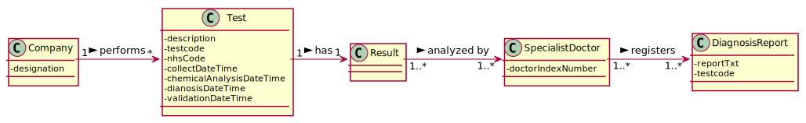
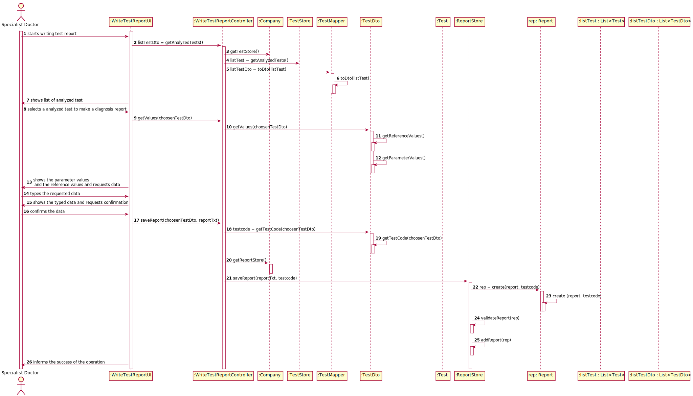

# US 14 - Write a report for a given test.

## 1. Requirements Engineering

### 1.1. User Story Description

As a specialist doctor, I intend to make the diagnosis and write a report for a given test.

### 1.2. Customer Specifications and Clarifications 

Question: What characterizes a diagnosis? What it needs to have in it to be a valid diagnosis?

Answer: The report contains the diagnosis. The report is free text and should have no more than 400 words. 

Question: Regarding the tests that the Specialist Doctor can write a report about. Should the SD chose from a list of tests? Should him only receive a list of test that have completed all the previous steps?

Answer: The system shows all tests ready (that have completed all the previous steps) to make the diagnosys and the Specialist Doctor selects one test. Then, the Specialist Doctor writes the report for the selected test.
### 1.3. Acceptance Criteria

*Insert here the client acceptance criteria.*

### 1.4. Found out Dependencies

### 1.5 Input and Output Data

**Input Data:**

* Diagnosis Report

**Output Data:**

* List of analyzed tests
* Reference values and analyzed parameters values of the choosen test
* (In)Success of the operation

### 1.6. System Sequence Diagram (SSD)

*Insert here a SSD depicting the envisioned Actor-System interactions and throughout which data is inputted and outputted to fulfill the requirement. All interactions must be numbered.*

### 1.7 Other Relevant Remarks

*Use this section to capture other relevant information that is related with this US such as (i) special requirements ; (ii) data and/or technology variations; (iii) how often this US is held.* 

## 2. OO Analysis

### 2.1. Relevant Domain Model Excerpt 

### 2.2. Other Remarks

*Use this section to capture some aditional notes/remarks that must be taken into consideration into the design activity. In some case, it might be usefull to add other analysis artifacts (e.g. activity or state diagrams).* 

## 3. Design - User Story Realization 

### 3.1. Rationale

**The rationale grounds on the SSD interactions and the identified input/output data.**

| Interaction ID | Question: Which class is responsible for... | Answer  | Justification (with patterns)  |
|:-------------  |:--------------------- |:------------|:---------------------------- |
| Step 1: write a report about a test result  		 |	...interacting with the actor?						 |  WritesTestReportUI           |    Pure Fabrication: responsible for user interaction                          |
| 		 |	...coordinating the US?						 |  WritesTestReportController          |    Controller                          |
| 		 |	...reading the inputed data?					 |  WritesTestReportUI       |    Controller                          |
| Step 2: shows the list of analyzed test  		 |	presenting the list of analyzed tests?						 | WriteTestReportUI             | IE: responsible for user interaction                             |
| Step 3: selects an analyzed test  		 |	...reading the inputed data?						 | WriteTestReportUI            |  IE: responsible for user interaction                            |
|  		 |	...saving the inputed data?						 | TestDTO            |  IE: responsible for user interaction                            |
| Step 4: request data  		 |	...reading the inputed data?		 | WriteTestReportUI            |         IE: responsible for user interaction                     |
| Step 5: types requested data  		 |	saving the inputed data?						 |             |                              |
| Step 6: shows the data and requests confirmation   		 |							 |             |                              |   
| Step 7: confirms data  		 |							 |             |                              |  
| Step 8: informs operation success  		 |							 |             |                              |  

### Systematization ##

According to the taken rationale, the conceptual classes promoted to software classes are: 

 * DiagnosisReport
 * Company
 * 

Other software classes (i.e. Pure Fabrication) identified: 

 * WriteTestReportUI
 * WriteTestReportController 
 * ReportStore
 * TestDto

## 3.2. Sequence Diagram (SD)

*In this section, it is suggested to present an UML dynamic view stating the sequence of domain related software objects' interactions that allows to fulfill the requirement.* 

## 3.3. Class Diagram (CD)

*In this section, it is suggested to present an UML static view representing the main domain related software classes that are involved in fulfilling the requirement as well as and their relations, attributes and methods.*

# 4. Tests 
*In this section, it is suggested to systematize how the tests were designed to allow a correct measurement of requirements fulfilling.* 

**_DO NOT COPY ALL DEVELOPED TESTS HERE_**

**Test 1:** Check that it is not possible to create an instance of the Example class with null values. 

	@Test(expected = IllegalArgumentException.class)
		public void ensureNullIsNotAllowed() {
		Exemplo instance = new Exemplo(null, null);
	}

*It is also recommended to organize this content by subsections.* 

# 5. Construction (Implementation)

*In this section, it is suggested to provide, if necessary, some evidence that the construction/implementation is in accordance with the previously carried out design. Furthermore, it is recommeded to mention/describe the existence of other relevant (e.g. configuration) files and highlight relevant commits.*

*It is also recommended to organize this content by subsections.* 

# 6. Integration and Demo 

*In this section, it is suggested to describe the efforts made to integrate this functionality with the other features of the system.*

# 7. Observations

*In this section, it is suggested to present a critical perspective on the developed work, pointing, for example, to other alternatives and or future related work.*

