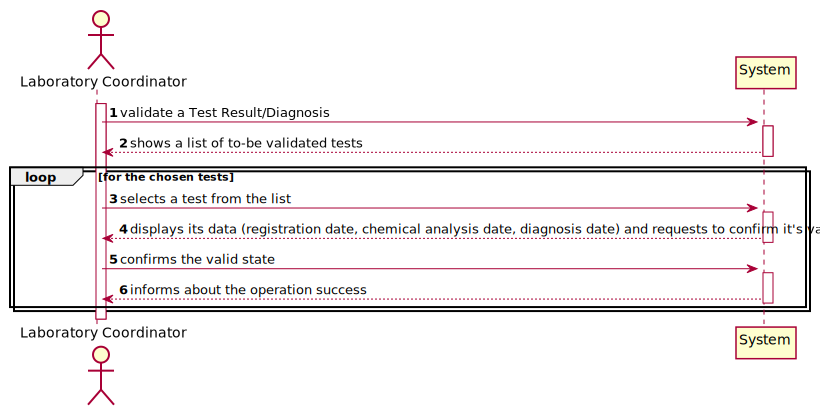
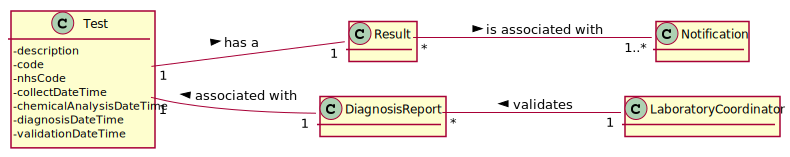

# US 15 - As a laboratory coordinator, I want to validate the work done by the clinical chemistry technologist and specialist doctor.

## 1. Requirements Engineering

### 1.1. User Story Description

* As a laboratory coordinator, I want to validate the work done by the clinical chemistry technologist and specialist doctor.

### 1.2. Customer Specifications and Clarifications

**From the specifications document:**

* "To validate the work done, the laboratory coordinator checks the chemical test/result and associated diagnosis made and confirms that everything was done correctly. "

**From the client clarifications:**

* Question: What stages of validation should be considered? [Client Forum](https://moodle.isep.ipp.pt/mod/forum/discuss.php?d=8174#p10701)
    * Answer: (yet to be answered) 
  
  
* Question: Should the tests be validated one by one, or as a group? [Client Forum](https://moodle.isep.ipp.pt/mod/forum/discuss.php?d=8180#p10708)
    * Answer: (yet to be answered)
  

* Question: Is the test sent to the laboratory coordinator or does he fetch it through a code? [Client Forum](https://moodle.isep.ipp.pt/mod/forum/discuss.php?d=8177#p10704)
    * Answer: (yet to be answered)
  

* Question: What if a certain test is invalid? Should it be scrapped or have the laboratory Coordinator propose to redo it? [Client Forum](https://moodle.isep.ipp.pt/mod/forum/discuss.php?d=8177#p10704)
    * Answer: (yet to be answered)
    

* Question: Can "Valid" or "Invalid" be accepted as a confirmation? If so, are these states available from a list of options? [Client Forum](https://moodle.isep.ipp.pt/mod/forum/discuss.php?d=8251#p10789)
    * Answer: (yet to be answered)

### 1.3. Acceptance Criteria

* AC1: The system does not show client personal information but shows all dates (test registration date, chemical analysis date and diagnosis date).

### 1.4. Found out Dependencies

* US12: As a clinical chemistry technologist, I intend to record the results of a given test.

* US14: As a specialist doctor, I intend to make the diagnosis and write a report for a given test.

### 1.5 Input and Output Data

**Input data**

* Typed data: (none)
* Selected data: State of validation.

**Output data**

*  (In)Success of the operation of defining a certain Test and saving it.

### 1.6. System Sequence Diagram (SSD)

### 1.7 Other Relevant Remarks

* Regarding the process of having a certain test to a client, this US can be considered as the final step of the process, since the one that follows, is described as sending the results as notification to the client. 

## 2. OO Analysis

### 2.1. Relevant Domain Model Excerpt

### 2.2. Other Remarks

The US09 is heavily dependent on the US11 contents, since a Test Type cannot be created without a Parameter Category. 

## 3. Design - User Story Realization 

### 3.1. Rationale

**The rationale grounds on the SSD interactions and the identified input/output data.**

| Interaction ID | Question: Which class is responsible for... | Answer  | Justification (with patterns)  |
|:-------------  |:--------------------- |:------------|:---------------------------- |
| Step 1: register a type of test | ...creating a new type of test? | TestTypeStore | Creator: The TestTypeStore is responsible for creating a test type|
|                                 | ...coordinating the US?  | createTestTypeController | Controller| 
| Step 2: shows a list of Parameter Categories | ...showing the available options? | createTestTypeUI and ParameterCategoryController| IE and Creator: UI is responsible for showing it and the Parameter Category Store is able to retrieve the available categories |
| Step 3: selects a category from the list | ...making the list available? | createTestTypeUI | IE: allows user to insert the intended option |
| Step 4: request data(code, description, collectingMethod) | ...requesting the data? | createTestTypeUI | IE: responsible for user interaction 
| Step 5: types requested data | ...saving the input data? | TestTypeStore | IE: The TestTypeStore is responsible for saving the new test type, since it was responsible for creating it and will validate it 
| Step 6: validates the data, shows it and requests a confirmation | ... validating the data locally (e.g.: mandatory vs.non-mandatory data)? | TestType | IE: is able to validate a new Test Type, according to the provided Acceptance Criteria 
|                                                                  | ... validating the data globally (e.g.: duplicated)? | TestTypeStore | IE: knows all TestType objects
| Step 7: confirms the data | ... saving the typed data? | TestTypeStore | Creator: saves all the TestType objects
| Step 8: adds test to list and informs operation success | ...informing addition success? | createTestTypeUI | IE: responsible for user interaction

### Systematization ##

According to the taken rationale, the conceptual classes promoted to software classes are: 

 * LaboratoryCoordinator  

Other software classes (i.e. Pure Fabrication) identified: 
 
 * validatexUI
 * validatexController

## 3.2. Sequence Diagram (SD)

## 3.3. Class Diagram (CD)

# 4. Tests

**Test 1:** Tests if (description)

# 5. Construction (Implementation)
  

# 6. Integration and Demo 

* This User Story was deeply important to integrate in our code, since a Clinical Analysis Laboratory cannot operate without having available Test Types.

# 7. Observations

* The developed work was made in order to allow an easy implementation of future changes. For example, the implementation of an Equals method (that overrides the Object equals).