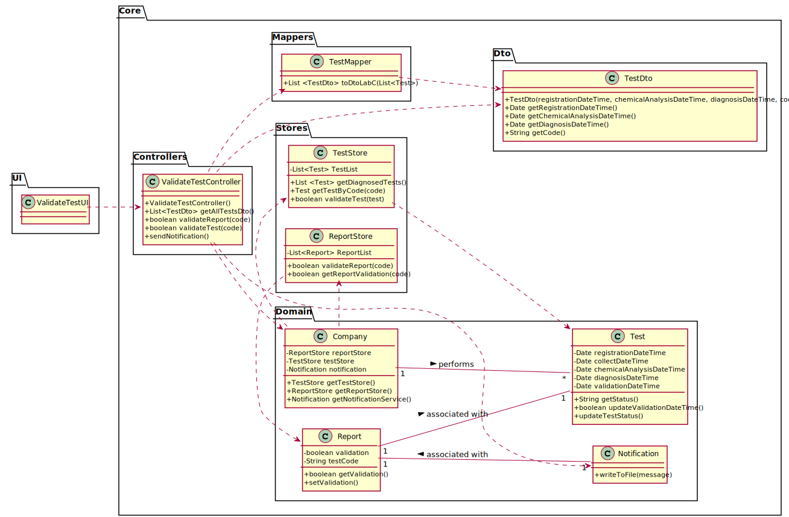

# US 15 - As a laboratory coordinator, I want to validate the work done by the clinical chemistry technologist and specialist doctor.

## 1. Requirements Engineering

### 1.1. User Story Description

* As a laboratory coordinator, I want to validate the work done by the clinical chemistry technologist and specialist doctor.

### 1.2. Customer Specifications and Clarifications

**From the specifications document:**

* "To validate the work done, the laboratory coordinator checks the chemical test/result and associated diagnosis made and confirms that everything was done correctly. "

**From the client clarifications:**

* Question: What stages of validation should be considered? [Client Forum](https://moodle.isep.ipp.pt/mod/forum/discuss.php?d=8174#p10701)
    * Answer: (yet to be answered) 
  
  
* Question: Should the tests be validated one by one, or as a group? [Client Forum](https://moodle.isep.ipp.pt/mod/forum/discuss.php?d=8180#p10708)
    * Answer: "The coordinator can validate all or a subset of test results."
  

* Question: Is the test sent to the laboratory coordinator or does he fetch it through a code? [Client Forum](https://moodle.isep.ipp.pt/mod/forum/discuss.php?d=8177#p10704)
    * Answer: "The system shows all tests ready to validate (tests that already have the test registration date, the chemical analysis date and the diagnosis date registered in the system) and the laboratory coordinator selects one or more tests to mark as validated."
  

* Question: What if a certain test is invalid? Should it be scrapped or have the laboratory Coordinator propose to redo it? [Client Forum](https://moodle.isep.ipp.pt/mod/forum/discuss.php?d=8177#p10704)
    * Answer: The objective is for the laboratory coordinator to be aware of the work developed in the chemical laboratory and to mark the job as done.
    

* Question: Can "Valid" or "Invalid" be accepted as a confirmation? If so, are these states available from a list of options? [Client Forum](https://moodle.isep.ipp.pt/mod/forum/discuss.php?d=8251#p10789)
    * Answer: "Only Valid state, and the laboratory coordinator selects one or more tests to mark as validated.

### 1.3. Acceptance Criteria

* AC1: The system does not show client personal information but shows all dates (test registration date, chemical analysis date and diagnosis date).

### 1.4. Found out Dependencies

* US12: As a clinical chemistry technologist, I intend to record the results of a given test.

* US14: As a specialist doctor, I intend to make the diagnosis and write a report for a given test.

### 1.5 Input and Output Data

**Input data**

* Typed data: (none)
* Selected data: State of validation.

**Output data**

*  (In)Success of the operation of defining a certain Test and saving it.

### 1.6. System Sequence Diagram (SSD)

* Alternative #1

* Alternative #2

### 1.7 Other Relevant Remarks

* Regarding the process of having a certain test to a client, this US can be considered as the final step of the process, since the one that follows, is described as sending the results as notification to the client. 

## 2. OO Analysis

### 2.1. Relevant Domain Model Excerpt

### 2.2. Other Remarks

The US15 totally relies on the previous US contents, since its function is to validate a performed Test, which requires many other components. 

## 3. Design - User Story Realization 

### 3.1. Rationale

**The rationale grounds on the SSD interactions and the identified input/output data.**

| Interaction ID | Question: Which class is responsible for... | Answer  | Justification (with patterns)  |
|:-------------  |:--------------------- |:------------|:---------------------------- |
| Step 1: validate a Test Result/Diagnosis      | ...validating a result?  | validateTestUI | Pure Fabrication: Assign a highly cohesive set of responsibilities to an artificial or convenience "behavior", which will later be reused.
|                                               | ...coordinating the US?  | validateTestController| Controller (Handles a UI event).
| Step 2: shows a list of to-be validated tests | ...showing the available states? | validateTestUI | IE: responsible for storing the tests ready for validation.
| Step 3: selects a test from the list          | ...making the list available? | TestStore | Creator: TestStore is responsible for showing all tests available for validation (TestStore records tests).
| Step 4: displays its data and requests to chose a validation state | ...requesting the data? | validateTestUI | IE: responsible for user interaction.
| Step 5: selects the desired state             | ...saving the selected state? | validateTestController | Controller (Handles the validation received).
| Step 6: shows it and requests a confirmation  | ... validating the data locally? | validateTestUI | IE: knows the possible validation states.
| Step 7: confirms the selected state           | ... saving the selected data?  | TestStore | Creator: TestStore is responsible for saving the validation state.
| Step 8: informs about the operation success   | ...informing addition success? | validateTestUI | IE: responsible for user interaction

### Systematization ##

According to the taken rationale, the conceptual classes promoted to software classes are: 

 * LaboratoryCoordinator
 * TestStore

Other software classes (i.e. Pure Fabrication) identified: 
 
 * validateTestUI
 * validateTestController

## 3.2. Sequence Diagram (SD)

## 3.3. Class Diagram (CD)

# 4. Tests

**Test 1:** Tests if (description)

# 5. Construction (Implementation)
  

# 6. Integration and Demo 

# 7. Observations****

