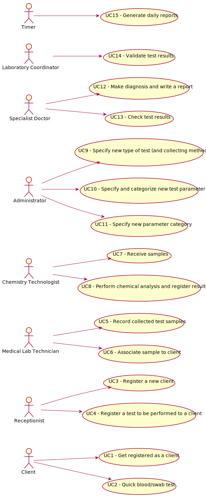

# Use Case Diagram (UCD)

**In the scope of this project, there is a direct relationship of _1 to 1_ between Use Cases (UC) and User Stories (US).**

# Use Cases / User Stories
| UC/US  | Description                                                          |
|:----|:------------------------------------------------------------------------|
| US1 | [As a client, I want to be registered](US1.md)|
| US2 | [As a client, I want to have a test done](US2.md)|
| US3 | [As a receptionist, I want to register a client](US3.md)|
| US4 | [As a receptionist, I intend to register a test](US4.md)|
| US5 | [As a medical lab technician, I want to record the collected samples](US5.md)|
| US6 | [As a medical lab technician, I want to associate samples to clients](US6.md)|
| US7 | [As a chemistry technologist, I want to receive the samples](US7.md)|
| US8 | [As a chemistry technologist, I want to register the results of an analysis](US8.md)|
| US9 | [As an administrator, I want to specify a new type of test and its collecting methods](US9.md)|
| US10 | [As an administrator, I want to specify a new test parameter and categorize it](US10.md)|
| US11 | [As an administrator, I want to specify a new parameter category](US11.md)|
| US12 | [As a specialist doctor, I want to be able to check the test results](US12.md)|
| US13 | [As a specialist doctor, I want to be able to make a diagnosis and write a report](US13.md)|
| US14 | [As a laboratory coordinator, I want to be able to validate and check test results](US14.md)|
| US15 | [As a timer, I have to generate daily reports](US15.md)|