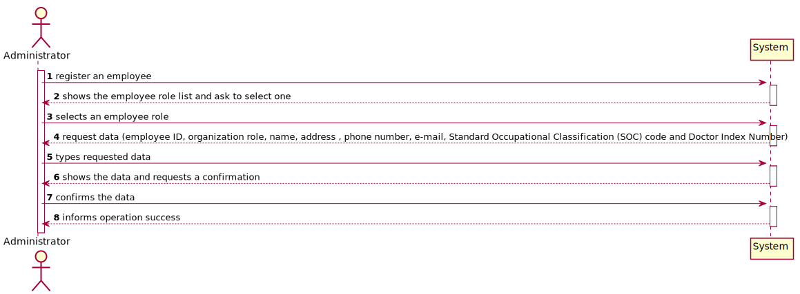
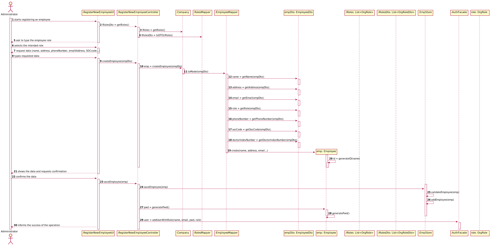
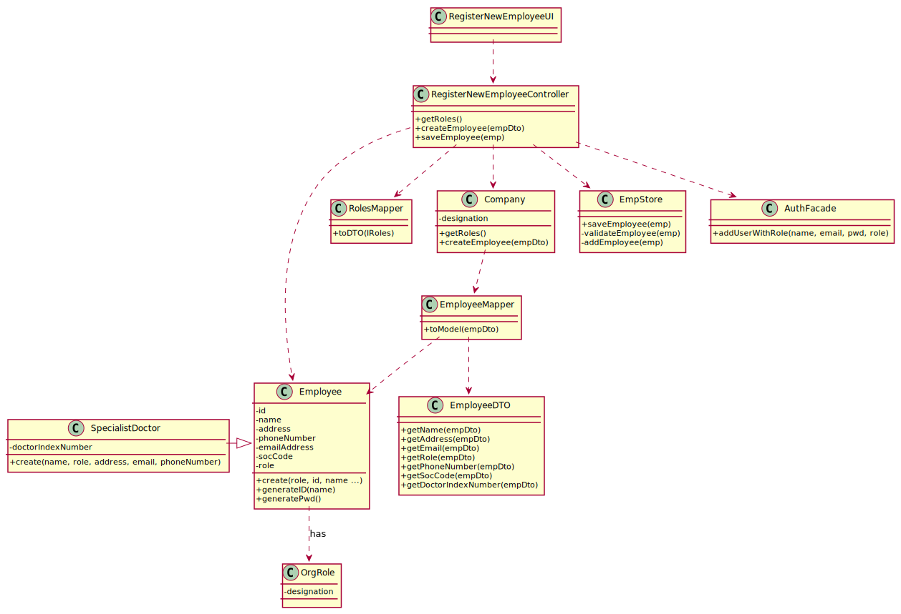

# US 7 - Register a new employee.

## 1. Requirements Engineering
### 1.1. User Story Description

As an administrator, I want to register a new employee.

### 1.2. Customer Specifications and Clarifications 
### 1.3. Acceptance Criteria

AC1: Each user must have a single role defined in the system. 

AC2: When registering an employee, the organization role must be a string with no more than 15 characters.

AC3: When registering an employee, the employee ID should be generated from the initials of the employee name and should include a number. The number should have 5 digits and it increases automatically when a new employee is registered in the system.

AC4: When registering an employee, the employee name must be a string with no more than 35 characters.

AC5: When registering an employee, the employee phone number must be a string with 11 characters.

AC6: When registering an employee, the employee Standard Occupational Classification code must be a integer with 4 digits.

AC7: When registering an employee, the employee doctor index number code must be a integer with 6 digits.

### 1.4. Found out Dependencies

The administrator needs to be logged in to register a new employee.

### 1.5 Input and Output Data
**Input Data**

• Typed data: name, address , phone number, e-mail, Standard Occupational Classification (SOC) code and Doctor Index Number. 	
• Selected data: organization role

**Output Data**

• (In)Success of the operation
### 1.6. System Sequence Diagram (SSD)

*Insert here a SSD depicting the envisioned Actor-System interactions and throughout which data is inputted and outputted to fulfill the requirement. All interactions must be numbered.*

### 1.7 Other Relevant Remarks
This US should be quite used, since registering an employee on the database of the app will be super important to reunite the information of all the employees og ManyLabs.

## 2. OO Analysis

### 2.1. Relevant Domain Model Excerpt 
*In this section, it is suggested to present an excerpt of the domain model that is seen as relevant to fulfill this requirement.* 

### 2.2. Other Remarks

N/A

## 3. Design - User Story Realization 

### 3.1. Rationale

**The rationale grounds on the SSD interactions and the identified input/output data.**

| Interaction ID | Question: Which class is responsible for... | Answer  | Justification (with patterns)  |
|:-------------  |:--------------------- |:------------|:---------------------------- |
| Step 1: register an employee 		 | ...interacting with the actor?		 |RegisterNewEmployeeUI              | Pure Fabrication: there is no reason to assign this responsibility to any existing class in the Domain Model.                             |
|   		 |		...coordinating the US?					 | RegisterNewEmployeeController            | Controller                             |
|   		 |		...register an employee?					 |    EmpStore          |   Creator: EmpStore is responsible for register a client                           |
| Step 2: request data  		 |			reading rhe inputed data?			 |    RegisterNewEmployeeUI         |    IE: responsible for user interaction                         | 
| Step 3: types requested data		 |		...saving the inputted data?					 |     EmployeeDTO        |                              |
| Step 4: shows the data and requests a confirmation  		 |	... validating the data locally (e.g.: mandatory vs.non-mandatory data)?			 |  Employee           |  IE: owns its data and knows his own criteria                            | 
|  		 |… validating the data globally (e.g.: duplicated)?			 |  EmployeeStore           |  IE:  knows all the employee objects                    |
| Step 5: confirms the data	 		 |	... saving the registered employee?						 |    EmpStore          |   IE: records all the employee objects 
| Step 6: informs operation success  		 |		... informing operation success?|    RegisterNewEmployeeUI          |   IE: responsible for user interaction 
### Systematization ##

According to the taken rationale, the conceptual classes promoted to software classes are: 

 * Employee
 

Other software classes (i.e. Pure Fabrication) identified: 

 * RegisterNewEmployeeUI  
 * RegisterNewEmployeeController

## 3.2. Sequence Diagram (SD)

*In this section, it is suggested to present an UML dynamic view stating the sequence of domain related software objects' interactions that allows to fulfill the requirement.* 

## 3.3. Class Diagram (CD)

*In this section, it is suggested to present an UML static view representing the main domain related software classes that are involved in fulfilling the requirement as well as and their relations, attributes and methods.*

# 4. Tests 

**RegisterNewEmployeeController TESTS**

**Test 1:** Check that it is possible to save an Employee that was not saved on the Employee List yet. 

	 @Test
    public void saveEmployeeTrue() {
        Employee emp = new Employee("Alexandre", new OrgRole("Recepcionist"), "rua1", "toberto@gmail.com", "12345678909", 1234);

        RegisterNewEmployeeController ctrl = new RegisterNewEmployeeController();

        boolean result = true;
        boolean expected = ctrl.saveEmployee(emp);

        Assert.assertEquals(result,expected);
    }
**Test 2:** Check that it is not possible to save an Employee that is already saved on the Employee List.
        
    @Test  
    public void saveEmployeeFalse() {
        Employee emp = new Employee("Alexandre", new OrgRole("Recepcionist"), "rua1", "toberto@gmail.com", "12345678909", 1234);

        RegisterNewEmployeeController ctrl = new RegisterNewEmployeeController();

        boolean result = false;
        ctrl.empStore.empList.add(emp);
        boolean expected = ctrl.saveEmployee(emp);

        Assert.assertEquals(result,expected);
    }
**Employee TESTS**
**Test 3:** Check that it is not possible to set an Employee Name with more than 35 characters.

    @org.junit.Test(expected = IllegalArgumentException.class)
    public void checkNameRulesInvalidLength() {

        Employee emp = new Employee();

        String name = "João de Castro Pestana Cândido de Almeida";
        emp.checkNameRules(name);
    }
**Test 4:** Check that it is not possible to set an Employee Phone Number with more than 11 characters.

    @org.junit.Test(expected = IllegalArgumentException.class)
    public void checkPhoneNumberRulesInvalidLength() {

        Employee emp = new Employee();

        String phoneNumber = "123456789091";
        emp.checkPhoneNumberRules(phoneNumber);
    }
**Test 5:** Check that it is not possible to set an Employee Phone Number with more than 11 characters.
    
    @org.junit.Test(expected = IllegalArgumentException.class)
    public void checkPhoneNumberRulesInvalidLengthLessThan11() {

        Employee emp = new Employee();

        String phoneNumber = "1234567891";
        emp.checkPhoneNumberRules(phoneNumber);
    }

# 5. Construction (Implementation)
**CONTROLLER**
**Class RegisterNewEmployeeController**

    public class RegisterNewEmployeeController {
        
        public List<OrgRoleDto> getRoles() { }
        public boolean createEmployee(EmployeeDto empDto) { }
        public boolean saveEmployee(Employee emp) { }
    }
**DOMAIN CLASSES**
**Class Company**

    public class Company {
        private String designation;
        private AuthFacade authFacade;
        private EmpStore employeeStore;
        private List<OrgRole> roleList;
        public int numEmp;
        
        public Company(String designation) { }
        public List<OrgRole> getRoles() { }
        public Employee createEmployee(EmployeeDto empDto) { }
        public EmpStore getEmployeeStore() { }
        
    }
**Class Employee**

    public class EmployeeDto {
        public Company company;
        public String name;
        public OrgRole role;
        public String address;
        public String email;
        private String empID;
        private String phoneNumber;
        private int socCode;
        private int doctorIndexNumb;
        
        public Employee () { }
        public Employee (String name, String role, String address, String email,String phoneNumber, int socCode, int doctorIndexNumb)  { }
        public Employee (String name, String role, String address, String email, String phoneNumber, int socCode)  { }
        
        private void checkNameRules (String name) { }
        private void checkRoleRules(String role) { }
        private void checkPhoneNumberRules (String phoneNumber){ }
        private void checkSOCCODERules (int socCode){ }
        private void checkDoctorIndexNumberRules (int doctorIndexNumb){ }
        private String generateID(String name) { }
        public String generatePwd() { }
        }

**Class EmployeeDto**

    public class EmployeeDto {
        private String name;
        private String role;
        private String address;
        private String email;
        private String phoneNumber;
        public int socCode;
        public int doctorIndexNumb;

        public EmployeeDto (String name, String role, String address, String email, String phoneNumber, int socCode) { }
        public EmployeeDto (String name, String role, String address, String email, String phoneNumber, int socCode, int doctorIndexNumb) { }
        
        public String getName { }
        public String getRole { }
        public String getAddress { }
        public String getEmail { }
        public String getPhoneNumber { }
        public int getSocCode { }
        public int getDoctorIndexNumber { }
    }

**Class SpecialistDoctor**

    public class SpecialistDoctor extends Employee {
        public SpecialistDoctor(String name, String role, String address, String email, String phoneNumber, int socCode, int doctorIndexNumb) { }
    }

**Class OrgRole**

    public class OrgRole {
        public String designation;

        public OrgRole (String designation) { }
    }

**Class OrgRoleDto**

    public class OrgRoleDto {
        private String designation;
        
        public OrgRoleDto(OrgRole role) { }

        public String getDesignation() { }
    }

**Class EmpStore**

    public class UserStore {
        public List<Employee> EmployeeStore;
        
        public EmpStore() { }
        public EmpStore getEmployeeStore() { }
        public List<Employee> getEmpList() { }
        public boolean validateEmployee(Employee emp) { }
        public boolean addEmployee(Employee emp) { }
    }

**MAPPERS CLASSES**

**Class RolesMapper**
   
    public class RegisterNewEmployeeController {
        
         public static List<OrgRoleDto> toDto(List<OrgRole> list) { }
    }

**Class EmployeeMapper**

    public class EmployeeMapper {
        public static Employee toModel (EmployeeDto  employeeDto){ }
    }

**Class RolesMapper**
    
    public class RolesMapper {
        public static List<OrgRoleDto> toDto(List<OrgRole> list) { }
    }

# 6. Integration and Demo 

This User Story was deeply important to integrate in our code, since an Employee being registered in the software will able him to perform very functions, depending on his role.

# 7. Observations

The developed work was made in order to allow an easy implementation of future changes.