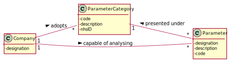

# US 10 - As an administrator, I want to specify a new parameter and categorize it.

## 1. Requirements Engineering

*In this section, it is suggested to capture the requirement description and specifications as provided by the client as well as any further clarification on it. It is also suggested to capture the requirements acceptance criteria and existing dependencies to other requirements. At last, identfy the involved input and output data and depicted an Actor-System interaction in order to fulfill the requirement.*

### 1.1. User Story Description

As an administrator, I want to specify a new parameter and categorize it.

### 1.2. Customer Specifications and Clarifications

From the Specifications Document:

* "Blood tests are frequently characterized by measuring several parameters which for presentation/reporting purposes are organized by categories. For example, parameters such as the number of Red Blood Cells (RBC), White Blood Cells (WBC) and Platelets (PLT) are usually presented under the blood count (Hemogram) category."
* "Regardless, such tests rely on measuring one or more parameters that can be grouped/organized by categories."

From the client clarifications:

* Question: "What is the data that characterize a parameter?"
	* [Answer:](https://moodle.isep.ipp.pt/mod/forum/discuss.php?d=7507#p9763) "Each parameter is associated with one category. Each parameter has a Code, a Short Name and a Description."

* Question: "Does the client want to specify more than one new parameter at a time? When a new parameter is specified, should there always be a category it falls under prior to its specification and subsequent categorization?"
	* [Answer:](https://moodle.isep.ipp.pt/mod/forum/discuss.php?d=7616#p9914) "Yes. Each parameter is associated with one category."
	

* Question: "Does the administrator need to log in order to create a parameter and categorize it?"
	* [Answer:](https://moodle.isep.ipp.pt/mod/forum/discuss.php?d=7639#p9943) "Yes."

* Question: "Is the categorization of a parameter mandatory or optional? How does the assignment of a parameter category works? Does he have to select the category or he have the option to create in the moment?"
	* [Answer:](https://moodle.isep.ipp.pt/mod/forum/discuss.php?d=7649#p9973) "Yes. There exists a user story to specify a new parameter category. Therefore, the administrator should select one category when creating a parameter."

* Question: "What data does the parameter have and what type / format should they have? When creating a new parameter, if the category does not exist in the system, should the administrator have the possibility to create a new one, or he must categorize it in the existing ones."
	* [Answer:](https://moodle.isep.ipp.pt/mod/forum/discuss.php?d=7678#p10003)

* Question: "Can a parameter be classified in more than one parameter category?"
	* [Answer:](https://moodle.isep.ipp.pt/mod/forum/discuss.php?d=7749#p10099) "No. Each parameter has only one category. There are no subcategories."

* Question: "When specifying more than one parameter at the same time, all that parameters will be categorized to one single category or should I ask the category to each parameter?"
	* [Answer:](https://moodle.isep.ipp.pt/mod/forum/discuss.php?d=7888#p10313) "You should always ask the category of each parameter."

* Question: "Is the code of a parameter the same as its respective category? Or can they be different?"
	* [Answer:](https://moodle.isep.ipp.pt/mod/forum/discuss.php?d=8041#p10524) "No, they are different things."
	
### 1.3. Acceptance Criteria

* AC1:"The Code are five alphanumeric characters."
* AC2:"The Short Name is a String with no more than 8 characters."
* AC3:"The Description is a String with no more than 20 characters."
* AC4:"Each parameter is associated with one category."

### 1.4. Found out Dependencies

* There is a dependency to "US11 As an administrator, I want to specify a new parameter category" since at least a parameter category must exist to classify the parameter being created.

### 1.5 Input and Output Data

Input Data

* Typed data:
  	
	* a code 
	* a short name/designation
	* a description
	

* Selected data:
  
	* Classifying parameter category

Output Data

* List of existing parameter categories
* (In)Success of the operation

### 1.6. System Sequence Diagram (SSD)

### 1.7 Other Relevant Remarks

## 2. OO Analysis

### 2.1. Relevant Domain Model Excerpt

### 2.2. Other Remarks

## 3. Design - User Story Realization

### 3.1. Rationale

**The rationale grounds on the SSD interactions and the identified input/output data.**

| Interaction ID | Question: Which class is responsible for... | Answer  | Justification (with patterns)  |
|:-------------  |:--------------------- |:------------|:---------------------------- |
| Step 1: asks to create a new parameter		 | ... interacting with the actor?				 |     CreateParameterUI        |   Pure Fabrication: there is no reason to assign this responsibility to any existing class in the Domain Model.                         |
|		 | ... creating a new parameter?				 |     ParameterStore        |     Creator: The ParameterStore is responsible for creating a new parameter.                       |
|		 | ... coordinating the US?				 | CreateParameterController         |    Controller                          |
| Step 2: requests data 		 | n/a				 |             |                              |
| Step 3: types requested data 		 | ... saving the inputted data?					 | Parameter            |  IE: The object created in step 1 has its own data                            |
| Step 4: shows the existing parameter categories and asks to select one		 |	...	knowing the parameter categories to show?			 |   createParameterUI and ParameterCategoryStore          |  IE and Creator: UI is responsible for showing it and the Parameter Category Store is able to retrieve the available categories                            |
| Step 5: selects one parameter category	 | 	... saving the selected category?	 |  Parameter           |  IE: object created in step 1 is classified in one Parameter Category.                            |
| Step 6: shows all data and requests a confirmation 		 |		n/a					 |             |                              |
| Step 7: confirms the data 		 | 	... validating the data locally (e.g.:mandatory vs. non-mandatory	data)?					 |    ParameterStore        |   IE: is able to validate a new parameter, according to the provided Acceptance Criteria                         | 
|		 | ... validating the data globally	(e.g.: duplicated)?				 |    ParameterStore         | IE: knows all the parameter objects                             |
|		 | ... saving the created parameter?			 |    ParameterStore| IE: records all the parameter objects                             |
| Step 8: informs operation success 		 | ... informing operation success?						 | CreateParameterUI            | IE: is responsible for user interactions.    | 
### Systematization ##

According to the taken rationale, the conceptual classes promoted to software classes are:

* ParameterStore
* Parameter
* Company

Other software classes (i.e. Pure Fabrication) identified:

* CreateParameterUI
* CreateParameterController

## 3.2. Sequence Diagram (SD)

## 3.3. Class Diagram (CD)

# 4. Tests

**_DO NOT COPY ALL DEVELOPED TESTS HERE_**

**Test 1:** Check if the acceptance criteria related to the code are met.

	@org.junit.Test
    public void checkCodeRulesValid() {
        Parameter parameter = new Parameter();

        String resultCode="abn3e";
        parameter.checkCodeRules(resultCode);
    }

    @org.junit.Test(expected = IllegalArgumentException.class)
    public void checkCodeRulesInvalidBlank(){
        Parameter parameter = new Parameter();

        String resultCode="";
        parameter.checkCodeRules(resultCode);
    }

    @org.junit.Test(expected = IllegalArgumentException.class)
    public void checkCodeRulesInvalidLength(){
        Parameter parameter = new Parameter();

        String resultCode="abcdef";
        parameter.checkCodeRules(resultCode);
    }

**Test 2:** Check if the parameter is saved in the store or not

	@Test
    public void saveParameterInStore() {
        ParameterCategory parameterCategory=new ParameterCategory("a","bvgtr");
        Parameter parameter = new Parameter("abcde","abcdefghijklmnopqrst","abcdefgh",parameterCategory);
        ParameterStore parameterStore=new ParameterStore();

        boolean result = true;
        boolean expected =parameterStore.saveParameter(parameter);

        Assert.assertEquals(result, expected);
    }

    @Test
    public void doesNotSaveParameterInStore() {
        ParameterCategory parameterCategory=new ParameterCategory("a","bvgtr");
        Parameter parameter = new Parameter("abcde","abcdefghijklmnopqrst","abcdefgh",parameterCategory);
        ParameterStore parameterStore=new ParameterStore();

        boolean result=false;
        parameterStore.add(parameter);
        boolean expected=parameterStore.saveParameter(parameter);

        Assert.assertEquals(result,expected);
    }

# 5. Construction (Implementation)

Parameter Class

	private String code;
	private String description;
	private String designation;
	private ParameterCategory pcat;
	private static final int CODE_LENGTH=5;
	private static final int DESIGNATION_MAX_LENGTH=8;
	private static final int DESCRIPTION_MAX_LENGTH=20;
	
	public Parameter(String code, String description, String designation, ParameterCategory pcat){
    }

	public Parameter(){
    }
	
	public String getCode(){
    }
	
	public String getDescription(){
    }
	
	public String getDesignation(){
    }
	
	public ParameterCategory getPcat(){
    }
	
	public void checkCodeRules(String code){
    }
	
	public void checkDescriptionRules(String description){
    }
	
	public void checkDesignationRules(String designation){
    }
	
	public void checkPcatRules(ParameterCategory pcat){
    }

Create Parameter Controller Class

	private App app;
	private Company company;
	private ParameterStore parameterStore;
	private ParameterCategoryStore pcStore;
	private Parameter parameter;
	private List<ParameterCategory> listCategories;
	private List<ParameterCategoryDto> categoriesNamesDto;
	
	public CreateParameterController(){
    }
		
	public List<ParameterCategoryDto> toDto(){
    }
	
	public boolean createParameter(String code, String description, String designation, ParameterCategoryDto catCode){
    }
	
	public boolean saveParameter(){
    }
	
Parameter Store Class

	private List<Parameter> parameterStoreList;
	
	public ParameterStore(){
    }	
	
	public Parameter create(String code, String description, String designation, ParameterCategory pcat){
    }

	public boolean saveParameter(Parameter parameter){
    }

	public boolean validate(Parameter parameter){
    }
	
	public void add(Parameter parameter){
    }
	
Company Class

	private String designation;
    private ParameterStore parameterStore;
    //(...) ommited

    public Company(String designation) {
    }

    public ParameterStore getParameterStore(){
        return parameterStore;
    }

# 6. Integration and Demo

A new option on the Admin menu options was added.

# 7. Observations

The developed work was made in order to allow an easy implementation of future changes.

