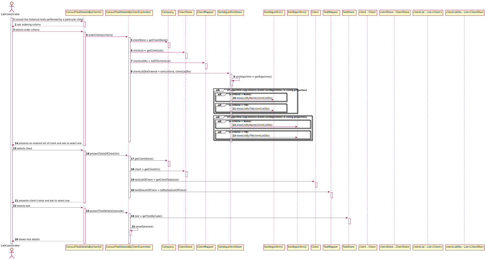

# US 13 - As a clinical chemistry technologist, I intend to consult the historical tests performed by a particular client

## 1. Requirements Engineering

### 1.1. User Story Description

As a clinical chemistry technologist, I intend to consult the historical tests
performed by a particular client and to be able to check tests details/results.

### 1.2. Customer Specifications and Clarifications 

**Question 1**: In the User Story 13, the Clinical Chemistry Technologist to "choose the target client" needs to type the name (or TIN number)? Or should be a list present with all the client's available and, after that, be possible to select one?

**Answer**: From the requirements introduced in the beginning of Sprint D: "The application must allow ordering the clients by TIN and by name to help the clinical chemistry technologist choose the target client". A sorted list should be presented to the clinical chemistry technologist.

**Question 2**: In US13, the Clinical Chemistry Technologist, can select more than one client at once to view its historical test results?

**Answer**: No.

**Question 3**: Moreover, will all the tests associated with the client be displayed or the clinical chemistry technologist will have also to select the tests he wants to see?

**Answer**: After selecting one client, the application should show all the historical test results, of that client, to the Clinical Chemistry Technologist.

**Question 4**: Should the user be the one selecting if the Clients are ordered by Name or TIN, or should it be defined through the configuration file? If it is the user, how should he be able to select it?

**Answer**: When using the application, the clinical chemistry technologist should be able to sort the clients by name or TIN. The algorithm that will be used to sort the data should be defined through a configuration file.

**Question 5**: From the user story description "As a clinical chemistry technologist, I intend to consult the historical tests performed by a particular client and to be able to check tests details/results". What do you mean by "check tests details/results" ?

**Answer**: The clinical chemistry technologist should be able to check the historical tests performed by a particular client and see the results obtained in each test. For a given client (that was selected by the clinical chemistry technologist) the application should show all tests performed by the client and, for each parameter, the application should show the parameter value and the parameter reference values. The clinical chemistry technologist should not have access to the report made by the specialist doctor.

**Question 5**: The client's tests, that we have to show on this US, need to have been validated by the lab coordinator or is it enough if they just have results and we can show them before being validated by the lab coordinator?

**Answer**: The tests to be presented in US13 are tests that have already been validated by the lab coordinator.

### 1.3. Acceptance Criteria

* AC 1 : The application must allow ordering the clients by TIN and
by name to help the clinical chemistry technologist choose the target client. The ordering algorithm to be used by the application must be defined through a configuration file. At least two sorting algorithms should be available.
### 1.4. Found out Dependencies

### 1.5 Input and Output Data

Input Data

* Selected data:
    * Ordering Criteria (by name or by TIN)
    * Client
    * Client's Test
    
Output Data

* Ordered Client List
* Client's Test List
* Test Details

### 1.6. System Sequence Diagram (SSD)

### 1.7 Other Relevant Remarks

*Use this section to capture other relevant information that is related with this US such as (i) special requirements ; (ii) data and/or technology variations; (iii) how often this US is held.* 

## 2. OO Analysis

### 2.1. Relevant Domain Model Excerpt 
*In this section, it is suggested to present an excerpt of the domain model that is seen as relevant to fulfill this requirement.* 

### 2.2. Other Remarks

*Use this section to capture some aditional notes/remarks that must be taken into consideration into the design activity. In some case, it might be usefull to add other analysis artifacts (e.g. activity or state diagrams).* 

## 3. Design - User Story Realization 

### 3.1. Rationale

**The rationale grounds on the SSD interactions and the identified input/output data.**

| Interaction ID | Question: Which class is responsible for... | Answer  | Justification (with patterns)  |
|:-------------  |:--------------------- |:------------|:---------------------------- |
| Step 1: consult the historical tests performed by a particular client  		 |		... coordinating the US?					 | ConsultTestDetailsByClientController            | Controller                             |
| 			  		 |	... interacting with the user? | ConsultTestDetailsByClientUI | Pure Fabrication: there is no reason to assign this responsibility to any existing class in the Domain Model.                             |
| Step 2: ask ordering criteria  		 |		...knowing the sorting criteria to show?					 |  SortAlgorithmStore           | IE: SortAlgorithmStore knows the available sorting criterias.                             |
| Step 3 : selects the ordering criteria  		 |		...reading the input? 					 |   ConsultTestDetailsByClientUI          |        IE: is responsible for user interactions.                      |
| Step 4: presents an ordered list of client and ask to select one  		 |	...knowing the list of clients to show?						 |   ClientStore          |  HCLC: application of colections. ClientStore knows all Clients.                            |
| Step 5: selects client  		 |		...reading the input?				 |    ConsultTestDetailsByClientUI       |       IE: is responsible for user interactions.                      |              
| Step 6: presents client's tests and ask to select one 		 |	...knowing the tests to show?					 |  Client         |   IE: Client knows his own tests.                          |              
| Step 7: selects test  		 |		...reading the input?				 |    ConsultTestDetailsByClientUI       |       IE: is responsible for user interactions.                      |              
| Step 8: shows test details 		 |		showing the output?				 |    ConsultTestDetailsByClientUI       |       IE: is responsible for user interactions.                      |              

### Systematization ##

According to the taken rationale, the conceptual classes promoted to software classes are: 

 * Company
 * Client 
 * Test

Other software classes (i.e. Pure Fabrication) identified: 
 
 * ConsultTestDetailsByClientUI  
 * ConsultTestDetailsByClientController
 * TestMapper
 * ClientMapper
 * ClientStore
 * SortAlgorithmStore

## 3.2. Sequence Diagram (SD)

*In this section, it is suggested to present an UML dynamic view stating the sequence of domain related software objects' interactions that allows to fulfill the requirement.* 

## 3.3. Class Diagram (CD)

*In this section, it is suggested to present an UML static view representing the main domain related software classes that are involved in fulfilling the requirement as well as and their relations, attributes and methods.*

# 4. Tests 
*In this section, it is suggested to systematize how the tests were designed to allow a correct measurement of requirements fulfilling.* 

**_DO NOT COPY ALL DEVELOPED TESTS HERE_**

**Test 1:** Check that it is not possible to create an instance of the Example class with null values. 

	@Test(expected = IllegalArgumentException.class)
		public void ensureNullIsNotAllowed() {
		Exemplo instance = new Exemplo(null, null);
	}

*It is also recommended to organize this content by subsections.* 

# 5. Construction (Implementation)

**Controller Class**

*ConsultTestDetailsByClientController*
  
    public class ConsultTestDetailsByClientController {
        public Company company;
        public SortAlgorithmStore sortAlgorithmStore;
        
        public ConsultTestDetailsByClientController(){
          this.company = App.getInstance().getCompany();
          this.sortAlgorithmStore = new SortAlgorithmStore();
    }

        public List<ClientDto> orderClients(String criteria) throws IOException { }
        public List<TestDto> presentTestsOfClient(String tin) { }
        public void presentTestDetails(String code) { }
        public void showData(TestType testType, Date chemicalAnalysisDate, List<TestParameterResult> parameterResultList){ }

**Domain Classes**

*Company*

    public class Company { 
        private ClientStore clientstore;
        public ClientStore getClientStore (){ }
    
    }

*Client*

    public class Client {
      public List<Test> getClientTestsList() { }
    }
**Pure Fabrication Classes**

*ClientStore*

    public class ClientStore {
      public List<Client> getClientList() { }
      public Client getClient (String TIN) { }
    }

*ClientMapper*

    public class ClientMapper {
    public static List<ClientDto> toDTO (List<Client> clientList) { }
    }

*SortAlgorithmStore*

    public class SortAlgorithmStore { 
      public SortAlgorithmStore() { }
      public List<ClientDto> sort (String criteria, List<ClientDto> clientDtoList) { }
      public SortAlgorithm getAlgoritmo() throws IOException { }
    }

*TestMapper*

    public class TestMapper {
    public static List<TestDto> toDto (List<Test> listTest) { }
    }

*TestStore*

    public class TestStore {
      public Test getTestByCode(String code){ }
    }
# 6. Integration and Demo 

*In this section, it is suggested to describe the efforts made to integrate this functionality with the other features of the system.*

# 7. Observations

*In this section, it is suggested to present a critical perspective on the developed work, pointing, for example, to other alternatives and or future related work.*

