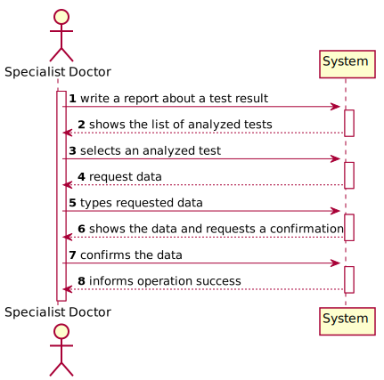
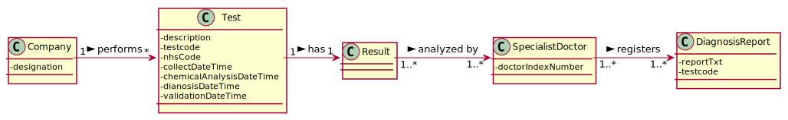
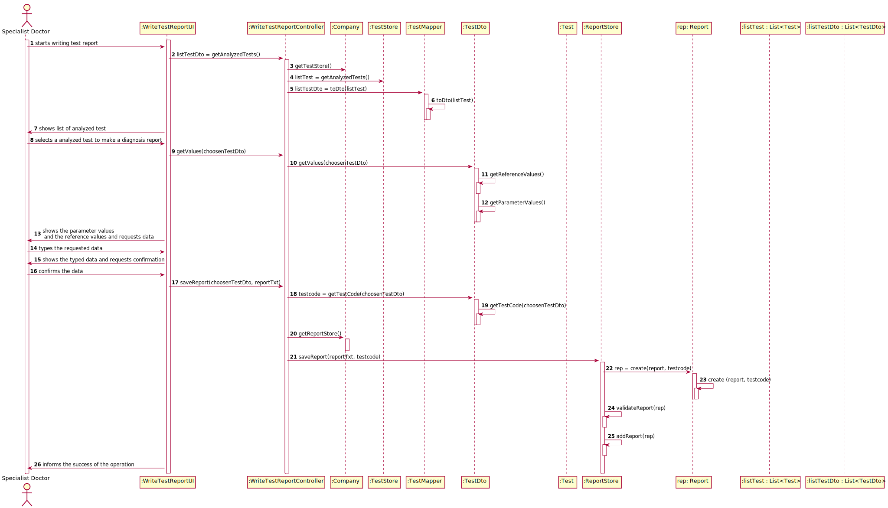

# US 14 - Write a report for a given test.

## 1. Requirements Engineering

### 1.1. User Story Description

As a specialist doctor, I intend to make the diagnosis and write a report for a given test.

### 1.2. Customer Specifications and Clarifications 

Question: What characterizes a diagnosis? What it needs to have in it to be a valid diagnosis?

Answer: The report contains the diagnosis. The report is free text and should have no more than 400 words. 

Question: Regarding the tests that the Specialist Doctor can write a report about. Should the SD chose from a list of tests? Should him only receive a list of test that have completed all the previous steps?

Answer: The system shows all tests ready (that have completed all the previous steps) to make the diagnosys and the Specialist Doctor selects one test. Then, the Specialist Doctor writes the report for the selected test.
### 1.3. Acceptance Criteria

* AC1: The Specialist Doctor must select a test to write a diagnosis report.
* AC2: The report can not have more than 400 char.
### 1.4. Found out Dependencies

US4 - As a receptionist, I entend to register a test.

US12 - As a clinical chemistry technologist, I intend to record the results of a given test.

US5 - As a medical lab technician, I want to record the samples collected in the scope of a given test.

### 1.5 Input and Output Data

***Input Data:***

**Typed Data:**
* Diagnosis Report

**Selected Data:**
* Test

***Output Data:***

* List of analyzed tests
* Reference values and analyzed parameters values of the choosen test
* (In)Success of the operation

### 1.6. System Sequence Diagram (SSD)

*Insert here a SSD depicting the envisioned Actor-System interactions and throughout which data is inputted and outputted to fulfill the requirement. All interactions must be numbered.*

### 1.7 Other Relevant Remarks

*Use this section to capture other relevant information that is related with this US such as (i) special requirements ; (ii) data and/or technology variations; (iii) how often this US is held.* 

## 2. OO Analysis

### 2.1. Relevant Domain Model Excerpt 

### 2.2. Other Remarks

## 3. Design - User Story Realization 

### 3.1. Rationale

**The rationale grounds on the SSD interactions and the identified input/output data.**

| Interaction ID | Question: Which class is responsible for... | Answer  | Justification (with patterns)  |
|:-------------  |:--------------------- |:------------|:---------------------------- |
| Step 1: write a report about a test result  		 |	...interacting with the actor?						 |  WritesTestReportUI           |    Pure Fabrication: responsible for user interaction                          |
| 		 |	...coordinating the US?						 |  WritesTestReportController          |    Controller                          |
| 		 |	...reading the inputed data?					 |  WritesTestReportUI       |    Controller                          |
| Step 2: shows the list of analyzed test  		 |	presenting the list of analyzed tests?						 | WriteTestReportUI             | Pure Fabrication: responsible for user interaction                             |
| Step 3: selects an analyzed test  		 |	...reading the inputed data?						 | WriteTestReportUI            |  Pure Fabrication: responsible for user interaction                            |
|  		 |	...saving the inputed data?						 | TestDTO            |  IE: responsible for user interaction                            |
| Step 4: request data  		 |	...reading the inputed data?		 | WriteTestReportUI            |         IE: responsible for user interaction                     |
| Step 5: types requested data  		 |	saving the inputed data?						 |             |                              |
| Step 6: shows the data and requests confirmation   		 |		... validating the data locally (e.g.: mandatory vs.non-mandatory data)?					 |   Report          |        IE: owns its data and knows his own criteria … validating the data globally (e.g.: duplicated)?                      |  
    | Step 6: shows the data and requests confirmation   		 |		… validating the data globally (e.g.: duplicated)?					 |   ReportStore          |        IE: knows all the Report objects                       | 
| Step 7: confirms data  		 |	... saving the diagnosis report?						 |  ReportStore           |  IE: records all the employee objects                            |  
| Step 8: informs operation success  		 |		... informing operation success?					 | WriteTestReportUI            | Pure Fabrication: responsible for user interaction                              |  

### Systematization ##

According to the taken rationale, the conceptual classes promoted to software classes are: 

 * DiagnosisReport
 * Company
 * Test

Other software classes (i.e. Pure Fabrication) identified: 

 * WriteTestReportUI
 * WriteTestReportController 
 * ReportStore
 * TestDto
 * TestMapper

## 3.2. Sequence Diagram (SD)

*In this section, it is suggested to present an UML dynamic view stating the sequence of domain related software objects' interactions that allows to fulfill the requirement.* 

## 3.3. Class Diagram (CD)

*In this section, it is suggested to present an UML static view representing the main domain related software classes that are involved in fulfilling the requirement as well as and their relations, attributes and methods.*

# 4. Tests 

**WriteTestReportController TESTS**

**Test 1: Check that it is possible to save a Report that was not saved on the Report Store yet.** 

	@Test
    public void saveReport() {
        WriteTestReportController ctrl = new WriteTestReportController();
        TestDto testDto = new TestDto("12345");
        String report = "Rport";
        boolean expected = true;
        boolean result = ctrl.saveReport(testDto, report);
        Assert.assertEquals(expected, result);
    }

**Report TESTS**

**Test 2: Check that is not possible to write a blank report.**

     @Test(expected = IllegalArgumentException.class)
    public void checkReportRulesisBlank() {
        Report report = new Report("Report", "00000000001");
        String test = "";
        report.checkReportRules(test);
    }

**Test 3: Check that is not possible to write a report with more than 400 char.**

    @Test(expected = IllegalArgumentException.class)
    public void checkReportRulesisOutOfLenght() {
        Report report = new Report("Report", "00000000001");
        String test = "ABCDEFGHIJABCDEFGHIJABCDEFGHIJABCDEFGHIJABCDEFGHIJABCDEFGHIJABCDEFGHIJABCDEFGHIJABCDEFGHIJABCDEFGHIJABCDEFGHIJABCDEFGHIJABCDEFGHIJABCDEFGHIJABCDEFGHIJABCDEFGHIJABCDEFGHIJABCDEFGHIJABCDEFGHIJABCDEFGHIJABCDEFGHIJABCDEFGHIJABCDEFGHIJABCDEFGHIJABCDEFGHIJABCDEFGHIJABCDEFGHIJABCDEFGHIJABCDEFGHIJABCDEFGHIJABCDEFGHIJABCDEFGHIJABCDEFGHIJABCDEFGHIJABCDEFGHIJABCDEFGHIJABCDEFGHIJABCDEFGHIJABCDEFGHIJABCDEFGHIJ0";
        report.checkReportRules(test);
    }
**ReportStore TESTS**

**Test 4: Check that is possible to save a report that is not saved on the Report Store.**

     @Test
    public void saveReport() {
        ReportStore rps = new ReportStore();
        boolean expected = true;
        boolean result = rps.saveReport("Report", "00000000001");
        Assert.assertEquals(expected, result);
    }

**Test 5: Check that is not possible to save a report that is already saved on the Report Store.**

    @Test
    public void doesNotSaveReport() {
        ReportStore rps = new ReportStore();
        boolean expected = false;
        rps.getReportList().add(new Report("Report", "00000000001"));
        boolean result = rps.saveReport("Report", "00000000001");
        Assert.assertEquals(expected, result);
    }

# 5. Construction (Implementation)

**CONTROLLER**

**Class WriteTestReportController** 
    
    public List<TestDto> getAnalyzedTests() { }
    public List<ParameterResult> getValues(TestDto test){
    public boolean saveReport(TestDto test ,String reportTxt) { }

**DOMAIN CLASSES**

**Class Company**

    public TestStore getTestStore () { }
    public ReportStore getReportStore () { }

**Class TestStore**

    public List<Test> getAnalyzedTests() { }

**Class TestDto**

     public String getTestCode() { }
     public List<ParameterResult> getValues() { }

**Class TestStore**

    public boolean saveReport(String reportTxt, String testCode) { }
    public boolean validateReport(Report rep) { }

**Class Report**

    public Report(String report, String testcode){ }

**MAPPERS CLASSES**

**Class TestMapper**

    public static List<TestDto> toDto (List<Test> listTest) { }

# 6. Integration and Demo 

*In this section, it is suggested to describe the efforts made to integrate this functionality with the other features of the system.*

# 7. Observations

*In this section, it is suggested to present a critical perspective on the developed work, pointing, for example, to other alternatives and or future related work.*

