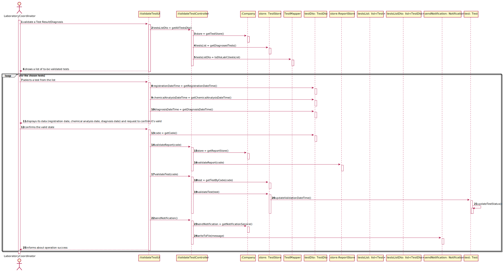

# US 15 - As a laboratory coordinator, I want to validate tests.

## 1. Requirements Engineering

### 1.1. User Story Description

* As a laboratory coordinator, I want to validate the work done by the clinical chemistry technologist and specialist doctor.

### 1.2. Customer Specifications and Clarifications

**From the specifications document:**

* "To validate the work done, the laboratory coordinator checks the chemical test/result and associated diagnosis made and confirms that everything was done correctly. "

* "Once the laboratory coordinator confirms that everything was done correctly, the client receives a notification alerting that the results are already available in the central application and informing that he/she must access the application to view those results."

**From the client clarifications:**

* Question: Should the tests be validated one by one, or as a group? [Client Forum](https://moodle.isep.ipp.pt/mod/forum/discuss.php?d=8180#p10708)
    * Answer: "The coordinator can validate all or a subset of test results."
  

* Question: Is the test sent to the laboratory coordinator or does he fetch it through a code? [Client Forum](https://moodle.isep.ipp.pt/mod/forum/discuss.php?d=8177#p10704)
    * Answer: "The system shows all tests ready to validate (tests that already have the test registration date, the chemical analysis date and the diagnosis date registered in the system) and the laboratory coordinator selects one or more tests to mark as validated."
  

* Question: What if a certain test is invalid? Should it be scrapped or have the laboratory Coordinator propose to redo it? [Client Forum](https://moodle.isep.ipp.pt/mod/forum/discuss.php?d=8177#p10704)
    * Answer: The objective is for the laboratory coordinator to be aware of the work developed in the chemical laboratory and to mark the job as done.
    

* Question: Can "Valid" or "Invalid" be accepted as a confirmation? If so, are these states available from a list of options? [Client Forum](https://moodle.isep.ipp.pt/mod/forum/discuss.php?d=8251#p10789)
    * Answer: "Only Valid state, and the laboratory coordinator selects one or more tests to mark as validated.
  

* Question: What information does the laboratory coordinator need to validate a test? 
    * Answer: Only the dates. Moreover, it should record the validation date. [Client Forum](https://moodle.isep.ipp.pt/mod/forum/discuss.php?d=8270&parent=10817#p11004)
  

* Question: After validation do we need to have the time and date of the validation?
    * Answer: Yes, the system should record the date (DD/MM/YYYY) and time (HH:MM) when the validation was made.
      Moreover, in this US, when the system shows to the laboratory coordinator all the dates (test registration date, chemical analysis date and diagnosis date), the system should show the date (DD/MM/YYYY) and the time (HH:MM). [Client Forum](https://moodle.isep.ipp.pt/mod/forum/discuss.php?d=8408#p11169)

* Question: After performing validation, does the client get sent a notification informing the test has became available to see its results?
    * Answer: From the Project Description: "Once the laboratory coordinator confirms that everything was done correctly, the client receives a notification alerting that the results are already available in the central application and informing that he/she must access the application to view those results."
      * "During the development of the Integrative Project we will not use any e-mail or SMS API services to send messages. All the e-mail and SMS messages should be written to a file with the name emailAndSMSMessages.txt. This file simulates the use of e-mail and SMS API services. "
      [Client Forum](https://moodle.isep.ipp.pt/mod/forum/discuss.php?d=8330#p10899)
        

* Question: What should happen to a test if either the test report or the results are invalid? Should we prompt for a redo of either process or simply erase the test?
    * Answer: The laboratory coordinator only sees the test dates of tests that already have all dates registered in the system (test registration date, the chemical analysis date and the diagnosis date). [Client Forum](https://moodle.isep.ipp.pt/mod/forum/discuss.php?d=8177#p10888)
  

* Question: After we validate, we send the email saying they can check the app for the results. But what happens to the test itself? Does it stay within the system or is deleted?
    * Answer: The tests should not be eliminated. [Client Forum](https://moodle.isep.ipp.pt/mod/forum/discuss.php?d=8538#p11355)
  

### 1.3. Acceptance Criteria

* AC1: The system does not show client personal information but shows all dates (test registration date, chemical analysis date and diagnosis date).
* AC2: During the development of the Integrative Project we will not use any e-mail or SMS API services to send messages.

### 1.4. Found out Dependencies

* US4: As a receptionist of the laboratory, I intend to register a test to be performed to a registered client.
* US5: As a medical lab technician, I want to record samples collected in the scope of a given test.
* US12: As a clinical chemistry technologist, I intend to record the results of a given test.
* US14: As a specialist doctor, I intend to make the diagnosis and write a report for a given test.

### 1.5 Input and Output Data

**Input data**

* Typed data: (none)
* Selected data: Chosen Tests, Validation State.

**Output data**

*   List of tests available for validation
*   Chosen tests data
*   (In)Success of the operation of defining a certain Test State.

### 1.6. System Sequence Diagram (SSD)

### 1.7 Other Relevant Remarks

* Regarding the process of having a certain test to a client, this US can be considered as the final step of the process, since the one that follows, is described as sending the results as notification to the client. 

## 2. OO Analysis

### 2.1. Relevant Domain Model Excerpt

### 2.2. Other Remarks

The US15 totally relies on the previous US contents, since its function is to validate a performed Test, which requires many other components. 

## 3. Design - User Story Realization 

### 3.1. Rationale

**The rationale grounds on the SSD interactions and the identified input/output data.**

| Interaction ID | Question: Which class is responsible for... | Answer  | Justification (with patterns)  |
|:-------------  |:--------------------- |:------------|:---------------------------- |
| Step 1: validate a Test Result/Diagnosis      | ...validating a result?  | validateTestUI | Pure Fabrication: Assign a highly cohesive set of responsibilities to an artificial or convenience "behavior", which will later be reused.
|                                               | ...coordinating the US?  | validateTestController| Controller (Handles a UI event).
| Step 2: shows a list of to-be validated tests | ...showing the available tests? | validateTestUI | IE: responsible for User Interaction.
|                                               | ...making the list available? | TestStore | IE: responsible for storing the tests ready for validation.
| Step 3: selects a test from the list          | ...showing the test info? | validateTestUI | IE: responsible for User Interaction.
| Step 4: displays its data and requests to confirm it's valid | ...requesting the data? | validateTestUI | IE: responsible for user interaction.
| Step 5: confirms the valid state              | ...saving the selected state? | validateTestController | Controller (Handles the validation received).
| Step 6: informs about the operation success   | ...informing addition success? | validateTestUI | IE: responsible for user interaction

### Systematization ##

According to the taken rationale, the conceptual classes promoted to software classes are: 

 * TestStore

Other software classes (i.e. Pure Fabrication) identified: 
 
 * validateTestUI
 * validateTestController

## 3.2. Sequence Diagram (SD)

## 3.3. Class Diagram (CD)

# 4. Tests

**Test 1:** Tests if the list with only Reported tests is returned properly.

      @Test
      public void getDiagnosedTests(){
          List<ParameterCategory> pcList = new ArrayList<>();
          ParameterCategory pc = new ParameterCategory("covid", "c0vid");
          pcList.add(pc);
  
          List<Parameter> pList = new ArrayList<>();
          Parameter parameter1 = new Parameter("12345", "covid", "c0vid", pc);
          pList.add(parameter1);
  
          TestType testType = new TestType("c0vid", "isCovid", "swab", pcList, new ExternalModuleBloodWithoutKey());
  
  
          app.domain.model.Test test = new app.domain.model.Test(testType, pList, pcList, "1123456789", "123456781234");
          test.setChemicalAnalysisDateTime(new Date());
          test.setDiagnosisDateTime(new Date());
          test.generateCode();
  
          TestStore testStore = new TestStore();
  
          test.setStatus(app.domain.model.Test.Status.Reported);
          testStore.saveTest(test);
  
          assertEquals(test, testStore.getDiagnosedTests().get(0));
      }

**Test 2:** Tests if a test is properly fetched from the store list.

      @Test
      public void getTestByCode(){
          List<ParameterCategory> pcList = new ArrayList<>();
          ParameterCategory pc = new ParameterCategory("covid", "c0vid");
          pcList.add(pc);
  
          List<Parameter> pList = new ArrayList<>();
          Parameter parameter1 = new Parameter("12345", "covid", "c0vid", pc);
          pList.add(parameter1);
  
          TestType testType = new TestType("c0vid", "isCovid", "swab", pcList, new ExternalModuleBloodWithoutKey());
  
  
          app.domain.model.Test testExpected = new app.domain.model.Test(testType, pList, pcList, "1123456789", "123456781234");
          testExpected.setChemicalAnalysisDateTime(new Date());
          testExpected.setDiagnosisDateTime(new Date());
          testExpected.generateCode();
  
          TestStore testStore = new TestStore();
  
          testExpected.setStatus(app.domain.model.Test.Status.Reported);
          testStore.saveTest(testExpected);
  
          app.domain.model.Test testResult = testStore.getTestByCode(testExpected.getCode());
  
          assertEquals(testExpected, testResult);
      }

**Test 3:** Tests if a test is validated.

      @Test
      public void validateTest(){
          List<ParameterCategory> pcList = new ArrayList<>();
          ParameterCategory pc = new ParameterCategory("covid", "c0vid");
          pcList.add(pc);
  
          List<Parameter> pList = new ArrayList<>();
          Parameter parameter1 = new Parameter("12345", "covid", "c0vid", pc);
          pList.add(parameter1);
  
          TestType testType = new TestType("c0vid", "isCovid", "swab", pcList, new ExternalModuleBloodWithoutKey());
  
  
          app.domain.model.Test test = new app.domain.model.Test(testType, pList, pcList, "1123456789", "123456781234");
          test.generateCode();
  
          TestStore testStore = new TestStore();
          testStore.saveTest(test);
  
          ReportStore reportStore = App.getInstance().getCompany().getReportStore();
  
          reportStore.saveReport("Report", test.getCode());
          reportStore.validateReport(test.getCode());
  
          assertTrue(testStore.validateTest(test));
      }

# 5. Construction (Implementation)

 * ValidateTestController Class

      public class ValidateTestController {
  
          public ValidateTestController(){}
      
          public List<TestDto> getAllTestsDto(){}
      
          public boolean validateReport(String code){}
      
          public boolean validateTest(String code){}
      
          public void sendNotification(){}
      }
  
* TestMapper Class

      public class TestMapper {

          public static List<TestDto> toDto (List<Test> listTest){}
      
          public static List<TestDto> toDtoLabC (List<Test> testsList){}
      
          public static List<TestDto> ModelToDto (List<Test> listTest){}
      
          public static TestDto ModelToDto (Test test){}
      
          public static String DtoToModel (TestDto testDto){}
      }

* TestStore Class

      public class TestStore {

          private List<Test> TestList;

          public TestStore (){}

          public List<Test> getDiagnosedTests(){}

          public Test getTestByCode(String code){}

          public boolean validateTest(Test test){}
      }

* ReportStore Class

      public class ReportStore {
          
          private List<Report> reportList;

          public boolean validateReport(String code){}

      }

* Company Class

      public class Company {

          private ReportStore reportStore;
      
          private TestStore testStore;

          private Notification notification;

          public Company(String designation){}
  
          public TestStore getTestStore(){}
    
          public ReportStore getReportStore (){}
          
          public Notification getNotificationService(){}

      }

* Report Class

      public class Report{
      
          private boolean validation;

          private String testCode;

          public Report (String report, String testcode){}

          public boolean getValidation(){}

          public void setValidation(boolean validation){}

      }

* TestDto class

      public class TestDto{

          private Date registrationDateTime;

          private Date chemicalAnalysisDateTime;

          private Date diagnosisDateTime;

          private String code;

          public TestDto(Date registrationDateTime, Date chemicalAnalysisDateTime, Date diagnosisDateTime, String code){}
  
          public Date getRegistrationDateTime(){}
  
          public Date getChemicalAnalysisDateTime(){}
  
          public Date getDiagnosisDateTime(){}
      }

* Test Class
        
      public class Test {

          private Date registrationDateTime;

          private Date collectDateTime;

          private Date chemicalAnalysisDateTime;

          private Date diagnosisDateTime;

          private Date validationDateTime;

          public String getStatus(){}

          public boolean updateValidationDateTime(){}

          public void updateTestStatus(){}
      
      }

* Notification class

      public class Notification {
      
          private PrintWriter out;

      
          public Notification(){}
      
          public void writeToFile(String message){}
      }

# 6. Integration and Demo 

* The User Story was deeply important to integrate in our cod because a Laboratory Coordinator is the able to validate the performed tests.

# 7. Observations

* No observations have been made.