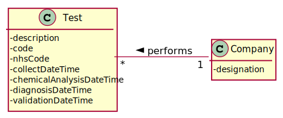
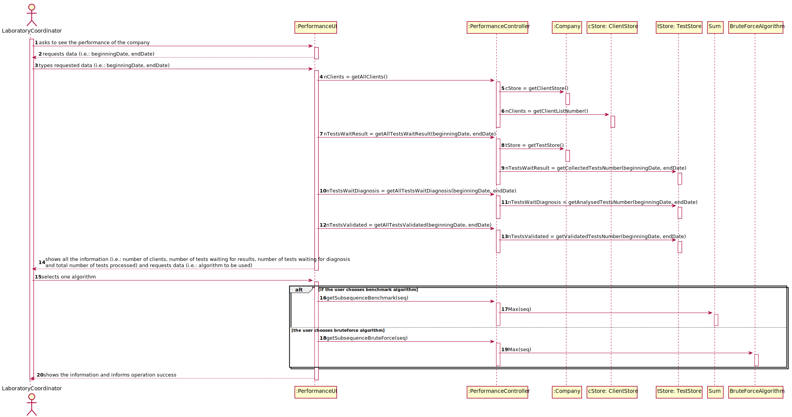
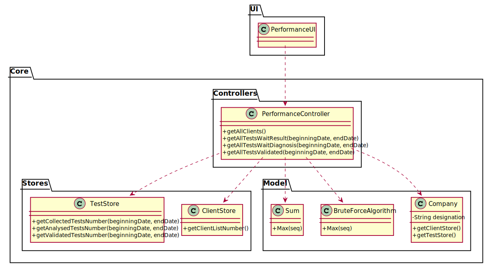

# US 16 - As a laboratory coordinator, I want to have an overview of all the tests performed by Many Labs and analyse the overall performance of the company.

## 1. Requirements Engineering

*In this section, it is suggested to capture the requirement description and specifications as provided by the client as well as any further clarification on it. It is also suggested to capture the requirements acceptance criteria and existing dependencies to other requirements. At last, identfy the involved input and output data and depicted an Actor-System interaction in order to fulfill the requirement.*

### 1.1. User Story Description

As a laboratory coordinator, I want to have an overview of all the tests performed by Many Labs and analyse the overall performance of the company (for instance, check the sub-intervals in which there were more samples waiting for the result). To facilitate overall analysis, the application should also display statistics and graphs.

### 1.2. Customer Specifications and Clarifications 

From the Specifications Document:

*

From the client clarifications:

* Question: "In US16, it is told that the laboratory coordinator wants to see the company's performance, and is given an example of what he might want to see (check the sub-intervals in which there were more samples waiting for the result). Regarding US16, is there any other features that should be available? // When we are showing the tests to the laboratory coordinator, what should be the data to shown for each test?"
    * [Answer:](https://moodle.isep.ipp.pt/mod/forum/discuss.php?d=8810#p11511) ""

* Question: "Should the interval of time considered for the evaluation be asked to the Laboratory Coordinator? // How should we ask him the interval of time to be considered? Should we ask him to type a number of days? A number of weeks? Should we give general options like: last week, last month..., for him to select from? In case the Laboratory Coordinator chooses, for example, one week, should we consider the last 7 days, or should we consider, for example, the data from monday to sunday? // What is the meaning of "overview" here? Should the laboratory coordinator see the number of tests waiting for samples, the number of tests waiting for results, the number of tests waiting for diagnoses... Or should he see the information available for each one of the tests in the application?"
    * [Answer:](https://moodle.isep.ipp.pt/mod/forum/discuss.php?d=8831#p11533) "Yes. // The laboratory coordinator should introduce two dates that define an interval, the beginning date and the end date. This interval will be used to find the contiguous subsequence with maximum sum. // The laboratory coordinator should be able to check the number of clients, the number of tests waiting for results, the number of tests waiting for diagnosis and the total number of tests processed in the laboratory in each day, week, month and year. Moreover, the laboratory coordinator should be able to check the contiguous subsequence with maximum sum."

* Question: "When referring to "the application should also display statistics and graphs" is it up to the team to decide which API or resource should be used to generate graphs and statistics, or do you prefer something specific?"
    * [Answer:](https://moodle.isep.ipp.pt/mod/forum/discuss.php?d=8869#p11583) "With JavaFX you can draw high quality graphs and there is no need to use other tools."

* Question: "After the Laboratory Coordinator types the requested data and views the analysis of the company performance, should he be able to re-type different data and view the results for a different interval of time and/or algorithm? Or does he need to go back to the menu and enter this page of the application again? // To make the re-type of the data easier, should there be a "clear" button, that is responsible for clearing the text fields for data entry?"
    * [Answer:](https://moodle.isep.ipp.pt/mod/forum/discuss.php?d=8901#p11619) "The laboratory coordinator should be able to explore different parameter values (settings) and check the results. Each team should prepare a simple and intuitive interface that requires a minimum number of interactions with the user."

* Question: "What information do you want to be presented in the form of statistics and graphs? "The number of clients, the number of tests waiting for results, the number of tests waiting for diagnosis and the total number of tests processed in the laboratory in each day, week, month and year"? Or "the time interval [...] when the company was less effective in responding"? // Is there any specific type of graph you would like the application to present? (eg. Bar Chart/Graph, Pie Chart, Histogram Chart...)"
    * [Answer:](https://moodle.isep.ipp.pt/mod/forum/discuss.php?d=8905#p11623) ""

* Question: "You said in this [Q&A](https://moodle.isep.ipp.pt/mod/forum/discuss.php?d=8831), that the laboratory coordinator should define an interval, the beginning date and the end date. Can we assume that every day in the interval defined by the coordinator is a working day with 12 working hours each? // If Saturday or Sunday are in the interval should we skip them or count them also as working days? // "For example one week (6 working days with 12 working hours)" In this case, is there any specifc hour to start filling the 144 integers list?"
    * [Answer:](https://moodle.isep.ipp.pt/mod/forum/discuss.php?d=8906#p11624) "Yes. // Sunday is not a working day. All the other days of the week are working days. // A working day is from 8h00 to 20h00."

* Question: "On the project description is written that "The algorithm to be used by the application must be defined through a configuration file", but on the requirements is written that "the laboratory coordinator should have the ability to dynamically select the algorithm to be applied from the ones available on the system". Should we discart the configuration file and add an option on th program to select one of the available algoritms?"
    * [Answer:](https://moodle.isep.ipp.pt/mod/forum/discuss.php?d=8931#p11652) ""

* Question: "Does the laboratory coordinator also select the amount of working hours per day? Or should we just consider it as 12 working hours/day?"
    * [Answer:](https://moodle.isep.ipp.pt/mod/forum/discuss.php?d=8959#p11688) ""

* Question: "Regarding US16, when the laboratory coordinator "analyses the overall performance of the company", is the analysis purely looking at the results? Or should he write any type of report based on the results for the interval he is seeing?"
    * [Answer:](https://moodle.isep.ipp.pt/mod/forum/discuss.php?d=8963#p11698) ""

* Question: "The elements used in the algorithm refer to a half-hour interval? // How do we obtain the number to be used in the algorithm do we subtract tests that got a result in that interval and the tests registered?"
    * [Answer:](https://moodle.isep.ipp.pt/mod/forum/discuss.php?d=8964#p11699) ""

* Question: "Should the graphs are only shown, saved, or saved and shown? // In the following [question](https://moodle.isep.ipp.pt/mod/forum/discuss.php?d=8831), you mentioned that we should show various types of data(the laboratory coordinator should be able to see the number of clients, the number of tests waiting for results, the number of tests waiting for diagnosis) can you please provide the scope of those statistics if they are since the creation of many or only for the interval chosen by the coordinator"
  * [Answer:]() ""

* Question: ""
  * [Answer:]() ""
    
    
### 1.3. Acceptance Criteria

* AC1:"While evaluating the performance the laboratory coordinator should have the ability to dynamically select the algorithm to be applied from the ones available on the system (the benchmark algorithm provided in moodle and the brute-force algorithm to be developed)."
* AC2:"Support for easily adding other similar algorithms is required."

### 1.4. Found out Dependencies

*Identify here any found out dependency to other US and/or requirements.*

### 1.5 Input and Output Data

*Identity here the data to be inputted by the system actor as well as the output data that the system have/needs to present in order to properly support the actor actions. Regarding the inputted data, it is suggested to distinguish between typed data and selected data (e.g. from a list)*

### 1.6. System Sequence Diagram (SSD)

*Insert here a SSD depicting the envisioned Actor-System interactions and throughout which data is inputted and outputted to fulfill the requirement. All interactions must be numbered.*

### 1.7 Other Relevant Remarks

*Use this section to capture other relevant information that is related with this US such as (i) special requirements ; (ii) data and/or technology variations; (iii) how often this US is held.* 

## 2. OO Analysis

### 2.1. Relevant Domain Model Excerpt 
*In this section, it is suggested to present an excerpt of the domain model that is seen as relevant to fulfill this requirement.* 

### 2.2. Other Remarks

*Use this section to capture some aditional notes/remarks that must be taken into consideration into the design activity. In some case, it might be usefull to add other analysis artifacts (e.g. activity or state diagrams).* 

## 3. Design - User Story Realization 

### 3.1. Rationale

**The rationale grounds on the SSD interactions and the identified input/output data.**

| Interaction ID | Question: Which class is responsible for... | Answer  | Justification (with patterns)  |
|:-------------  |:--------------------- |:------------|:---------------------------- |
| Step 1  		 |							 |             |                              |
| Step 2  		 |							 |             |                              |
| Step 3  		 |							 |             |                              |
| Step 4  		 |							 |             |                              |
| Step 5  		 |							 |             |                              |
| Step 6  		 |							 |             |                              |              

### Systematization ##

According to the taken rationale, the conceptual classes promoted to software classes are: 

 * Class1
 * Class2
 * Class3

Other software classes (i.e. Pure Fabrication) identified: 
 * xxxxUI  
 * xxxxController

## 3.2. Sequence Diagram (SD)

*In this section, it is suggested to present an UML dynamic view stating the sequence of domain related software objects' interactions that allows to fulfill the requirement.* 

## 3.3. Class Diagram (CD)

*In this section, it is suggested to present an UML static view representing the main domain related software classes that are involved in fulfilling the requirement as well as and their relations, attributes and methods.*

# 4. Tests 
*In this section, it is suggested to systematize how the tests were designed to allow a correct measurement of requirements fulfilling.* 

**_DO NOT COPY ALL DEVELOPED TESTS HERE_**

**Test 1:** Check that it is not possible to create an instance of the Example class with null values. 

	@Test(expected = IllegalArgumentException.class)
		public void ensureNullIsNotAllowed() {
		Exemplo instance = new Exemplo(null, null);
	}

*It is also recommended to organize this content by subsections.* 

# 5. Construction (Implementation)

*In this section, it is suggested to provide, if necessary, some evidence that the construction/implementation is in accordance with the previously carried out design. Furthermore, it is recommeded to mention/describe the existence of other relevant (e.g. configuration) files and highlight relevant commits.*

*It is also recommended to organize this content by subsections.* 

# 6. Integration and Demo 

*In this section, it is suggested to describe the efforts made to integrate this functionality with the other features of the system.*

# 7. Observations

*In this section, it is suggested to present a critical perspective on the developed work, pointing, for example, to other alternatives and or future related work.*

