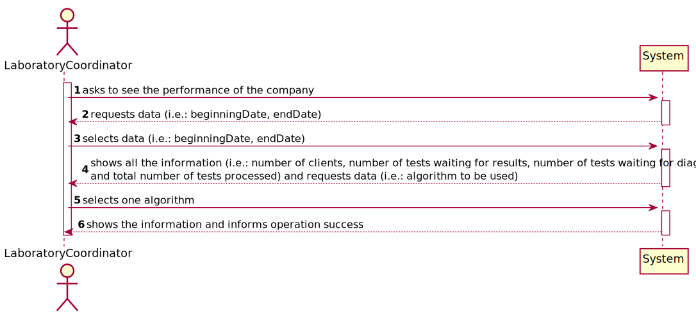

# US 16 - As a laboratory coordinator, I want to have an overview of all the tests performed by Many Labs and analyse the overall performance of the company.

## 1. Requirements Engineering

### 1.1. User Story Description

As a laboratory coordinator, I want to have an overview of all the tests performed by Many Labs and analyse the overall performance of the company (for instance, check the sub-intervals in which there were more samples waiting for the result). To facilitate overall analysis, the application should also display statistics and graphs.

### 1.2. Customer Specifications and Clarifications 

From the Specifications Document:

* "Moreover, Many Labs is a company that needs to be continuously evaluating and improving its internal processes to achieve excellence and to beat the competition. Therefore, the company wants to decrease the number of tests waiting for its result. To evaluate this, it proceeds as following: for any interval of time, for example one week (6 working days with 12 working hours per day), the difference between the number of new tests and the number of results available to the client during each half an hour period is computed. In that case, a list with 144 integers is obtained, where a positive integer means that in such half an hour more tests were processed than results were obtained, and a negative integer means the opposite. Now, the problem consists in determining what the contiguous subsequence of the initial sequence is, whose sum of their entries is maximum. This will show the time interval, in such week, when the company was less effective in responding. So, the application should implement a brute-force algorithm (an algorithm which examines each subsequence) to determine the contiguous subsequence with maximum sum, for any interval of time registered. The implemented algorithm should be analysed in terms of its worst-case time complexity, and it should be compared to a provided benchmark algorithm. The algorithm to be used by the application must be defined through a configuration file. The complexity analysis must be accompanied by the observation of the execution time of the algorithms for inputs of variable size in order to observe the asymptotic behaviour. The time complexity analysis of the algorithms should be properly documented in the application user manual (in the annexes) that must be delivered with the application."

From the client clarifications:

* Question: "Should the interval of time considered for the evaluation be asked to the Laboratory Coordinator? // How should we ask him the interval of time to be considered? Should we ask him to type a number of days? A number of weeks? Should we give general options like: last week, last month..., for him to select from? In case the Laboratory Coordinator chooses, for example, one week, should we consider the last 7 days, or should we consider, for example, the data from monday to sunday? // What is the meaning of "overview" here? Should the laboratory coordinator see the number of tests waiting for samples, the number of tests waiting for results, the number of tests waiting for diagnoses... Or should he see the information available for each one of the tests in the application?"
    * [Answer:](https://moodle.isep.ipp.pt/mod/forum/discuss.php?d=8831#p11533) "Yes. // The laboratory coordinator should introduce two dates that define an interval, the beginning date and the end date. This interval will be used to find the contiguous subsequence with maximum sum. // The laboratory coordinator should be able to check the number of clients, the number of tests waiting for results, the number of tests waiting for diagnosis and the total number of tests processed in the laboratory in each day, week, month and year. Moreover, the laboratory coordinator should be able to check the contiguous subsequence with maximum sum."

* Question: "When referring to "the application should also display statistics and graphs" is it up to the team to decide which API or resource should be used to generate graphs and statistics, or do you prefer something specific?"
    * [Answer:](https://moodle.isep.ipp.pt/mod/forum/discuss.php?d=8869#p11583) "With JavaFX you can draw high quality graphs and there is no need to use other tools."

* Question: "After the Laboratory Coordinator types the requested data and views the analysis of the company performance, should he be able to re-type different data and view the results for a different interval of time and/or algorithm? Or does he need to go back to the menu and enter this page of the application again? // To make the re-type of the data easier, should there be a "clear" button, that is responsible for clearing the text fields for data entry?"
    * [Answer:](https://moodle.isep.ipp.pt/mod/forum/discuss.php?d=8901#p11619) "The laboratory coordinator should be able to explore different parameter values (settings) and check the results. Each team should prepare a simple and intuitive interface that requires a minimum number of interactions with the user."

* Question: "You said in this [Q&A](https://moodle.isep.ipp.pt/mod/forum/discuss.php?d=8831), that the laboratory coordinator should define an interval, the beginning date and the end date. Can we assume that every day in the interval defined by the coordinator is a working day with 12 working hours each? // If Saturday or Sunday are in the interval should we skip them or count them also as working days? // "For example one week (6 working days with 12 working hours)" In this case, is there any specifc hour to start filling the 144 integers list?"
    * [Answer:](https://moodle.isep.ipp.pt/mod/forum/discuss.php?d=8906#p11624) "Yes. // Sunday is not a working day. All the other days of the week are working days. // A working day is from 8h00 to 20h00."

* Question: "On the project description is written that "The algorithm to be used by the application must be defined through a configuration file", but on the requirements is written that "the laboratory coordinator should have the ability to dynamically select the algorithm to be applied from the ones available on the system". Should we discart the configuration file and add an option on th program to select one of the available algoritms?"
    * [Answer:](https://moodle.isep.ipp.pt/mod/forum/discuss.php?d=8931#p11652) "Developing an application, like the one we are developing during the Integrative Project, is a dynamic process and the best teams are those who are prepared to react to change quickly. Moreover, the latest client requests/requirements are those that should be considered. Typically, a client updates the requirements throughout the project development. Please consider the requirements introduced at the beginning of Sprint D. The laboratory coordinator should have the ability to dynamically select the algorithm to be applied from the ones available on the system (either the benchmark algorithm provided in moodle or the brute-force algorithm to be developed by each team)."

* Question: "Does the laboratory coordinator also select the amount of working hours per day? Or should we just consider it as 12 working hours/day?"
    * [Answer:](https://moodle.isep.ipp.pt/mod/forum/discuss.php?d=8959#p11688) "The lab coordinator does not select the amount of working hours per day. Please consider 12 working hours per day."

* Question: "Regarding US16, when the laboratory coordinator "analyses the overall performance of the company", is the analysis purely looking at the results? Or should he write any type of report based on the results for the interval he is seeing?"
    * [Answer:](https://moodle.isep.ipp.pt/mod/forum/discuss.php?d=8963#p11698) "You should only identify the time interval where there was a delay in the response (the maximum subsequence)."

* Question: "The elements used in the algorithm refer to a half-hour interval? // How do we obtain the number to be used in the algorithm do we subtract tests that got a result in that interval and the tests registered?"
    * [Answer:](https://moodle.isep.ipp.pt/mod/forum/discuss.php?d=8964#p11699) "Yes. // Yes."

* Question: "What is the total number of tests processed in the laboratory? Is it the number of tests that were given results in that time span or is it the number of tests that were validated in that time span?"
    * [Answer:](https://moodle.isep.ipp.pt/mod/forum/discuss.php?d=9198#p11983) "The total number of tests processed in the laboratory is the total number of tests that were validated by the laboratory coordinator. In a previous answer I asked: "The laboratory coordinator should be able to check the number of clients, the number of tests waiting for results, the number of tests waiting for diagnosis and the total number of tests processed in the laboratory in each day, week, month and year. " I asked these statistics for a given interval that should be selected by the user. Moreover, the application should also show to the laboratory coordinator the total number of clients and the total number of validated tests that exist in the system."

* Question: "What are the statistics that require a graph, could you specify, please."
    * [Answer:](https://moodle.isep.ipp.pt/mod/forum/discuss.php?d=9204#p11989) "In a previous post I asked: "The laboratory coordinator should be able to check the number of clients, the number of tests waiting for results, the number of tests waiting for diagnosis and the total number of tests processed (tests validated) in the laboratory in each day, week, month and year. The system should show these statistics for a given interval that should be selected/defined by the user". The application should present these statistics using four graphs/charts, one for each time resolution (day, week, month and year)."
  
    
### 1.3. Acceptance Criteria

* AC1:"While evaluating the performance the laboratory coordinator should have the ability to dynamically select the algorithm to be applied from the ones available on the system (the benchmark algorithm provided in moodle and the brute-force algorithm to be developed)."
* AC2:"Support for easily adding other similar algorithms is required."

### 1.4. Found out Dependencies

Others US that create tests and its parameters.

### 1.5 Input and Output Data

Input Data

* Typed data:

  * Beginning date and end date

* Selected data:

  * Algorithm to be applied

Output Data

* Number of clients, number of tests waiting for results, number of tests waiting for diagnosis and total number of tests processed
* List of algorithms
* Interval where there was a delay in the response
* (In)Success of the operation

### 1.6. System Sequence Diagram (SSD)

### 1.7 Other Relevant Remarks

*Use this section to capture other relevant information that is related with this US such as (i) special requirements ; (ii) data and/or technology variations; (iii) how often this US is held.* 

## 2. OO Analysis

### 2.1. Relevant Domain Model Excerpt 

### 2.2. Other Remarks

## 3. Design - User Story Realization 

### 3.1. Rationale

**The rationale grounds on the SSD interactions and the identified input/output data.**

| Interaction ID | Question: Which class is responsible for... | Answer  | Justification (with patterns)  |
|:-------------  |:--------------------- |:------------|:---------------------------- |
| Step 1: asks to see the performance of the company |	... interacting with the actor? | PerformanceUI         | Pure Fabrication: there is no reason to assign this responsibility to any existing class in the Domain Model |
|                                                    | ... coordinating the US?         | PerformanceController | Controller                                                                                                   |
| Step 2: requests data (i.e.: beginningDate, endDate) |	n/a		 |             |                              |
| Step 3: types requested data (i.e.: beginningDate, endDate) |	n/a						 |             |                              |
| Step 4: shows all the information (i.e.: number of clients, number of tests waiting for results, number of tests waiting for diagnosis and total number of tests processed) and requests data (i.e.: algorithm to be used) |	... knowing ClientStore and TestStore? | Company | IE: Company knows the ClientStore and TestStore to which it is delegating some tasks. |
| Step 5: selects one algorithm |	n/a						 |             |                              |
| Step 6: shows the information and informs operation success 		 |	... informing operation success?						 |  PerformanceUI           |   IE: is responsible for user interactions                           |              

### Systematization ##

According to the taken rationale, the conceptual classes promoted to software classes are: 

 * Company

Other software classes (i.e. Pure Fabrication) identified: 
 * PerformanceUI  
 * PerformanceController
 * ClientStore
 * TestStore

## 3.2. Sequence Diagram (SD)

## 3.3. Class Diagram (CD)

# 4. Tests

# 5. Construction (Implementation)

**PerformanceController**

    public class PerformanceController {
        private App app;
        private Company company;
        private TestStore testStore;
        private ClientStore clientStore;
        private Sum sum;
        public PerformanceController(){
        }

        public int getAllClients(){
        }

        public int getAllTestsWaitResult(Date beginning, Date end){
        }

        public int getAllTestsWaitDiagnosis(Date beginning, Date end){
        }

        public int getAllTestsValidated(Date beginning, Date end){
        }

        public int [] getSubsequenceBenchmark(int[] seq){
        }

        public int [] getSubsequenceBruteForce(int[] seq){
        }
    }

**TestStore**

    public class TestStore implements Serializable{
        public int getCollectedTestsNumber(Date beginning, Date end){
        }

        public int getAnalysedTestsNumber(Date beginning, Date end){
        }

        public int getValidatedTestsNumber(Date beginning, Date end){
        }
    }

**ClientStore**

    public int getClientListNumber(){
    }

# 6. Integration and Demo 

A new menu was added, for the Laboratory Coordinator, with one option.

# 7. Observations

The developed work was made in order to allow an easy implementation of future changes.

