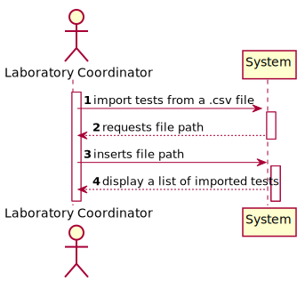
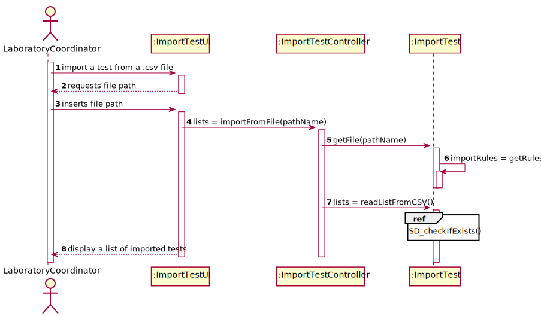

# US 17 - As a laboratory coordinator, I want to import clinical tests.

## 1. Requirements Engineering

### 1.1. User Story Description

* As a laboratory coordinator, I want to import clinical tests from a CSV file.

### 1.2. Customer Specifications and Clarifications

**From the specifications document:**

* (There is no information available on the Specifications Document)

**From the client clarifications:**

* Question: Are the csv files to be regarded as the ‘data base’ of all the tests? In other words, are each of the tests to be imported precisely with that Test_Code value? Consequently, resulting in the replacement of any registered test that precedes that same import, whose Test_Code might coincide with the Test_Code of the imported test? [Client Forum](https://moodle.isep.ipp.pt/mod/forum/discuss.php?d=9039#p11948)
  * Answer: Please check the following [post](https://moodle.isep.ipp.pt/mod/forum/discuss.php?d=8925#p11947).
  

  * Question if the referred post: For example, the sample barcode, which is useful. Or the category code, which I mentioned in the question above.They are not in the CSV... should we insert some random value?
    * Answer: If the information is not available in the system for a given test, that test should not be loaded into the system. If the information available in the CSV file is correct but incomplete, then, to load the tests that are correct (but incomplete) each team should first create the entities/instance in the system. 
    If a subset of required attributes are not available in the CSV file, then each team should define attribute values to create a valid instance. After "setting" the system, each team should load all (correct) tests from the CSV file.
      * Regarding the barcode, if the "Test_Chemical_DateHour" attribute is not available in the CSV file for a given test, then the barcode should not be generated. If the "Test_Chemical_DateHour" attribute is available in the CSV file, then the a barcode number is automatically generated by the system.
      * Regarding the "Test_Code" attribute, this is an internal code to identify tests in our company. When loading tests from CSV files, if the code already exists in the system, then the application should generate a new code for the given test (that is being loaded from the CSV file).
  
  

* Question: Previously you said that “we can have more categories and parameters for each type of test.” regarding the format of the .csv files. Then, my understanding is that between the TestType and Test_Reg_DateHour columns, the number of columns is dynamic, correct? Could we end up seeing a Category_3, a Category_4, and so on? [Client Forum](https://moodle.isep.ipp.pt/mod/forum/discuss.php?d=9039#p11948)
  * Answer: Yes.

  

* Question: On the same issue, if there was, let’s say, a Urine type of test, would we also see some of its own categories and parameters reflected on the .csv file, as we see, for instance, N/A COVID categories on .csv files with only BLOOD type of tests? [Client Forum](https://moodle.isep.ipp.pt/mod/forum/discuss.php?d=9039#p11948)
  * Answer: Yes.

* Question: Up until now, we haven’t had any need to assign an address to a client. Seeing that there is now an Address column, that for us is somewhat left unused, would you advise us to add it as an attribute to the Client entity? [Client Forum](https://moodle.isep.ipp.pt/mod/forum/discuss.php?d=9039#p11948)
  * Answer: Yes. The address should have no more than 90 characters. Please consider the address of the Employee to have the same format that I am suggesting now for the client's address. In the beginning of the project I said that the address of the Employee should have no more than 30 characters but with this size we can not write a normal UK address.

  

* Question: If some kind of data is wrong, what should happen should we just ignore the line where it is located? [Client Forum](https://moodle.isep.ipp.pt/mod/forum/discuss.php?d=8960#p11890)
  * Answer: The application should not load tests that have incorrect attribute values. The application should identify the tests that have incorrect values and it should continue loading all valid tests that exist in the file. A message should be sent to the console to identify the tests/lines that have incorrect values.

* Question: Should we show the data that the laboratory coordinator is importing? [Client Forum](https://moodle.isep.ipp.pt/mod/forum/discuss.php?d=8960#p11890)
  * Answer: Yes, it should show all the data that was imported at that time.

* Question: Will the CSV files always have the same format as the ones available on moodle? [Client Forum](https://moodle.isep.ipp.pt/mod/forum/discuss.php?d=8883#p11685)
  * Answer: Yes. But we can have more categories and parameters for each type of test.
  

* Question: In the CSV files provided for this sprint we can find a parameter with code HDL00 which belongs to the Cholesterol category and to the blood test type, but by searching the external modules for the blood test type the team could not find a match for the said parameter. What can we as a team do to resolve such issue? [Client Forum](https://moodle.isep.ipp.pt/mod/forum/discuss.php?d=8877#p11684)
  * Answer: If the API does not have reference values for this parameter, than you should not present the reference values to the application user.

* Question: In what folder should the CSV file be when we want to use the application through the console? [Client Forum](https://moodle.isep.ipp.pt/mod/forum/discuss.php?d=8857#p11584)
  * Answer: In this sprint each team should develop a graphical user interface. The file to import can be located in any folder. The user should specify the path of the file.

### 1.3. Acceptance Criteria

* AC1: If the file contains invalid data (e.g., a parameter not defined in the system), that data should not be load into the system. An exception should be thrown.
* AC2: The user should be able to see which tests were imported and which ones were not.

### 1.4. Found out Dependencies

* US3: As a receptionist of the laboratory, I want to register a client.

* US8: As an administrator, I want to register a new clinical analysis laboratory stating which kind of test(s) it operates.

* US9: As an administrator, I want to specify a new type of test and its collecting methods.
  
* US10: As an administrator, I want to specify a new parameter and categorize it.

* US11: As an administrator, I want to specify a new parameter category.

### 1.5 Input and Output Data

**Input data**

* Typed data: File path.
* Selected data: (none)

**Output data**

* List of tests which were imported.

* List of tests which could not be imported.

### 1.6. System Sequence Diagram (SSD)

### 1.7 Other Relevant Remarks

* This functionality should be present on a Graphical User Interface.

## 2. OO Analysis

### 2.1. Relevant Domain Model Excerpt

### 2.2. Other Remarks

No other remarks have been made

## 3. Design - User Story Realization 

### 3.1. Rationale

**The rationale grounds on the SSD interactions and the identified input/output data.**

| Interaction ID | Question: Which class is responsible for... | Answer  | Justification (with patterns)  |
|:-------------  |:--------------------- |:------------|:---------------------------- |
| Step 1: import tests from a .csv file         | ...importing a test?  | ImportTestUI | Pure Fabrication: Assign a highly cohesive set of responsibilities to an artificial or convenience "behavior", which will later be reused.
|                                               | ...coordinating the US?  | ImportTestController| Controller (Handles a UI event). 
| Step 2: requests file path                    | ...requesting the file path? | ImportTestUI | IE: Responsible for User Interaction. 
| Step 3: inserts file path                     | ...saving the inserted path? | ImportTestController| IE: Responsible for saving the path.
| Step 4: displays which test is being imported | ...showing the data? | ImportTestUI | IE: Shows each test being imported.
|                                               | ...making the data available? | ImportTest | IE: Responsible for analyzing the file containing the Test Data. 

### Systematization ###

According to the taken rationale, the conceptual classes promoted to software classes are: 

  * Test
  * Client
  * Report
  * ClinicalAnalysisLaboratory
  * ParameterCategory
  * TestType

Other software classes (i.e. Pure Fabrication) identified:
  
  * ImportTest
  * ImportTestUI
  * ImportTestController
  * TestStore
  * ClientStore
  * ReportStore
  * ClinicalAnalysisLaboratoryStore
  * ParameterCategoryStore
  * TestTypeStore
  * APIBarcodeAdapter

## 3.2. Sequence Diagram (SD)

## 3.3. Class Diagram (CD)

# 4. Tests

# 5. Construction (Implementation)

* ImportTest Class

      public class ImportTest {
      
          private Company company;
      
          private File ficheiroInput;
      
          private BufferedReader bufferedReader;
      
          private String[] firstLine;
      
          private int[] importRules;
      
          public ImportTest(){}
      
          public boolean getFile(String pathName) throws IOException {}
      
          public int[] getRules () throws IOException {}
      
          public List<List> readListFromCSV() throws IOException {}
      
          public String checkIfExists(String [] linhaSplit){}
      
          public Client checkIfClientExists(String[] conteudoClient){}
      
          public void checkIfLabExists(String labID){}
      
          public ParameterCategory checkIfCategoryExists(String name){}
      
          public TestParameter checkIfTestParameterExists(double result, int numCategoria, int numParameter, TestType testType){}
      
          public TestType checkIfTestTypeExists(String code){}
      
          public boolean checkIfTestExists(String code, String nhsCode){}
      
          public Date checkIfDateExists(String date) throws ParseException {}
      
          public boolean addTest(Client client, List<ParameterCategory> parameterCategoryList, List<TestParameter> testParameterList, TestType testType, String code, String nhsCode, boolean existsTest, Date registerDate, Date chemicalAnalysisDate, Date diagnosisDate, Date validationDate) throws Exception {}
      
          public static int[] contaCategorias (String[] linhaRegra){}
      
          public static void contaParametros(String[] linhaRegra, int[] contaCategorias){}
      
      }

* ImportTestController Class

      public class ImportTestController {
      
          private ImportTest importTest;
      
          public ImportTestController(){}
      
          public List<List> importFromFile(String pathName) throws IOException{}
      }

* ImportTestUI Class

      public class ImportTestUI implements Runnable{
      
          private ImportTestController importTestController;
      
          public ImportTestUI(){}
      
          public void run(){}
      }

# 6. Integration and Demo 

* The User Story made the system capable of importing tests from a given list.

# 7. Observations

* No observations have been made.