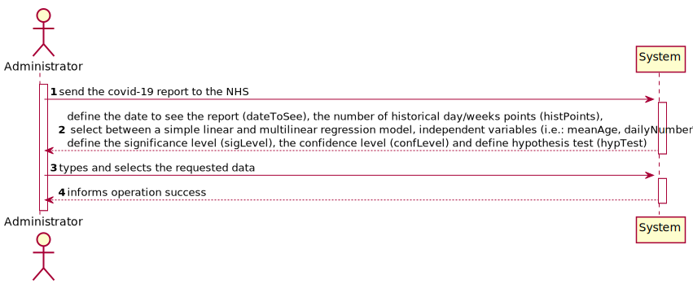
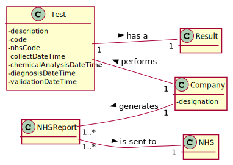
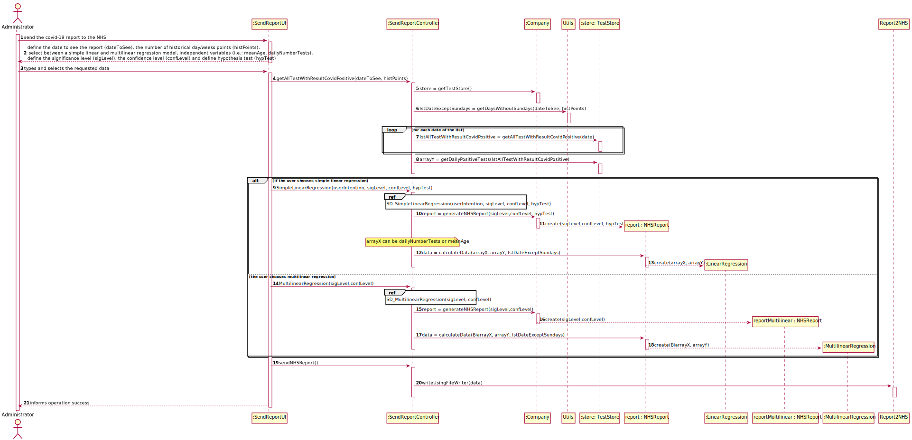
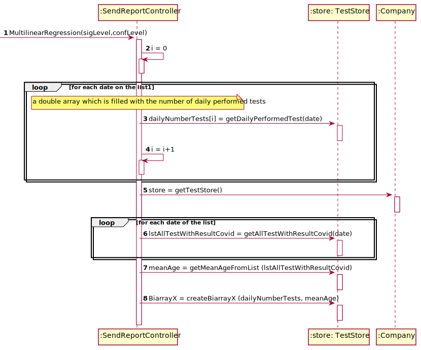
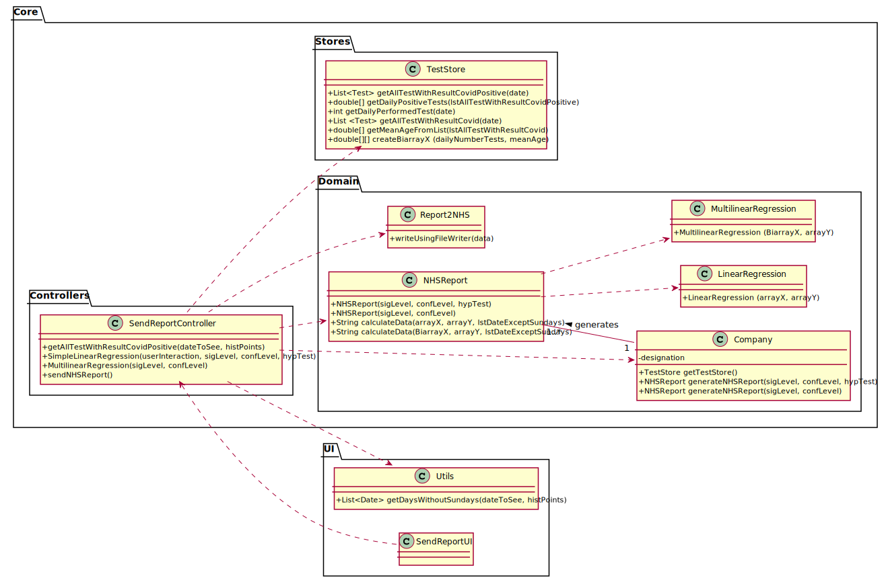

# US18 - As an Administrator I want to send the Covid-19 report to the NHS at any time

## 1. Requirements Engineering

### 1.1. User Story Description

As an Administrator I want to send the Covid-19 report to the NHS at any time. I want to define the interval of dates to fit the regression model, the number of historical points (number of days or number of weeks) that must be sent to the NHS, the regression model to use and select the independent variables to use.

### 1.2. Customer Specifications and Clarifications 

From the Specifications Document:
* " The company is also required to generate daily (automatic) reports with all the information demanded by the NHS and should send them to the NHS using their API. To make the predictions, the NHS contract defines that a linear regression algorithm should be used. The NHS required that both simple linear and multiple linear regression algorithms should be evaluated to select the best model. "

From the client clarifications:

* Question: which significance level should we use for the hypothesis tests? [Client forum](https://moodle.isep.ipp.pt/mod/forum/discuss.php?d=8890)
    * Answer: The application should allow the user to choose the significance level.
  
* Question: Regarding US18 and US19, it is only one report containing all the tests performed by Many Labs to be sent each time, correct? Or is it one report per laboratory, for example? Or other option? [Client forum](https://moodle.isep.ipp.pt/mod/forum/discuss.php?d=8892)
    * Answer: The report should contain all the tests made by Many Labs.
  
* Question: Should the report contain the data of all the tests with results (with or without report, with or without validation) or contain only the validated tests? (Or other option?) [Client forum](https://moodle.isep.ipp.pt/mod/forum/discuss.php?d=8892)
    * Answer: The NHS Covid report should include statistics computed only from validated tests.

* Question: From the project description it is known "send the forecasts for these same time horizons (the number of Covid-19 cases for the following day, next week and next month)." In the example report we have in moodle, there is a line that says "// Prediction values". Does this mean that after this line we should put our predictions or it refers to the following table? [Client forum](https://moodle.isep.ipp.pt/mod/forum/discuss.php?d=8910)
    * Answer: Yes, the prediction values are the ones available in the table that we include in the example.
  
* Question: From Sprint D requirements we get "I want to define... the number of historical points (number of days or number of weeks) that must be sent to the NHS". Is the Administrator who must choose between days or weeks? If so, how should he make this choice? [Client forum](https://moodle.isep.ipp.pt/mod/forum/discuss.php?d=8937)
    * Answer: Yes. The Administrator should select between days and weeks using the user interface.
  
* Question: Regarding US18, we've noticed that in the NHS Report model, the administrator defined the date interval to be between 17/05 and 22/05, but in the prediction table I see 15 results between 13/05 and 29/05. I know that between 17 and 22 there aren't 15 days and I would like to know if the 15 rows in the results table are by design (meaning that the application detected that the administrator wanted 15 historical points and it spanned the date further on both sides to provide the 15 days) or is it an error. [Client forum](https://moodle.isep.ipp.pt/mod/forum/discuss.php?d=8941)
    * Answer:
  
* Question: Which of the data should take the lead, the number of historical points, or the date range? [Client forum](https://moodle.isep.ipp.pt/mod/forum/discuss.php?d=8941)
    * Answer:
  
* Question: Should the number of historical points have the same range as the date interval defined by the administrator? [Client forum](https://moodle.isep.ipp.pt/mod/forum/discuss.php?d=8942)
    * Answer: No. The points within the interval are used to fit the linear regression model. The number of historical points are the points for which we want to send the estimates/expect values to NHS. The points within the interval and historical points can overlap. Please carefully review the report example file available in moodle.
  
* Question: From the report example we got that the administrator defines the dates interval to fit the model. Which date should the application use to provide the report? Is it the registration date or results registration date? [Client forum](https://moodle.isep.ipp.pt/mod/forum/discuss.php?d=8944)
    * Answer: The registration date should be considered. But only tests that have already been validated should be considered.
  
* Question: Should we always ask to the user define the current date, or can we get it somewhere else? [Client forum](https://moodle.isep.ipp.pt/mod/forum/discuss.php?d=8965)
    * Answer:
  
* Question: The data should be send according to day, week and month? This affects the number of tests in general? [Client forum](https://moodle.isep.ipp.pt/mod/forum/discuss.php?d=8965)
    * Answer:
  
* Question: The dates tha fit the model are selected so that the predictions follow the values from those days? [Client forum](https://moodle.isep.ipp.pt/mod/forum/discuss.php?d=8965)
    * Answer:
  
* Question: The only variables to be compared to the positive cases are the number of tests and mean age or are there any other variable that you would like to Analyse ? [Client forum](https://moodle.isep.ipp.pt/mod/forum/discuss.php?d=8965)
    * Answer:
  
* Question: From the covid report example you gave us we can see that is missing two dates(16/05/2021 and  23/05/2021) in the predictions table. Is there any specific reason? [Client forum](https://moodle.isep.ipp.pt/mod/forum/discuss.php?d=9059)
    * Answer: These days of the week are two Sundays and the laboratory does not work on Sundays.
  
* Question: Is the same logic applied to the confidence intervals to be on the table? [Client forum](https://moodle.isep.ipp.pt/mod/forum/discuss.php?d=9096)
    * Answer: Yes the user could be choose the significance level for hip t and confidence level for IC
  
* Question: If the admin selects the multilinear regression he/she can select more than one independent variable. Should he select from a checklist the ones that he/she want? If so, what are the supposed independent variables we need to include in the checklist? From Sprint D requirements we also get "Administrator should be able to choose the independent variable to use with the simple linear regression model (either the number of tests realized or the mean age)." [Client forum](https://moodle.isep.ipp.pt/mod/forum/discuss.php?d=9104)
    * Answer: to apply mlr you need two independent variables- daily number tests and mean age person tested daily. Also you need the same records per week.
  
* Question: In US18 you said " ..the number of historical points (number of days or number of weeks) that must be sent to the NHS .." what exactly is this ? Is this a interval of dates ? [Client forum](https://moodle.isep.ipp.pt/mod/forum/discuss.php?d=9109)
    * Answer: Yes, you must allow the client to choose days of weeks
  
* Question: I read from a previous post that " to apply mlr you need two independent variables- daily number tests and mean age person tested daily. Also you need the same records per week. " so when de administrator selects a MLR the system should adopt by default that the independent variables are daily number tests and mean age person , or he should write or select the independent variables that he wants ? [Client forum](https://moodle.isep.ipp.pt/mod/forum/discuss.php?d=9121)
    * Answer: When the Administrator selects MLR, the number tests and mean age independent variables should be used without being selected.
  
* Question: Could you clarify how the historical points work? Acording to the NhsReportExample, it was chosen 15 points and the dates to fit the regression model but it seems that it was not chosen the day to start the prediction table. [Client forum](https://moodle.isep.ipp.pt/mod/forum/discuss.php?d=9142)
    * Answer: In the header of the exampleNHSReport.txt file it says "If the administrator selects: The current day to be 31/05/2021...". Please relate this information with the table available in the exampleNHSReport.txt file.
  
* Question: I know that the administrator chose 15 historical points and it is shown in the table down below in the file, but my question is, what's the criteria for showing 3 days before 17/05 and 6 days after 22/05? [Client forum](https://moodle.isep.ipp.pt/mod/forum/discuss.php?d=9232)
    * Answer: The interval data is used to fit the regression model. The historical points are defined to get the number of ESTIMATED positive cases.
  
* Question: Should I find the line/equation (and everything else derived from it) using the data concerning the interval of days chosen, or from the historical days chosen? [Client forum](https://moodle.isep.ipp.pt/mod/forum/discuss.php?d=9232)
    * Answer: The interval data is used to fit the regression model.
  
* Question: In US 18, should we ask the user to select which parameter he/she wants be analyzed for the hypothesis tests (a or b)? [Client forum](https://moodle.isep.ipp.pt/mod/forum/discuss.php?d=9234)
    * Answer: Yes.
  
* Question: Should we ask for the prevision interval level or should we just use 95% like it's shown in the example report? [Client forum](https://moodle.isep.ipp.pt/mod/forum/discuss.php?d=9234)
    * Answer: The user should introduce the confidence level value.
  
* Question: Should the reports sent to the NHS be saved in the app, or are they just sent? [Client forum](https://moodle.isep.ipp.pt/mod/forum/discuss.php?d=9271)
    * Answer: There is no need to save the report in the app.
  
* Question: If on a certain day or week there aren't any Covid 19 tests realized and therefore no clients, should we consider the mean age to be 0? [Client forum](https://moodle.isep.ipp.pt/mod/forum/discuss.php?d=9297)
    * Answer: Yes, you should consider the mean age to be zero. Sundays should not be considered in your analysis.
  
### 1.3. Acceptance Criteria

* AC1: The system should allow the Administrator to select between a simple linear and multilinear regression model to fit the data. Moreover, the Administrator should be able to choose the independent variable to use with the simple linear regression model (either the number of tests realized or the mean age). The system should send the report using the NHS API (available in moodle).
* AC2: The system should allow user to choose the significance level.
* AC3: The system should allow user to select between days and weeks.
* AC4: The system should allow user to choose the confidence level.
* AC5: The system should allow user to select between a and b for the hypothesis tests.

### 1.4. Found out Dependencies

* US4: As an Administrator I want to send the Covid-19 report to the NHS at any time.
* US17: As a laboratory coordinator, I want to import clinical tests.

### 1.5 Input and Output Data

Input Data

* Typed data:
  
  * date to see the report
  * number of historical day points
  * significance level
  * confidence level
    
* Selected data:
  
  * simple linear and multilinear regression model
  * independent variables
  * hypothesis test

Output Data

* (In)Success of the operation

### 1.6. System Sequence Diagram (SSD)

*Insert here a SSD depicting the envisioned Actor-System interactions and throughout which data is inputted and outputted to fulfill the requirement. All interactions must be numbered.*

### 1.7 Other Relevant Remarks

* This us is quite important since it allows you to send covid report to the National Healthcare Service, using and API (NHS API)

## 2. OO Analysis

### 2.1. Relevant Domain Model Excerpt 

### 2.2. Other Remarks

*Use this section to capture some aditional notes/remarks that must be taken into consideration into the design activity. In some case, it might be usefull to add other analysis artifacts (e.g. activity or state diagrams).* 

## 3. Design - User Story Realization 

### 3.1. Rationale

**The rationale grounds on the SSD interactions and the identified input/output data.**

| Interaction ID | Question: Which class is responsible for... | Answer  | Justification (with patterns)  |
|:-------------  |:--------------------- |:------------|:---------------------------- |
| Step 1: send the covid-19 report to the NHS  		 | ... interacting with the actor?							 | sendReportUI             | Pure Fabrication: there is no reason to assign this responsibility to any existing class in the Domain Model.                              |
|   		 | ... coordinating the US?							 | sendReportController             | Controller                              |
|   		 | ... generate the covid-19 report?							 | Company            | Creator: Company is responsible for generate a report                              |
| Step 2: define the date to see the report (dateToSee), the number of historical day/weeks points (histPoints),\n select between a simple linear and multilinear regression model, independent variables (i.e.: meanAge, dailyNumberTests), \ndefine the significance level (sigLevel), the confidence level (confLevel) and define hypothesis test (hypTest)  		 | n/a							 |             |                              |
| Step 3: types and selects the requested data  		 | ... reads the input data?							 | SendReportUI             | Pure Fabrication: there is no reason to assign this responsibility to any existing class in the Domain Model.                             |
|   		 | ... knows TestStore ?							 | Company             | IE: Company knows the TestStore to which it is delegating some tasks.                              |
|   		 | ... send the covid-19 report?							 | Report2NHS             | IE: because it has the necessary information to send the covid-19 report to NHS.                              |
| Step 4: informs operation success  		 | ... informing operation success?							 | sendReportUI             | IE: responsible for user interaction                              |              

### Systematization ##

According to the taken rationale, the conceptual classes promoted to software classes are: 

 * Company
 * NHSReport

Other software classes (i.e. Pure Fabrication) identified: 

 * sendReportUI  
 * sendReportController
 * TestStore  
 * Utils
 * LinearRegression
 * MultilinearRegression
 * Report2NHS

## 3.2. Sequence Diagram (SD)

*In this section, it is suggested to present an UML dynamic view stating the sequence of domain related software objects' interactions that allows to fulfill the requirement.* 

## 3.3. Class Diagram (CD)

*In this section, it is suggested to present an UML static view representing the main domain related software classes that are involved in fulfilling the requirement as well as and their relations, attributes and methods.*

# 4. Tests 

**Test 1:**  Check the method generateNHSReport present in the Company class.

    @Test
    public void generateNHSReportLinear() {
        Company company = new Company("Many Labs");

        NHSReport nhsReportExpected = new NHSReport(95,95,true);
        NHSReport nhsReportResult = company.generateNHSReport(95,95,true);

        Assert.assertEquals(nhsReportExpected.toString(), nhsReportResult.toString());

    }

    @Test
    public void GenerateNHSReportMultilinear() {

        Company company = new Company("Many Labs");

        NHSReport nhsReportExpected = new NHSReport(95,95);
        NHSReport nhsReportResult = company.generateNHSReport(95,95);

        Assert.assertEquals(nhsReportExpected.toString(), nhsReportResult.toString());
    }

# 5. Construction (Implementation)

**SendReportController**

    
      public class SendReportController {
    
      
        private App app;
        private Company company;
        public TestStore testStore;
        private List<Date> lstDateExceptSundays;
        private List<Test> [] lstAllTestWithResultCovidPositive;
        private List<Test> [] lstAllTestWithResultCovid;
        private double[] arrayY;
        private String data;
    
      
        public SendReportController (){
        }

        public void getAllTestWithResultCovidPositive(Date dateToSee, int histPoints){
        }

        public void SimpleLinearRegression(boolean userIntention, double sigLevel,double confLevel, boolean hypTest) throws ParseException {
        }
    
        public void MultilinearRegression (double sigLevel, double confLevel) throws ParseException {
        }

        public void sendNHSReport (){
        }
    }

**Company**

    public class Company implements Serializable {
    
        private String designation;
        private TestStore testStore;
        // ... (omitted)
    
        public Company(String designation){
        }

        public TestStore getTestStore (){
        }

        public NHSReport generateNHSReport (double sigLevel, double confLevel, boolean hypTest){
        }

        public NHSReport generateNHSReport (double sigLevel, double confLevel){
        }
    }

**TestStore**

    public class TestStore implements Serializable{

        private List<Test> TestList;
        // ... (omitted)
        
        public TestStore (){
            this.TestList = new ArrayList<>();
        }

        public List<Test> getAllTestWithResultCovidPositive(Date date){
        }

        public int getDailyPerformedTests(Date date){
        }

        public double[] getDailyPositiveTests(List<Test> [] lstAllTestWithResultCovidPositive){
        }

        public List<Test> getAllTestWithResultCovid(Date date) {
        }

        public double[] getMeanAgeFromList(List<Test> [] lstAllTestWithResultCovid) throws ParseException {
        }

        public double[][] createBiarrayX (double[] dailyNumberTests, double[] meanAge){
        }
    }

**NHSReport**

    public class NHSReport {

        private double sigLevel;
        private double confLevel;
        private boolean hypTest;
        private LinearRegression linearRegression;
        private MultilinearRegression multilinearRegression;

        public NHSReport(double sigLevel, double confLevel, boolean hypTest){
        }

        public NHSReport(double sigLevel, double confLevel){
        }

        public String calculateData(double[] x, double[] y, List<Date> lstDateExceptSundays){
        }

        public String calculateData (double[][] BiarrayX, double[] y, List<Date> lstDateExceptSundays){
        }
            
    }

**Report2NHS**

    public class Report2NHS {

        public Report2NHS() {
        }
    
        public static void writeUsingFileWriter(String data) {
        }
    }

**LinearRegression**

    public class LinearRegression {

        private final double intercept, slope;
        private final double r2;
        private final double svar0, svar1;

        public LinearRegression(double[] x, double[] y) {
        }
    }

**MultilinearRegression**

    public class MultilinearRegression {
    
        private double SQT, SQR,SQE,beta0,beta1,beta2,degreeFreedom,degreeFreedomErro,degreeFreedomRegressao,r2,r2adj,MQR,MQE,F;
        private double[][] xtxinv, betas;

        public MultilinearRegression(double[][]x,double[]y){

        }
    }

**Utils**

    public class Utils {

        public static List<Date> getDaysWithoutSundays (Date date, int histPoints) {
        }
    }

# 6. Integration and Demo 

* This User Story was deeply important to integrate in our code, since it is necessary to send the covid-19 report to the National Healthcare Service.

# 7. Observations

* The developed work was made in order to allow an easy implementation of future changes and an easy understanding.

